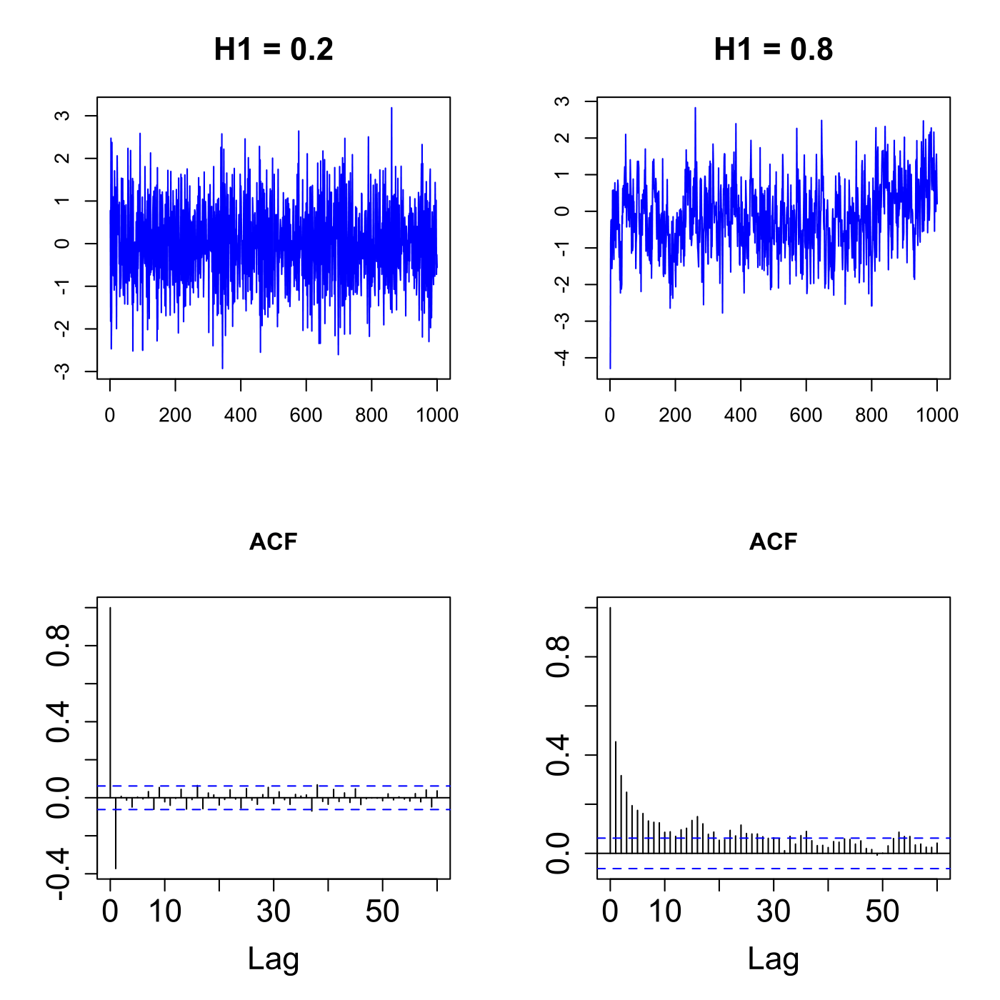

[](http://quantlet.de/)

## [](http://quantlet.de/) **SFEfgnacf** [](http://quantlet.de/)

```yaml

Name of QuantLet : SFEfgnacf

Published in : Statistics of Financial Markets

Description : 'Produces plots and autocorrelation functions of fractional Gaussian noise with 2
different Hurst parameters.'

Keywords : 'acf, autocorrelation, discrete, graphical representation, plot, process, simulation,
stationary, stochastic, stochastic-process, time-series, fractional gaussian noise,
fractional-brownian-motion, hurst-exponent'

See also : SFEacfar1, SFEacfar2, SFEacfma1, SFEacfma2, SFEpacfar2, SFEpacfma2

Author : Piotr Majer

Submitted : Fri, June 13 2014 by Philipp Gschoepf

```




### R Code:
```r

# clear variables and close windows
rm(list = ls(all = TRUE))
graphics.off()

# install and load packages
libraries = c("dvfBm")
lapply(libraries, function(x) if (!(x %in% installed.packages())) {
    install.packages(x)
})
lapply(libraries, library, quietly = TRUE, character.only = TRUE)

# parameter settings
n   = 1000 + 1
H1  = 0.2
H2  = 0.8
dz1 = perturbFBM(n, H1, type = "no", SNR = NULL, plot = FALSE)
dz2 = perturbFBM(n, H2, type = "no", SNR = NULL, plot = FALSE)
z1  = diff(dz1)
z2  = diff(dz2)

# plot
par(mfrow = c(2, 2))
plot(z1, type = "l", col = "blue", xlab = "", ylab = "", main = "H1 = 0.2", cex.lab = 1.4, 
    cex.main = 1.6)
plot(z2, type = "l", col = "blue", xlab = "", ylab = "", main = "H1 = 0.8", cex.lab = 1.4, 
    cex.main = 1.6)

ac1 = acf(z1, lag.max = 60, plot = F)
ac2 = acf(z2, lag.max = 60, plot = F)

plot(ac1, cex.axis = 1.6, cex.lab = 1.6, ylab = "", main = "ACF", cex.main = 1.6)
plot(ac2, cex.axis = 1.6, cex.lab = 1.6, ylab = "", main = "ACF", cex.main = 1.6)


```
