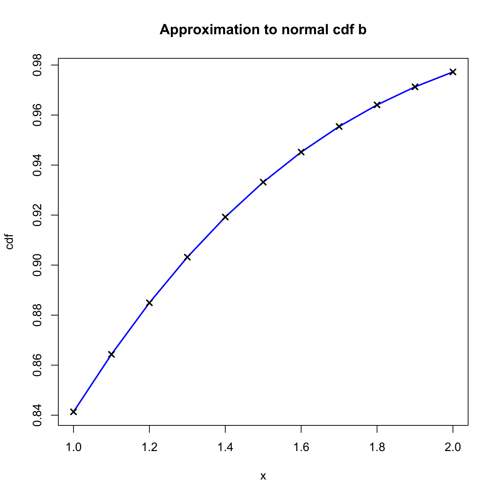
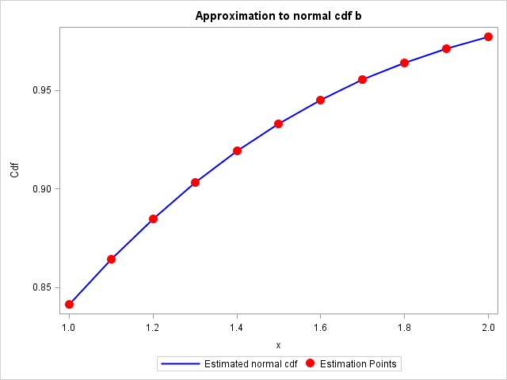

[](http://quantlet.de/)

## [](http://quantlet.de/) **SFENormalApprox2** [](http://quantlet.de/)

```yaml

Name of QuantLet : SFENormalApprox2

Published in : Statistics of Financial Markets

Description : 'Computes numerical approximation to a normal cumulative distribution function (cdf)
using method b).'

Keywords : 'approximation, cdf, distribution, graphical representation, normal,
normal-distribution, numeric, plot'

See also : SFENormalApprox1, SFENormalApprox3, SFENormalApprox4

Author : Wolfgang K. Haerdle

Author[Matlab] : Wolfgang K. Haerdle

Author[SAS] : Daniel T. Pele

Submitted : Mon, November 24 2014 by Awdesch Melzer

Submitted[Matlab] : Wed, April 27 2016 by Ya Qian

Submitted[SAS] : Fri, June 06 2014 by Lukas Borke

Output: 
- phi: approximation of Normal cdf at different values

Example : 'Estimated normal cdf at that points 1:0.1:2 are given: [0.8413 0.8643 0.8849 0.9032
0.9192 0.9332 0.9452 0.9554 0.9641 0.9713 0.9772].'

```

.png)






### R Code:
```r

# clear variables and close windows
rm(list = ls(all = TRUE))
graphics.off()

# Main computation
y = 10:20
y = y/10
b = 0.231641888
a1 = 0.127414796
a2 = -0.142248368
a3 = 0.71070687
a4 = -0.726576013
a5 = 0.530702714
t = 1/(1 + b * y)
phi = 1 - (a1 * t + a2 * t^2 + a3 * t^3 + a4 * t^4 + a5 * t^5) * exp(-y * y/2)

# plot
plot(y, phi, col = "blue", type = "l", main = "Approximation to normal cdf b", 
    xlab = "x", ylab = "cdf", lwd = 2)
points(y, phi, col = "black", pch = 4, lwd = 2)

```

### MATLAB Code:
```matlab

clear all
close all
clc


format long
% main computation
y = 1:0.1:2;
b = 0.231641888;
a1= 0.127414796;
a2=-0.142248368;
a3= 0.71070687;
a4=-0.726576013;
a5= 0.530702714;
t = 1./(1 + b.*y);
phi = 1 - (a1.*t+a2.*t.^2+a3.*t.^3+a4.*t.^4+a5.*t.^5).*exp(-y.*y/2);

% output
disp(' ') ;
disp('Estimation Points')
disp(y)
disp('Estimated Normal CDF')
disp(phi)

subplot(1,2,1)
hold on
plot(y,phi,'LineWidth',2);
xlabel('x')
ylabel('cdf')
title('Approximation to normal cdf b')
scatter(y,phi,'r','o')
hold off

subplot(1,2,2)
axis off
hold on
w1=num2str(y','%10.2f');
w2=num2str(phi','%11.10f');
text(0.1,0.8,w1)
text(0.5,0.8,w2)
hold off
```

### SAS Code:
```sas
goptions reset=all;

Proc iml;
* main computation;
y  =  0.1*(10:20)`;
b = 0.231641888;
a1= 0.127414796;
a2=-0.142248368;
a3= 0.71070687;
a4=-0.726576013;
a5= 0.530702714;
t  =  1/(1 + b*y);
phi = 1 - (a1*t+a2*t##2+a3*t##3+a4*t##4+a5*t##5)#exp(-y#y/2);
plot = y||phi;
create plot from plot;append from plot;
close plot;
quit;


data plot;set plot;
rename col1 = y col2 = phi ;

*Plot the approximation to normal cdf;

title Approximation to normal cdf b;

proc sgplot data  =  plot ;
series x  =  y y  =  phi / lineattrs = (color  =  blue THICKNESS  =  2) 
legendlabel = "Estimated normal cdf";

scatter x  =  y y  =  phi/ 
   markerattrs=( symbol=circlefilled color=red size=12 )
legendlabel = "Estimation Points" ;

yaxis label  =  'Cdf';
xaxis label = 'x' ;
run;
quit;

proc print data = plot;
run;
```
