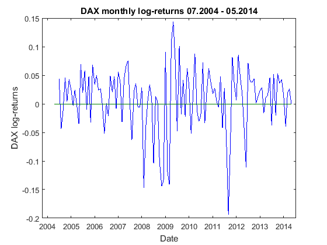
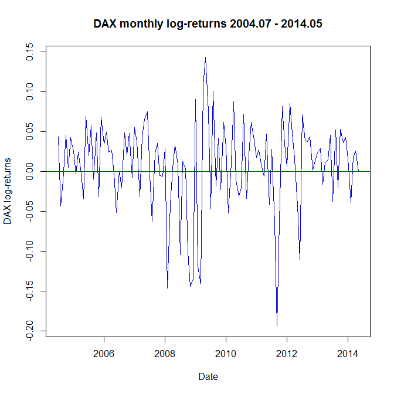

[](http://quantlet.de/)

## [](http://quantlet.de/) **SFESumm** [](http://quantlet.de/)

```yaml

Name of QuantLet: SFESumm

Published in: Statistics of Financial Markets

Description: 'Produces a plot and summary statistics for DAX monthly 
log-returns from July 2004 to May 2014.'

Keywords: kurtosis, returns, skewness, statistics, summary, time-series, volatility

See also: SFEBinomial

Author: Ying Chen, Cindy Lamm, Piedad Castro

Submitted: Fri, June 17 2016 by Piedad Castro

Datafile: 2004-2014_dax_ftse.csv

Input: 'The datafile contains daily price data from 07.05.2004 to 07.05.2014 for 
selected companies which are part of DAX30 and FTSE100 as well as the 
corresponding index data. This code makes only use of the date and DAX variables.'

```





### R Code
```r

# clear variables and close windows
rm(list = ls(all = TRUE))
graphics.off()

# set working directory
# setwd("C:/...")

# install and load packages
libraries = c("data.table", "dplyr", "moments")
lapply(libraries, function(x) if (!(x %in% installed.packages())) {
  install.packages(x)
})
lapply(libraries, library, quietly = TRUE, character.only = TRUE)

# data import
DAX = read.csv("2004-2014_dax_ftse.csv")

# Date variable as variable of class Date
DAX$Date = as.Date(DAX$Date, "%Y-%m-%d")

# firt business day of each month
day           = format(DAX$Date, format = "%d")
DAX$monthYear = format(DAX$Date,format="%Y-%m")
firstDay      = tapply(day, DAX$monthYear, min)
firstDay      = paste(row.names(firstDay), firstDay, sep="-")

# monthly DAX
row.names(DAX) = DAX$Date
monthlyDAX     = DAX[firstDay[-1], ]
monthlyDAX     = select(monthlyDAX, DAX.30, Date, monthYear)

# monthly log-returns
returns = diff(log(monthlyDAX$DAX.30))

# summary statistics of the monthly log-returns
annVol          = sd(returns)*sqrt(12)
(returnsSummary = c(Minimum           = min(returns), 
                    Maximum           = max(returns), 
                    Mean              = mean(returns), 
                    Median            = median(returns), 
                    Std.Error         = sd(returns), 
                    Annual_volatility = annVol,
                    Skewness          = skewness(returns), 
                    Kurtosis          = kurtosis(returns)))

# start and end of the time series
Start = as.numeric(unlist(strsplit(monthlyDAX$monthYear[2], split = "-")))
End   = as.numeric(unlist(strsplit(monthlyDAX$monthYear[nrow(monthlyDAX)], split = "-")))

# save DAX monthly log-returns as a time series
ts_returns = ts(returns, start=Start, end=End, frequency=12) 

# title of the plot
forTitle   = format(monthlyDAX$Date, "%Y.%m")
Title = paste("DAX monthly log-returns ", forTitle[2], " - ", forTitle[nrow(monthlyDAX)], sep = "")

# plot of the DAX monthly log-returns
plot(ts_returns, main = Title, t = "l", col = "blue3",
     xlab = "Date", ylab = "DAX log-returns", lwd = 1.5)
abline(h = 0, col = "darkgreen", lwd = 1.5)

```

automatically created on 2018-05-28

### MATLAB Code
```matlab

%% clear variables and console and close windows
clear
clc
close all

%% set directory
%cd('C:/...')

%% data import
formatSpec = '%{yyyy-MM-dd}D%f%f%f%f%f%f%f%f%f%f%f%f%f%f%f%f%f%f%f%f%f%f%f%f%f%f%f%f%f%f%f%f%f%f%f%f%f%f%f%f%f%f';
DAX        = readtable('2004-2014_dax_ftse.csv','Delimiter',',', 'Format',formatSpec);

%% firt business day of each month
DAX       = DAX(:,{'Date','DAX30'});
DAX.Year  = year(DAX.Date);
DAX.Month = month(DAX.Date); 
DAX.Day   = day(DAX.Date);
minDay    = grpstats(DAX,{'Year','Month'}, 'min', 'DataVars','Day');
n         = size(minDay, 1);
minDayDAX = [];
for i=1:n
    repDay = [repmat(minDay.min_Day(i), minDay.GroupCount(i),1)];
    minDayDAX = [minDayDAX; repDay];
end
DAX.minDay = minDayDAX;

%% monthly DAX
monthlyDAX = DAX(DAX.Day==DAX.minDay,:);
monthlyDAX = monthlyDAX(2:end,:);

%% DAX monthly log-returns
returns = diff(log(monthlyDAX.DAX30));

%% summary statistics of the monthly log-returns
summary.Minimum           = min(returns);
summary.Maximum           = max(returns);
summary.Mean              = mean(returns);
summary.median            = median(returns);
summary.Std_Error         = std(returns);
summary.Annual_volatility = std(returns)*sqrt(12);
summary.Skewness          = skewness(returns);
summary.Kurtosis          = kurtosis(returns);
summary

%% Title of the plot
Title = ['DAX monthly log-returns '...
          num2str(monthlyDAX.Month(2), '%02i') '.'...
          num2str(monthlyDAX.Year(2), '%02i') ' - '...
          num2str(monthlyDAX.Month(end), '%02i') '.'...
          num2str(monthlyDAX.Year(end), '%02i')];
      
%% plot of the DAX monthly log-returns
set(gcf,'color','w')  % set background color to white
plot(monthlyDAX.Date(2:end), returns, 'Color', 'b')
xlim = get(gca,'xlim');  %Get x range 
hold on
plot([xlim(1) xlim(2)],[0 0], 'Color', [0 0.5 0])
title(Title)
xlabel('Date') % x-axis label
ylabel('DAX log-returns') % y-axis label
```

automatically created on 2018-05-28