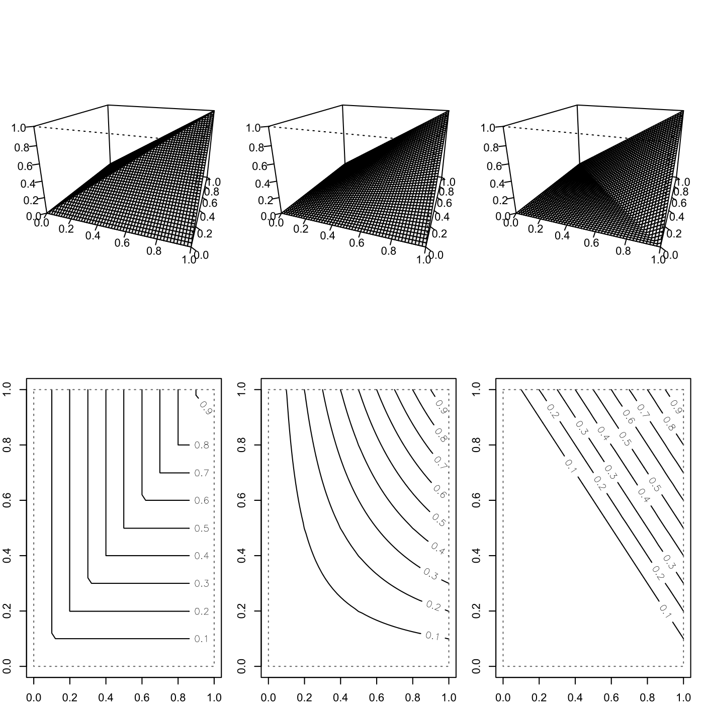

[](http://quantlet.de/)

## [](http://quantlet.de/) **SFEfrechet** [](http://quantlet.de/)

```yaml

Name of QuantLet : SFEfrechet

Published in : Statistics of Financial Markets

Description : 'Plots distribution and distribution contour of Frechet-Hoeffding upper bound, lower
bound and product (independence) copula into a grid.'

Keywords : copula, distribution, plot, graphical representation, 3D, Frechet, cdf, contour

See also : 'SFEclaytonMC, SFEstaticCop, SFEtCop, SFEVaRcopulaSIM2ptv, SFEArchCopDensity,
BCS_ClaytonMC, SFEplotCop, SFEgaussCop, SFEresDens, SFEtMC, SFScontourgumbel, SFEgaussCop'

Author : Ostap Okhrin

Submitted : Mon, November 10 2014 by Felix Jung

```




### R Code:
```r

# clear variables and close windows
rm(list = ls(all = TRUE))
graphics.off()

# install and load packages
libraries = c("copula")
lapply(libraries, function(x) if (!(x %in% installed.packages())) {
install.packages(x)
})
lapply(libraries, library, quietly = TRUE, character.only = TRUE)

# Set up plotting grid
layout(matrix(c(1, 2, 3, 4, 5, 6), 2, 3, byrow = TRUE))  # Defines the array of the plots
par(mar = c(2, 2, 2, 1), pty = "m")  # Adds margins to the plot edges

# Compute copulae
maxCop  = normalCopula(1)   # Frechet-Hoeffding upper bound
prodCop = indepCopula()     # Product copula
minCop  = normalCopula(-1)  # Frechet-Hoeffding lower bound

# Create perspective plots of copulae
persp(maxCop, pCopula, theta = 20, phi = 20, shade = 0.1, ticktype = "detailed", 
    ylab = "", xlab = "", zlab = "")
persp(prodCop, pCopula, theta = 20, phi = 20, shade = 0.1, ticktype = "detailed", 
    ylab = "", xlab = "", zlab = "")
persp(minCop, pCopula, theta = 20, phi = 20, shade = 0.1, ticktype = "detailed", 
    ylab = "", xlab = "", zlab = "")

# Create contour diagrams of copulae
contour(maxCop, pCopula, xlim = c(0, 1), ylim = c(0, 1), ann = FALSE)
contour(prodCop, pCopula, xlim = c(0, 1), ylim = c(0, 1), ann = FALSE)
contour(minCop, pCopula, xlim = c(0, 1), ylim = c(0, 1), ann = FALSE)
```
