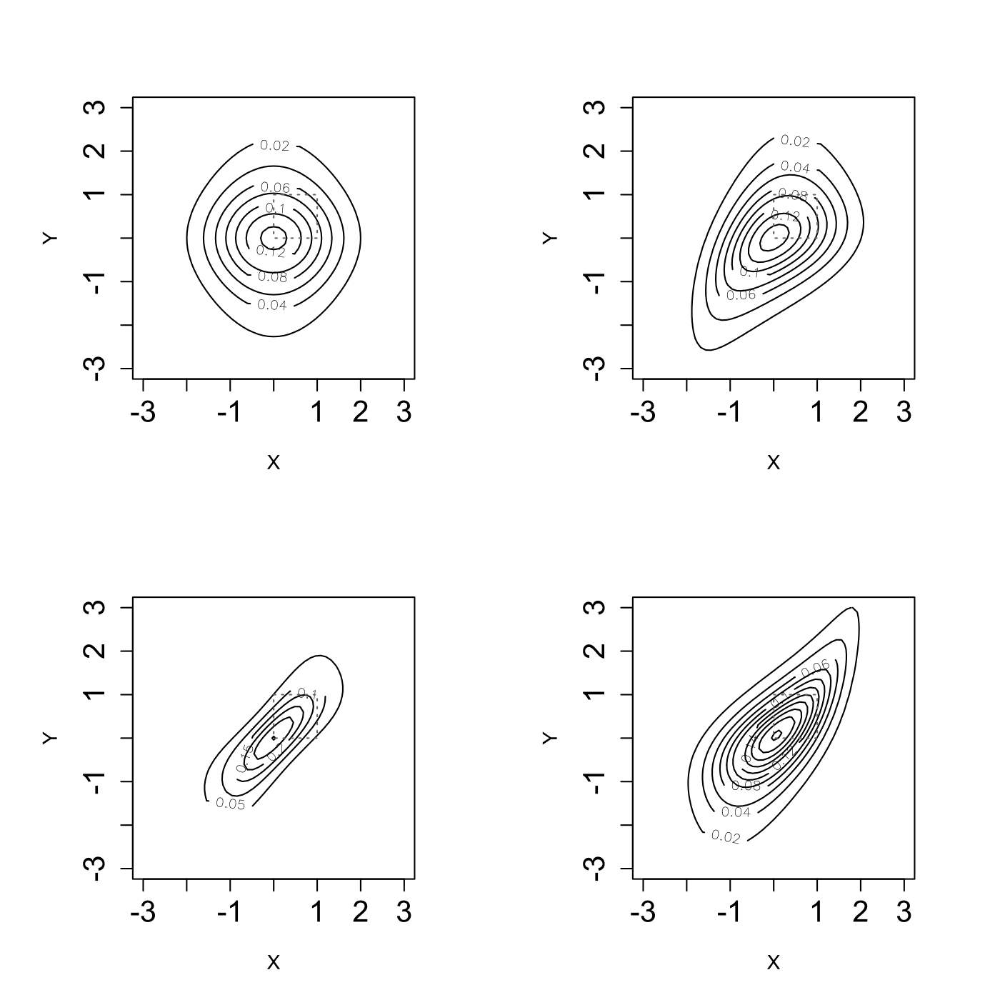

[](http://quantlet.de/)

## [](http://quantlet.de/) **SFEplotCop** [](http://quantlet.de/)

```yaml

Name of QuantLet : SFEplotCop

Published in : Statistics of Financial Markets

Description : 'Plots (joint) pdf contours of a standard normal and a t3 distributed variable with
normal, Clayton, Frank and Gumbel Copula.'

Keywords : 'copula, distribution, normal, normal-distribution, plot, graphical representation, pdf,
density, clayton, Frank, gaussian, gumbel'

See also : 'SFEclaytonMC, SFEstaticCop, SFEtCop, SFEVaRcopulaSIM2ptv, SFEArchCopDensity,
BCS_ClaytonMC, SFEfrechet, SFEgaussCop, SFEresDens, SFEtMC, SFScontourgumbel, SFEgaussCop'

Author : Ostap Okhrin

Submitted : Tue, September 13 2011 by Awdesch Melzer

Example : 'Pdf contour plots, with (clockwise) Gaussian (rho = 0), Clayton (theta = 0.9), Frank
(theta = 8) and Gumbel (theta = 2) copulae.'

```




### R Code:
```r

# clear variables and close windows
rm(list = ls(all = TRUE))
graphics.off()

# install and load packages
libraries = c("copula")
lapply(libraries, function(x) if (!(x %in% installed.packages())) {
install.packages(x)
})
lapply(libraries, library, quietly = TRUE, character.only = TRUE)

# plot
layout(matrix(c(1, 2, 4, 3), 2, 2, byrow = TRUE))
par(pty = "s")

# gaussMVD is a multivariate distribution function constructed from copulas
# the first margin is normally distributed with the corresponding parameters
# the second margin is t-distributed with df=3
gaussMVD = mvdc(normalCopula(0), margins = c("norm", "t"), paramMargins = list(list(mean = 0, 
    sd = 1), list(df = 3)))
# the contour diagram of the density of gaussMVD is plotted
contour(gaussMVD, dMvdc, xlim = c(-3, 3), ylim = c(-3, 3), nlevels = 10, xlab = "X", 
    ylab = "Y", cex.axis = 1.5)

clayMVD = mvdc(claytonCopula(0.9), margins = c("norm", "t"), paramMargins = list(list(mean = 0, 
    sd = 1), list(df = 3)))
contour(clayMVD, dMvdc, xlim = c(-3, 3), ylim = c(-3, 3), xlab = "X", ylab = "Y", 
    cex.axis = 1.5)

gumMVD = mvdc(gumbelCopula(2), margins = c("norm", "t"), paramMargins = list(list(mean = 0, 
    sd = 1), list(df = 3)))
contour(gumMVD, dMvdc, xlim = c(-3, 3), ylim = c(-3, 3), xlab = "X", ylab = "Y", 
    cex.axis = 1.5)

frankMVD = mvdc(frankCopula(8), margins = c("norm", "t"), paramMargins = list(list(mean = 0, 
    sd = 1), list(df = 3)))
contour(frankMVD, dMvdc, xlim = c(-3, 3), ylim = c(-3, 3), xlab = "X", ylab = "Y", 
    nlevels = 10, cex.axis = 1.5)

```
