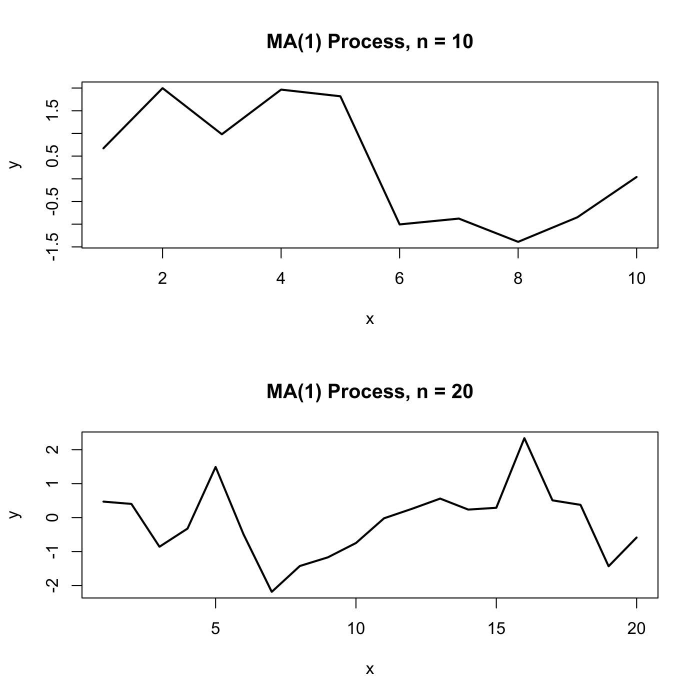

[](http://quantlet.de/)

## [](http://quantlet.de/) **SFEplotma1** [](http://quantlet.de/)

```yaml

Name of QuantLet : SFEplotma1

Published in : Statistics of Financial Markets

Description : 'Plots two realizations of an MA(1) (moving average) process with MA coefficient =
beta, random normal innovations and n=n1 (above) and n=n2 (below).'

Keywords : 'moving-average, stationary, linear, discrete, simulation, time-series, process,
stochastic-process, stochastic, plot, graphical representation'

See also : SFEacfar2, SFEacfma1, SFEacfma2

Author : Joanna Tomanek, Lasse Groth

Submitted : Wed, September 14 2011 by Awdesch Melzer

Input: 
- n1, n2: lags
- beta: moving average coefficient

Example : An example is produced for beta=0.5, n1=10 and n2=20.

Code warning: 
- 1: 'In min(Mod(polyroot(c(1, -model$ar)))) :'
- 2: no non-missing arguments to min; returning Inf

```




### R Code:
```r

# clear variables and close windows
rm(list = ls(all = TRUE))
graphics.off()

# install and load packages
libraries = c("stats")
lapply(libraries, function(x) if (!(x %in% installed.packages())) {
    install.packages(x)
})
lapply(libraries, library, quietly = TRUE, character.only = TRUE)

# parameter settings
n1   = "10"
n2   = "20"
beta = "0.5"

# Input n1
message = "Please specify n1"
default = n1
n1 = winDialogString(message, default)
n1 = type.convert(n1, na.strings = "NA", as.is = FALSE)

# Input n2
message = "Please specify n2"
default = n2
n2 = winDialogString(message, default)
n2 = type.convert(n2, na.strings = "NA", as.is = FALSE, dec = ".")

# Input moving average coefficient
message = "Please specify MA-component"
default = beta
beta = winDialogString(message, default)
beta = type.convert(beta, na.strings = "NA", as.is = FALSE, dec = ".")

# Simulation of MA(1)-processes
x1 = arima.sim(n1, model = list(ar = 0, d = 0, ma = beta), rand.gen = function(n1) rnorm(n1, 
    0, 1))
x2 = arima.sim(n2, model = list(ar = 0, d = 0, ma = beta), rand.gen = function(n2) rnorm(n2, 
    0, 1))

x1 = as.matrix(x1)
x2 = as.matrix(x2)

# Plot
par(mfrow = c(2, 1))

par(mfg = c(1, 1))
plot(x1, type = "l", lwd = 2, xlab = "x", ylab = "y")
title(paste("MA(1) Process, n =", n1))

par(mfg = c(2, 1))
plot(x2, type = "l", lwd = 2, xlab = "x", ylab = "y")
title(paste("MA(1) Process, n =", n2))

```
