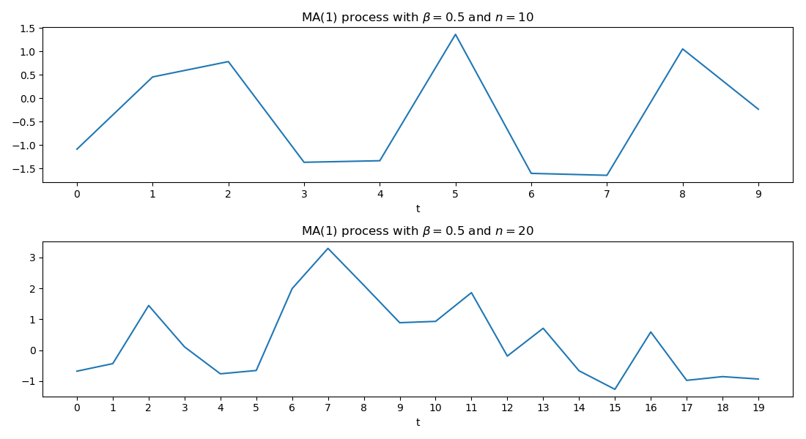

[](http://quantlet.de/)

## [](http://quantlet.de/) **SFEplotma1** [](http://quantlet.de/)

```yaml

Name of QuantLet: SFEplotma1

Published in: Statistics of Financial Markets

Description: 'Plots two realizations of an MA(1) (moving average) process with MA coefficient = beta, random normal innovations and n=n1 (above) and n=n2 (below).'

Keywords: moving-average, stationary, linear, discrete, simulation, time-series, process, stochastic-process, stochastic, plot, graphical representation

See also: SFEacfar2, SFEacfma1, SFEacfma2 

Author: Joanna Tomanek, Lasse Groth, WK Härdle
Author[Python]: Justin Hellermann

Submitted: Wed, September 14 2011 by Awdesch Melzer, 20190704 changed by WKH deleted the dialogue interface.
Submitted[Python]: Thu, Aug 01 2019 by Justin Hellermann

Input: 
- n1, n2 : lags
- beta : moving average coefficient 

Example: 'An example is produced for beta=0.5, n1=10 and n2=20.' 

Code warning:
- 1: 'In min(Mod(polyroot(c(1, -model$ar)))) :'
- 2: no non-missing arguments to min; returning Inf

```




### R Code
```r


# clear variables and close windows
rm(list = ls(all = TRUE))
graphics.off()

# install and load packages
libraries = c("stats")
lapply(libraries, function(x) if (!(x %in% installed.packages())) {
    install.packages(x)
})
lapply(libraries, library, quietly = TRUE, character.only = TRUE)

# parameter settings
n1   = 10
n2   = 20
beta = 0.5

# Simulation of MA(1)-processes
x1 = arima.sim(n1, model = list(ar = 0, d = 0, ma = beta), rand.gen = function(n1) rnorm(n1, 
    0, 1))
x2 = arima.sim(n2, model = list(ar = 0, d = 0, ma = beta), rand.gen = function(n2) rnorm(n2, 
    0, 1))

x1 = as.matrix(x1)
x2 = as.matrix(x2)

# Plot
par(mfrow = c(2, 1))

par(mfg = c(1, 1))
plot(x1, type = "l", lwd = 2, xlab = "x", ylab = "y")
title(paste("MA(1) Process, n =", n1))

par(mfg = c(2, 1))
plot(x2, type = "l", lwd = 2, xlab = "x", ylab = "y")
title(paste("MA(1) Process, n =", n2))

```

automatically created on 2019-08-01

### PYTHON Code
```python

import pandas as pd
import numpy as np
from statsmodels.graphics.tsaplots import plot_acf
import matplotlib.pyplot as plt
from statsmodels.tsa.arima_process import ArmaProcess

# parameter settings
lag = 30    # lag value
n1 = 10
n2 = 20
b = 0.5

# Obtain MA(1) sample by sampling from a ARMA() model with no AR coefficient
ar1 = np.array([1])
ma1 = np.array([1,b])
np.random.seed(123)
MA_object1 = ArmaProcess(ar1,ma1)
simulated_data_1 = MA_object1.generate_sample(nsample=n1)
simulated_data_2 = MA_object1.generate_sample(nsample=n2)


f, ax = plt.subplots(2,figsize=(11, 6))
ax[0].plot(simulated_data_1)#title='Sample ACF of an MA(1) Process')
ax[0].set_xlabel('t')
ax[0].set_title(r'MA(1) process with $\beta=$'+str(b)+' and $n=10$')
ax[0].set_xticks(np.arange(0, n1, step=1))

ax[1].plot(simulated_data_2)
ax[1].set_xlabel('t')
ax[1].set_title(r'MA(1) process with $\beta=$'+str(b)+' and $n=20$')
ax[1].set_xticks(np.arange(0, n2, step=1))
plt.tight_layout()
plt.savefig('SFEplotma1_py.png')
plt.show()
```

automatically created on 2019-08-01