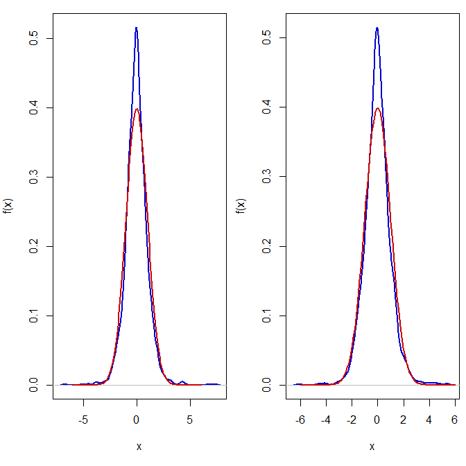

[](http://quantlet.de/)

## [](http://quantlet.de/) **SFEresDens** [](http://quantlet.de/)

```yaml

Name of QuantLet: SFEresDens

Published in: Statistics of Financial Markets

Description: 'Plots the Kernel density estimator of the residuals and 
	      of the normal density for the log-returns of the Deutsche Telekom 
              and Volkswagen from  10.05.2004 to 07.05.2014,'

Keywords: Quartic, copula, density, garch, normal, kernel

See also: BCS_ClaytonMC, SFEclaytonMC, SFEgaussCop, SFEtCop, SFEtMC, SFScontourgumbel

Author: Ostap Okhrin, Piedad Castro

Submitted: Thu, June 30 2016 by Piedad Castro

Input: 'The datafile contains daily price data from 07.05.2004 to 07.05.2014 for 
selected companies which are part of DAX30 and FTSE100 as well as the 
corresponding index data. This code makes use of the daily prices for the Deutsche 
Telekom and Volkswagen.'

```



### R Code
```r

# clear variables and close windows
rm(list = ls(all = TRUE))
graphics.off()

# set working directory
# setwd("C:/...")
setwd("D:/Trabajo HU")

# install and load packages
libraries = c("data.table", "fGarch")
lapply(libraries, function(x) if (!(x %in% installed.packages())) {
  install.packages(x)
})
lapply(libraries, library, quietly = TRUE, character.only = TRUE)

# load data
dataset = fread("2004-2014_dax_ftse.csv", select =  c("DEUTSCHE TELEKOM", "VOLKSWAGEN"))
dataset = as.data.frame(dataset)

# log-returns
X = lapply(dataset, 
           function(x){
             diff(log(x))
           })

garchModel = lapply(X, 
                    function(x){
                      garchFit(~garch(1, 1), data = x, trace = F)
                    })

eps = lapply(garchModel, 
             function(x){
               x@residuals/x@sigma.t
             })

eps = as.data.frame(eps)

means = colMeans(eps)
sds   = sapply(eps, sd)

# Plot: kernel density estimator of the residuals and of the normal density
layout(matrix(1:ncol(eps), 1, ncol(eps), byrow = TRUE))
for(i in 1:ncol(eps)){
  par(mai = c(1, 0.8, 0.2, 0.1)) 
  plot(density(eps[[i]], kernel = "biweight"), main = "", xlab = "x",  ylab = "f(x)", col = "blue3", lwd = 2)
  x.norm = seq(means[i] - 6*sds[i], means[i] + 6*sds[i], length.out = 100)
  y.norm = dnorm(x.norm, means[i], sds[i])
  lines(x.norm, y.norm, col = "red3", type = "l", lwd = 2)
}
dev.off()

```

automatically created on 2018-05-28