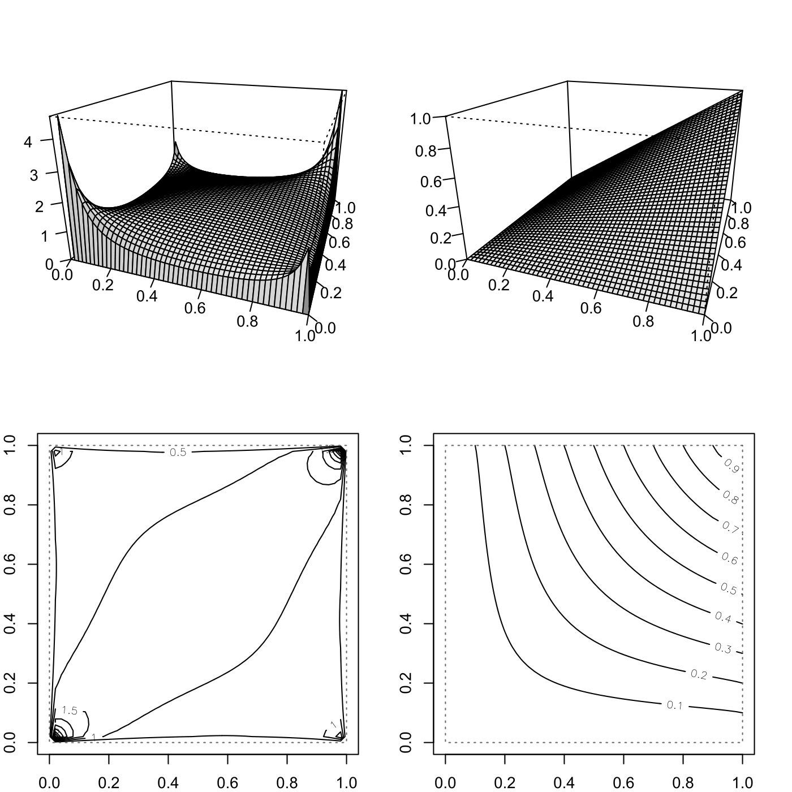

[](http://quantlet.de/)

## [](http://quantlet.de/) **SFEtCop** [](http://quantlet.de/)

```yaml

Name of QuantLet : SFEtCop

Published in : Statistics of Financial Markets

Description : 'Plots density, distribution, density contour and distribution contour of a t-copula
with 2 dimensions, df=3 and parameter=0.2.'

Keywords : 'copula, distribution, t-distribution, plot, graphical representation, pdf, cdf,
density, contour, clayton, Frank, gaussian, gumbel'

See also : 'SFEclaytonMC, SFEstaticCop, SFEplotCop, SFEVaRcopulaSIM2ptv, SFEArchCopDensity,
BCS_ClaytonMC, SFEfrechet, SFEgaussCop, SFEresDens, SFEtMC, SFScontourgumbel, SFEgaussCop'

Author : Ostap Okhrin

Submitted : Mon, November 10 2014 by Felix Jung

```




### R Code:
```r

# clear variables and close windows
rm(list = ls(all = TRUE))
graphics.off()

# install and load packages
libraries = c("copula")
lapply(libraries, function(x) if (!(x %in% installed.packages())) {
install.packages(x)
})
lapply(libraries, library, quietly = TRUE, character.only = TRUE)

# Set up plotting grid
layout(matrix(c(1, 2, 3, 4), 2, 2, byrow = TRUE))
par(mar = c(2, 2, 2, 2))

tCop = tCopula(param = 0.2, df = 3, dim = 2)

# Create perspective plots of density and distribution
persp(tCop, dCopula, phi = 20, theta = 20, ticktype = "detailed", ylab = "", xlab = "", 
    zlab = "", shade = 0.1)
persp(tCop, pCopula, phi = 20, theta = 20, ticktype = "detailed", ylab = "", xlab = "", 
    zlab = "", shade = 0.1)

# Create contour diagrams of density and distribution
contour(tCop, dCopula)
contour(tCop, pCopula)
```
