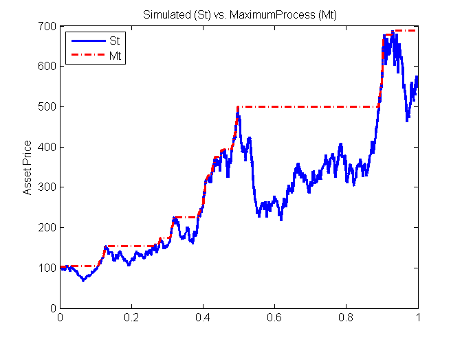

[](http://quantlet.de/)

## [](http://quantlet.de/) **SFEmaxprocess** [](http://quantlet.de/)

```yaml

Name of QuantLet: SFEmaxprocess

Published in: Statistics of Financial Markets

Description: 'Plots a simulated price process (St) as a solid line and the maximum process (Mt) as an increasing dotted line.'

Keywords: asset, black-scholes, european-option, exotic-option, financial, graphical representation, option, option-price, plot, maximum process, process, stochastic, stochastic-process, random-walk, wiener-process, brownian-motion, simulation

Author: Maria de Lourdes Alavez Estevez

Author [Matlab]: Maria de Lourdes Alavez Estevez

Submitted: Wed, April 02 2014 by Felix Jung

Input: 
- S0: Stocks Initial Price
- r: Interest Rate per year
- vol: Volatility per year

Example: 
- Example: User inputs the SFE3maxprocess parameters [Stocks Initial Price, Interest Rate, Volatility] like [100,0.05,0.03].
```




### R Code
```r


# clear variables and close windows
rm(list = ls(all = TRUE))
graphics.off()

# parameter settings
para = c(100, 0.05, 0.03)
S0   = para[1]  # Initial Stock Price
r    = para[2]  # Interest Rate per Year
vol  = para[3]  # Volatility per Year
N    = 1000
t    = 1:N/N

volatility    = vol * vol
dt            = 1
randomWt1     = rnorm(N, 0, 1)
Wtsum1        = cumsum(t(randomWt1))
Path1         = exp((r - 0.5 * volatility) * dt + vol * sqrt(dt) * Wtsum1)
StockPath1    = matrix(0, N, 1)
StockPath1[1] = S0

for (i in 2:N) {
    StockPath1[i] = S0 * Path1[i]
}

s    = StockPath1
y    = matrix(0, N, 1)
y[i] = s[1]

for (i in 2:N) {
    if (s[i] > y[i - 1]) {
        y[i] = s[i]
    } else {
        y[i] = y[i - 1]
    }
}

# plot
plot(t, StockPath1, type = "l", col = "blue3", lwd = 2, ylab = "Asset Price", xlab = "", main = "Simulated process (St) vs Maximum process (Mt)")
lines(t, y, col = "red3", lty = "dotted", lwd = 2)
legend(0, max(y), c("St", "Mt"), lty = c(1, 1), lwd = 3, col = c("blue3", "red3"), 
    bg = "white")
```

automatically created on 2018-05-28

### MATLAB Code
```matlab

clear
close all
clc

RandStream.setGlobalStream(RandStream('mt19937ar', 'seed', 33));
disp('Please input Stock&#65533;s Initial Price S0, Interest Rate per Year r');
disp('Volatility per year vol');
disp('as:[100, 0.05, 0.03]');
disp(' ');
para = input('[S0, r, vol]=');

while length(para) < 3
    disp('Not enough input arguments. Please input in 1*3 vector form like [100, 0.05, 0.03]');
    disp(' ');
    para = input('[S0, r, vol]=');
end

S0            = para(1); %Initial Stock Price
r             = para(2);  %Interest Rate per Year
vol           = para(3);%Volatility per Year
N             = 1000;
t             = (1:N) / N;
volatility    = vol * vol;
dt            = 1;
randomWt1     = normrnd(0, 1, N, 1);
Wtsum1        = cumsum(randomWt1);
Path1         = exp((r - 0.5 * volatility) * dt + vol * sqrt(dt) * Wtsum1);
StockPath1    = zeros(N, 1);
StockPath1(1) = S0;

for i = 2:N
    StockPath1(i) = S0 * Path1(i);
end

s    = StockPath1;
y    = zeros(N, 1);
y(1) = s(1);

for i = (2:N)
    if s(i) > y(1:i);
        y(i) = s(i);
    else
        y(i) = y(i-1);
    end
end

plot(t, StockPath1, 'blue', 'LineWidth', 2)
hold on
plot(t, y, 'red -.', 'LineWidth', 2)
hold on
ylabel('Asset Price')
title(' Simulated (St) vs. MaximumProcess (Mt)')
legend('St', 'Mt', 'Location', 'NorthWest')
hold off

```

automatically created on 2018-05-28