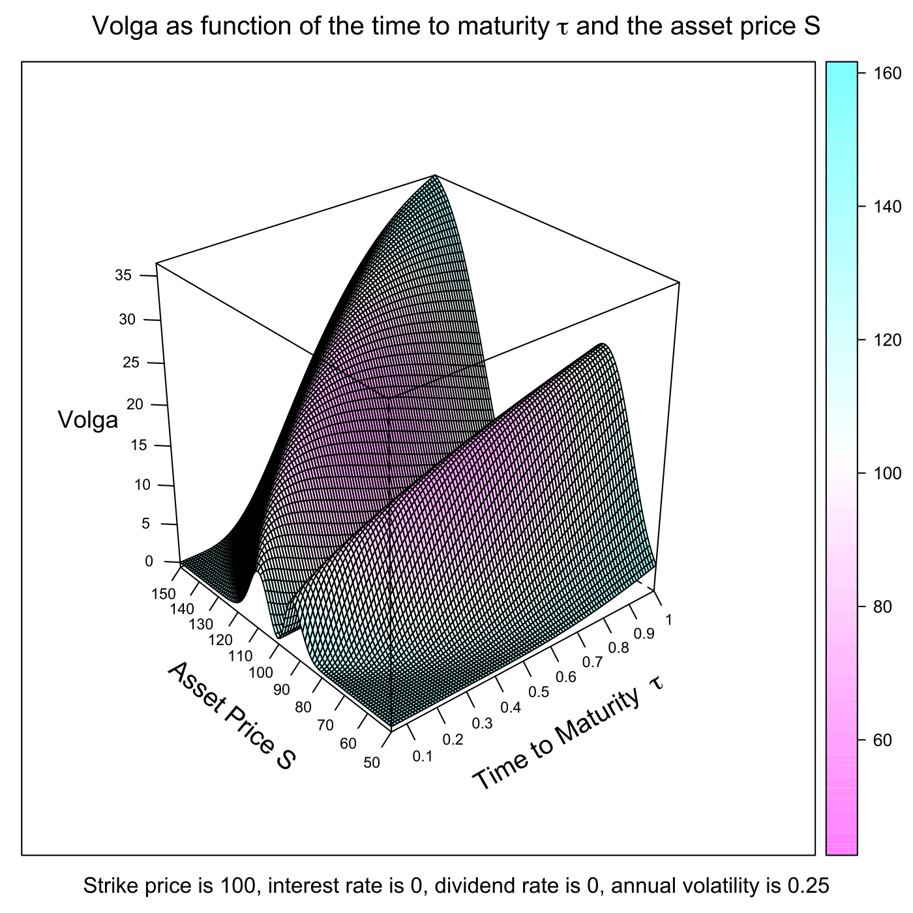

[](http://quantlet.de/)

## [](http://quantlet.de/) **SFEvolga** [](http://quantlet.de/)

```yaml

Name of QuantLet : SFEvolga

Published in : Statistics of Financial Markets

Description : 'Plots the Volga of a call option as a function of the time to maturity and the asset
price.'

Keywords : 'asset, black-scholes, call, european-option, financial, graphical representation,
greeks, option, option-price, plot'

See also : 'SFEvanna, SFEdelta, SFEgamma, SFEvega, SFEtheta, SFEspeed, SFEcharmcall, SFEcolor,
SFEultima, SFEvomma, SFEzomma, SFEdvegadtime'

Author : Ying Chen, Christian M. Hafner

Submitted : Fri, June 13 2014 by Philipp Gschoepf

Example : 'For given [lower, upper] bound of Asset price S like [50,150] and [lower, upper] bound
of time to maturity tau like [0.05, 1] a plot of the Volga of a call option is produced.'

```




### R Code:
```r

# clear variables and close windows
rm(list = ls(all = TRUE))
graphics.off()

# install and load packages
libraries = c("lattice")
lapply(libraries, function(x) if (!(x %in% installed.packages())) {
install.packages(x)
})
lapply(libraries, library, quietly = TRUE, character.only = TRUE)

# parameter settings
S_min   = 50          # lower bound of Asset Price
S_max   = 150         # upper bound of Asset Price 
tau_min = 0.01        # lower bound of Time to Maturity
tau_max = 1           # upper bound of Time to Maturity
s       = 100         # stock price
k       = 100         # exercise price 
r       = 0           # interest rate
sig     = 0.25        # volatility
tau     = 0.5         # time to maturity
q       = 0           # dividend rate
steps   = 100         # steps

meshgrid = function(a, b) {
    list(x = outer(b * 0, a, FUN = "+"), y = outer(b, a * 0, FUN = "+"))
}

first = meshgrid(seq(tau_min, tau_max, -(tau_min - tau_max)/(steps - 1)), seq(tau_min, tau_max, -(tau_min - tau_max)/(steps - 
    1)))

tau  = first$x
dump = first$y

second = meshgrid(seq(S_min, S_max, -(S_min - S_max)/(steps - 1)), seq(S_min, S_max, -(S_min - S_max)/(steps - 1)))

dump2 = second$x
S     = second$y

d1    = (log(S/k) + (r - q - sig^2/2) * tau)/(sig * sqrt(tau))
volga = (S * sqrt(tau) * exp(-q * tau) * dnorm(d1) * d1 * (d1 - sig * sqrt(tau)))

# Plot
title = bquote(expression(paste("Strike price is ", .(k), ", interest rate is ", 
    .(r), ", dividend rate is ", .(q), ", annual volatility is ", .(sig))))
wireframe(volga ~ tau * S, drape = T, ticktype = "detailed", main = expression(paste("Volga as function of the time to maturity ", 
    tau, " and the asset price S")), sub = title, scales = list(arrows = FALSE, 
    col = "black", distance = 1, tick.number = 8, cex = 0.7, x = list(labels = round(seq(tau_min, 
        tau_max, length = 11), 1)), y = list(labels = round(seq(S_min, S_max, length = 11), 
        1))), xlab = list(expression(paste("Time to Maturity  ", tau)), rot = 30, 
    cex = 1.2), ylab = list("Asset Price S", rot = -40, cex = 1.2), zlab = list("Volga", 
    cex = 1.1))

```
