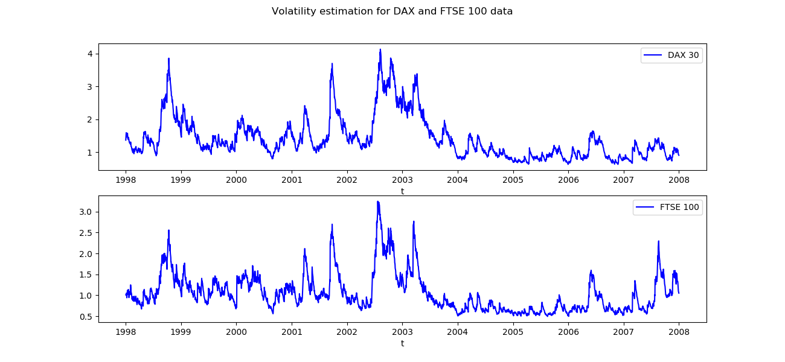

[](http://quantlet.de/)

## [](http://quantlet.de/) **SFEvolgarchest** [](http://quantlet.de/)

```yaml

Name of QuantLet: SFEvolgarchest

Published in: Statistics of Financial Markets

Description: 'Reads the date, DAX index values, stock prices of 20 largest companies at Frankfurt Stock Exchange (FSE), FTSE 100 index values and stock prices of 20 largest companies at London Stock Exchange (LSE) and estimates the volatility of the DAX and FTSE 100 daily return processes from 1998 to 2007 using a GARCH(1,1) model.'

Keywords: data visualization, graphical representation, plot, financial, asset, stock-price, returns, time-series, dax, ftse100, index, descriptive-statistics, volatility, garch, index

See also: SFEtimeret, SFEvolnonparest, SFEmvol01, SFEmvol03, SFElshill, SFEtail

Author: Andrija Mihoci
Author[Python]: Justin Hellermann

Submitted: Thu, December 15 2011 by Dedy Dwi Prastyo
Submitted[Python]: Thu, Aug 01 2019 by Justin Hellermann
Datafiles: FSE_LSE.dat

Example: 'Plot of time series of estimated next-day volatility for DAX and FTSE 100 returns.'

Code warning: 
- '1: In sqrt(diag(fit$cvar)) : NaNs produced'

```




### R Code
```r


# clear variables and close windows
rm(list = ls(all = TRUE))
graphics.off()

# install and load packages
libraries = c("tseries", "fGarch")
lapply(libraries, function(x) if (!(x %in% installed.packages())) {
    install.packages(x)
})
lapply(libraries, library, quietly = TRUE, character.only = TRUE)

# load data
DS  = read.table("FSE_LSE.dat")
D   = DS[, 1]                       # date
S   = DS[, 2:43]                    # S(t)
s   = log(S)                        # log(S(t))
n1  = dim(s)
end = n1[1]                         # end of sample
r   = s[-1, ] - s[1:(end - 1), ]    # r(t)
n   = dim(r)[1]                     # sample size
t   = 1:n                           # time index, t

# DAX and FTSE 100 returns
rdax  = r[, 1]     # DAX returns
rftse = r[, 22]    # FTSE 100 returns

# ARCH(q) models for the volatility process of DAX returns
for (i in 1:15) {
    assign(paste("dax.garch", i, sep = ""), garchFit(substitute(~garch(i, 1), list(i = i, 
        0)), rdax, trace = FALSE))
    assign(paste("ftse.garch", i, sep = ""), garchFit(substitute(~garch(i, 1), 
        list(i = i, 0)), rftse, trace = FALSE))
}

# Read the optimized log-likelihood value for q=1:15
dax.LLF = c(dax.garch1@fit$llh, dax.garch2@fit$llh, dax.garch3@fit$llh, dax.garch4@fit$llh, 
    dax.garch5@fit$llh, dax.garch6@fit$llh, dax.garch7@fit$llh, dax.garch8@fit$llh, 
    dax.garch9@fit$llh, dax.garch10@fit$llh, dax.garch11@fit$llh, dax.garch12@fit$llh, 
    dax.garch13@fit$llh, dax.garch14@fit$llh, dax.garch15@fit$llh) * (-1)

ftse.LLF = c(ftse.garch1@fit$llh, ftse.garch2@fit$llh, ftse.garch3@fit$llh, ftse.garch4@fit$llh, 
    ftse.garch5@fit$llh, ftse.garch6@fit$llh, ftse.garch7@fit$llh, ftse.garch8@fit$llh, 
    ftse.garch9@fit$llh, ftse.garch10@fit$llh, ftse.garch11@fit$llh, ftse.garch12@fit$llh, 
    ftse.garch13@fit$llh, ftse.garch14@fit$llh, ftse.garch15@fit$llh) * (-1)

# AR(1)-GARCH(1,1) volatility estimation for DAX and FTSE 100 data
dax.arch1  = garchFit(~arma(1, 0) + garch(1, 1), rdax, trace = FALSE)
ftse.arch1 = garchFit(~arma(1, 0) + garch(1, 1), rftse, trace = FALSE)

# Labels
time      = strptime(D, format = "%Y%m%d")
labels    = as.numeric(format(as.Date(time, "%Y-%m-%d"), "%Y"))
where.put = c(1, which(diff(labels) == 1) + 1)

title = bquote(paste("Volatility estimation for DAX and FTSE 100 data"))

# Plot of the DAX volatility
par(mfrow = c(2, 1))
plot(dax.arch1@sigma.t, main = "DAX", col = "blue3", type = "l", axes = FALSE, 
    frame = TRUE, ylab = "", xlab = "", ylim = c(0, 0.045), )
axis(side = 2, at = seq(0, 0.05, 0.01), label = seq(0, 0.05, 0.01), lwd = 1, cex.axis = 1)
axis(side = 1, at = where.put, label = labels[where.put], lwd = 0.5, cex.axis = 1)
abline(h = seq(0, 0.05, 0.01), lty = "dotted", lwd = 0.5, col = "grey")
abline(v = where.put, lty = "dotted", lwd = 0.5, col = "grey")

# Plot of the FTSE 100 volatility
plot(ftse.arch1@sigma.t, main = "FTSE 100", col = "blue3", axes = FALSE, frame = TRUE, 
    type = "l", ylab = "", xlab = "Time, t", ylim = c(0, 0.035), sub = title)
axis(side = 2, at = seq(0, 0.05, 0.01), label = seq(0, 0.05, 0.01), lwd = 1, cex.axis = 1)
axis(side = 1, at = where.put, label = labels[where.put], lwd = 0.5, cex.axis = 1)
abline(h = seq(0, 0.05, 0.01), lty = "dotted", lwd = 0.5, col = "grey")
abline(v = where.put, lty = "dotted", lwd = 0.5, col = "grey")

```

automatically created on 2019-08-01

### PYTHON Code
```python

import numpy as np 
import pandas as pd 
import matplotlib.pyplot as plt
import arch
from arch import arch_model
from arch.univariate import GARCH
from statsmodels.tsa.arima_model import ARMA
import datetime

ds = pd.read_table("FSE_LSE.dat",header=None)
date = ds.iloc[:,0]

def log_returns(df):
	logs=np.log((df.pct_change()+1).dropna())
	logs=pd.DataFrame(logs)
	return(logs)

class index_data():
	def __init__(self):
		pass

	def feed_data(self,data):
		self.raw_ts=data

	def fit_ARCH(self,data):#fit ARCH(q)models
		llhs=[]
		for q in np.arange(0,15):
			#return is scaled in order to facilitate convergence
			self.arch = arch_model(data*100,vol='ARCH',p=1,q=q)
			self.arch_fit=self.arch.fit(disp='off')
			llh=self.arch_fit.loglikelihood
			llhs.append(llh)
		self.llh=llh

	def fit_ARMA_GARCH(self,data):

		#fit the GARCH with AR term
		self.garch = arch_model(data*100,vol='GARCH',p=1,q=1,mean='ARX')
		self.garch_fit = self.garch.fit(disp='off')
		self.arma_garch_vola=self.garch_fit._volatility
		

r = log_returns(ds.iloc[:,np.arange(1,42)])
rdax = r.iloc[:,0]
rftse = r.iloc[:,21]
n = ds.shape[0]
t = np.arange(n)

dax = index_data()
dax.feed_data(ds.iloc[:,1])
dax.fit_ARCH(rdax)
dax.fit_ARMA_GARCH(rdax)

ftse = index_data()
ftse.feed_data(ds.iloc[:,21])
ftse.fit_ARCH(rftse)
ftse.fit_ARMA_GARCH(rftse)

n=ftse.arma_garch_vola.shape[0]
date_str=[str(d) for d in date]

date_str=[d[:4]+'-'+d[4:6]+'-'+d[6:] for d in date_str]
dt=[datetime.datetime.strptime(d,'%Y-%m-%d') for d in date_str]


fig, ax = plt.subplots(2,1,figsize=(13, 6))
fig.suptitle('Volatility estimation for DAX and FTSE 100 data')
ax[0].plot(dt[-n:],dax.arma_garch_vola,label='DAX 30',color='blue')
ax[0].set_xlabel('t')

ax[0].legend()

ax[1].plot(dt[-n:],ftse.arma_garch_vola,color='blue',label='FTSE 100')
ax[1].set_xlabel('t')
ax[1].legend()

fig.suptitle('Volatility estimation for DAX and FTSE 100 data')
plt.savefig('SFEvolgarchest_py.png')
plt.show()


```

automatically created on 2019-08-01