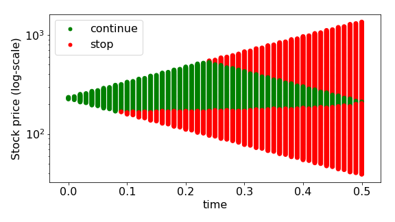

[](http://quantlet.de/)

## [](http://quantlet.de/) **SFEbitreeCDiv** [](http://quantlet.de/)

```yaml

Name of QuantLet: SFEbitreeCDiv

Published in: Statistics of Financial Markets

Description: 'Computes European/American option prices using a binomial tree for assets with/without continuous dividends.'

Keywords: 'binomial, tree, asset, call, put, option, option-price, european-option, dividends, financial, black-scholes'

See also: SFEbitreeFDiv, SFEbitreePDiv, SFSbitreeNDiv

Author[R]: Awdesch Melzer, Ying Chen

Author[Matlab]: Ying Chen

Author[Python]: Franziska Wehrmann

Submitted[R]: Tue, June 17 2014 by Thijs Benschop
Submitted[Python]: Thu, January 30 2020 by Franziska Wehrmann

Input: 
- i : Interest Rate
- type : 0 is American, 1 is European
- n : Number of Intervals
- k : Exercise Price
- t : Time to Expiration
- s0 : Stock Price
- sig : Volatility
- div : Contionous Dividend in Percentage
- flag : 1 is call, 0 is Put

Output: binomial trees and price of option

Example: 'User inputs parameters [s0, k, i, sig, t, n, type] like [230, 210, 0.04545, 0.25, 0.5, 5 ,0], [option (1 for call, 0 for put), continuous dividend in percentage (0 for no dividend)] as [1, 0.2], then call price is shown.'

Example[Matlab]: 'User inputs the SFEbitreeCDiv parameters [s0, k, i, sig, t, n, type] like[230, 210, 0.04545, 0.25, 0.5, 5 ,0], [option (1 for call, 0 for put), continuous dividend in percentage (0 for no dividend)] as [1, 0.2], then American call price 21.4566 is shown. [s0, k, i, sig, t, n, type] like [1.5, 1.5, 0.09, 0.2, 0.33, 6 ,1], [option (1 for call, 0 for put), continuous dividend in percentage (0 for no dividend)] as [1, 0.02], then American call price 0.0836 is shown.' 

Example[python]: 'Download .py file and run or copy-paste in jupyter notebook. Change variables in MAIN section of script (below definition of fuctions).'

```



### R Code
```r


# clear variables and close windows
rm(list = ls(all = TRUE))
graphics.off()

# input parameters
print("Please input Price of Underlying Asset s0, Exercise Price k, Domestic Interest Rate per Year i,")
print("Volatility per Year sig, Time to Expiration (Years) t, Number of steps n, type")
print("yields vector [s0, k, i, sig, t, n, type]=")
print("after 1. input the following: 230  210  0.04545  0.25  0.5  5  0")
print("then press enter two times")
para = scan()

while (length(para) < 7) {
    print("Not enough input arguments. Please input in 1*7 vector form like 230 210  0.04545  0.25  0.5  5  0)")
    print(" ")
    print("[s0, k, i, sig, t, n, type]=")
    para = scan()
}

s0   = para[1]     # Stock price
k    = para[2]     # Exercise price
i    = para[3]     # Rate of interest
sig  = para[4]     # Volatility
t    = para[5]     # Time to expiration
n    = para[6]     # Number of intervals
type = para[7]     # 0 is American/1 is European

# Check conditions
if (s0 <= 0) {
    print("SFEBiTree: Price of Underlying Asset should be positive! Please input again. s0=")
    s0 = scan()
}
if (k < 0) {
    print("SFEBiTree: Exercise price couldnot be negative! Please input again. k=")
    k = scan()
}
if (sig < 0) {
    print("SFEBiTree: Volatility should be positive! Please input again. sig=")
    sig = scan()
}
if (t <= 0) {
    print("SFEBiTree: Time to expiration should be positive! Please input again. t=")
    t = scan()
}
if (n < 1) {
    print("SFEBiTree: Number of steps should be at least equal to 1! Please input again. n=")
    n = scan()
}

print(" ")
print("Please input option choice (1 for call, 0 for put) flag, continuous dividend in percentage (0 if no dividend) div")
print("as: 1  0.2")
print("[flag div]=")
para2 = scan()

while (length(para2) < 2) {
    print("Not enough input arguments. Please input in 1*2 vector form like [1 0.2]")
    print("[flag div]=")
    para2 = scan()
}

flag = para2[1]     # 1 is call/0 is put
div  = para2[2]     # Contionous dividend in percentage
if (div < 0) {
    print("SFEBiTree: Dividend must be nonnegative! Please input again. div=")
    div = scan()
}

# Main computation
dt        = t/n                                       # Interval of step
u         = exp(sig * sqrt(dt))                       # Up movement parameter u
d         = 1/u                                       # Down movement parameter d
b         = i                                         # Costs of carry
p         = 0.5 + 0.5 * (b - sig^2/2) * sqrt(dt)/sig  # Probability of up movement
tdivn     = floor(tdiv/t * n - 1e-04) + 1
s         = matrix(1, n + 1, n + 1) * s0
un        = rep(1, n + 1) - 1
un[n + 1] = 1
dm        = t(un)
um        = matrix(0, 0, n + 1)
j         = 1

while (j < n + 1) {
    d1 = cbind(t(rep(1, n - j) - 1), t((rep(1, j + 1) * d)^(seq(1, j + 1) - 1)))
    dm = rbind(dm, d1)  # Down movement dynamics
    u1 = cbind(t(rep(1, n - j) - 1), t((rep(1, j + 1) * u)^((seq(j, 0)))))
    um = rbind(um, u1)  # Up movement dynamics
    j  = j + 1
}

um  = t(rbind(un, um))
s   = s[1, 1] * um * dm  # Stock price development
print("Stock_Price")
print(s)
s   = s[nrow(s):1, ]  # Rearangement
opt = matrix(0, nrow(s), ncol(s))

# Option is an American call
if ((flag == 1) && (type == 0)) {
    opt[, n + 1] = pmax(s[, n + 1] - k, 0)  # Determine option values from prices
    loopv = seq(n, 1)
    for (j in loopv) {
        l = seq(1, j)
        # Probable option values discounted back one time step
        discopt = ((1 - p) * opt[l, j + 1] + p * opt[l + 1, j + 1]) * exp(-b * 
            dt)
        # Option value is max of current price - X or discopt
        opt[, j] = rbind(t(t(pmax(s[l, j] - k, discopt))), t(t(rep(0, n + 1 - j))))
    } 
    American_Call_Price = opt[nrow(opt):1, ]
    print(American_Call_Price)
    print(" ")
    print("The price of the option at time t_0 is")
    print(American_Call_Price[n + 1, 1])
}

if ((flag == 1) && (type == 1)) {
    # Option is a European call
    opt[, n + 1] = pmax(s[, n + 1] - k, 0)  # Determine option values from prices
    loopv = seq(n, 1)
    for (j in loopv) {
        l = seq(1, j)
        # Probable option values discounted back one time step
        discopt = ((1 - p) * opt[l, j + 1] + p * opt[l + 1, j + 1]) * exp(-b * 
            dt)
        # Option value
        opt[, j] = rbind(t(t(discopt)), t(t(rep(0, n + 1 - j))))
    } 
    European_Call_Price = opt[nrow(opt):1, ]
    print(European_Call_Price)
    print(" ")
    print("The price of the option at time t_0 is")
    print(European_Call_Price[n + 1, 1])
}

if ((flag == 0) && (type == 0)) {
    # Option is an American put
    opt[, n + 1] = pmax(k - s[, n + 1], 0)  # Determine option values from prices
    loopv = seq(n, 1)
    for (j in loopv) {
        l = seq(1, j)
        # Probable option values discounted back one time step
        discopt = ((1 - p) * opt[l, j + 1] + p * opt[l + 1, j + 1]) * exp(-b * 
            dt)
        # Option value is max of X - current price or discopt
        opt[, j] = rbind(t(t(pmax(k - s[l, j], discopt))), t(t(rep(0, n + 1 - j))))
    } 
    American_Put_Price = opt[nrow(opt):1, ]
    print(American_Put_Price)
    print(" ")
    print("The price of the option at time t_0 is")
    print(American_Put_Price[n + 1, 1])
}

if ((flag == 0) && (type == 1)) {
    # Option is a European put
    opt[, n + 1] = pmax(k - s[, n + 1], 0)  # Determine option values from prices
    loopv = seq(n, 1)
    for (j in loopv) {
        l = seq(1, j)
        # Probable option values discounted back one time step
        discopt = ((1 - p) * opt[l, j + 1] + p * opt[l + 1, j + 1]) * exp(-b * 
            dt)
        # Option value
        opt[, j] = rbind(t(t(discopt)), t(t(rep(0, n + 1 - j))))
    }  
    European_Put_Price = opt[nrow(opt):1, ]
    print(European_Put_Price)
    print(" ")
    print("The price of the option at time t_0 is")
    print(European_Put_Price[n + 1, 1])
}


```

automatically created on 2020-01-31

### MATLAB Code
```matlab


clear;
clc;
close all;

%% user inputs parameters

disp('Please input Price of Underlying Asset s0, Exercise Price k, Domestic Interest Rate per Year i,');
disp('Volatility per Year sig, Time to Expiration (Years) t, Number of steps n, type');
disp('as: [230, 210, 0.04545, 0.25, 0.5, 5, 0] or  [1.5, 1.5, 0.09, 0.2, 0.33, 6 ,1]');
disp(' ');
para = input('[s0, k, i, sig, t, n, type]=');

while length(para) < 7
    disp('Not enough input arguments. Please input in 1*7 vector form like [230, 210, 0.04545, 0.25, 0.5, 5, 0] or  [1.5, 1.5, 0.09, 0.2, 0.33, 6 ,1],');
    disp(' ');
    para = input('[s0, k, i, sig, t, n, type]=');
end

s0   = para(1);              % Stock price
k    = para(2);              % Exercise price
i    = para(3);              % Rate of interest
sig  = para(4);              % Volatility
t    = para(5);              % Time to expiration
n    = para(6);              % Number of intervals
type = para(7);              % 0 is American/1 is European

%Check conditions
if s0<=0
    disp('SFEBiTree: Price of Underlying Asset should be positive! Please input again')
    s0=input('s0=');
end
if k<0
    disp('SFEBiTree: Exercise price couldnot be negative! Please input again')
    k=input('k=');
end
if sig<0
    disp('SFEBiTree: Volatility should be positive! Please input again')
    sig=input('sig=');
end
if t<=0
    disp('SFEBiTree: Time to expiration should be positive! Please input again')
    t=input('t=');
end
if n<1
    disp('SFEBiTree: Number of steps should be at least equal to 1! Please input again')
    n=input('n=');
end

disp(' ') ;
disp('Please input option choice (1 for call, 0 for put) flag, continuous dividend in percentage (0 if no dividend) div');
disp('as: [1, 0.2] or [1, 0.02]');
para2=input('[flag div]=');

while length(para2) < 2
    disp('Not enough input arguments. Please input in 1*2 vector form like [1, 0.2] or [1, 0.02]');
    disp(' ') ;
    para2=input('[flag div]=');
end
flag=para2(1);     % 1 is call/0 is put
div=para2(2);      % Contionous dividend in percentage
if div<0
    disp('SFEBiTree: Dividend must be nonnegative! Please input again')
    div=input('div=');
end


%% main computation
dt=t/n;                               % Interval of step
u=exp(sig*sqrt(dt));                  % Up movement parameter u
d=1/u;                                % Down movement parameter d
b=i-div;                              % Costs of carry
p=0.5+0.5*(b-sig^2/2)*sqrt(dt)/sig;   % Probability of up movement
s=ones(n+1,n+1)*s0;
un=ones(n+1,1)-1;
un(n+1,1)=1;
dm=un';
um=[];
j=1;

while j<n+1
    d1=[ones(1,n-j)-1 (ones(1,j+1)*d).^((1:j+1)-1)];
    dm=[dm; d1];                                       % Down movement dynamics
    u1=[ones(1,n-j)-1 (ones(1,j+1)*u).^((j:-1:0))];
    um=[um; u1];                                       % Up movement dynamics
    j=j+1;
end

um=[un';um]';
dm=dm';
s=s(1,1).*um.*dm;                                     % Stock price development
disp('Stock_Price')
disp(s)
s=flipud(s);                                          % Rearangement
opt = zeros(size(s));

%% Option is a American call

if flag == 1 & type==0                                
    opt(:,n+1) = max(s(:,n+1)-k,0);                   % Determine option values from prices
    for j = n:-1:1;
        l = 1:j;
        % Probable option values discounted back one time step
        discopt = ((1-p)*opt(l,j+1)+p*opt(l+1,j+1))*exp(-b*dt);
        % Option value is max of current price - X or discopt
        opt(:,j) = [max(s(1:j,j)-k,discopt);zeros(n+1-j,1)];
    end
    American_Call_Price = flipud(opt)
    disp(' ') ;
    disp('The price of the option at time t_0 is')
    disp(American_Call_Price(n+1,1))

%% Option is a European call

elseif flag == 1 & type==1                          
    opt(:,n+1) = max(s(:,n+1)-k,0);                   % Determine option values from prices
    for j = n:-1:1;
        l = 1:j;
        % Probable option values discounted back one time step
        discopt = ((1-p)*opt(l,j+1)+p*opt(l+1,j+1))*exp(-b*dt);
        % Option value
        opt(:,j) = [discopt;zeros(n+1-j,1)];
    end
    European_Call_Price = flipud(opt)
    disp(' ') ;
    disp('The price of the option at time t_0 is')
    disp(European_Call_Price(n+1,1))
   
%% Option is an American put

elseif flag == 0 & type==0                            
    opt(:,n+1) = max(k-s(:,n+1),0);                    % Determine option values from prices
    for j = n:-1:1
        l = 1:j;
        % Probable option values discounted back one time step
        discopt = ((1-p)*opt(l,j+1)+p*opt(l+1,j+1))*exp(-b*dt);
        % Option value is max of X - current price or discopt
        opt(:,j) = [max(k-s(1:j,j),discopt);zeros(n+1-j,1)];
    end
    American_Put_Price = flipud(opt)
    disp(' ') ;
    disp('The price of the option at time t_0 is')
    disp(American_Put_Price(n+1,1))
   
%% Option is a European put

elseif flag == 0 & type==1                            
    opt(:,n+1) = max(k-s(:,n+1),0);                    % Determine option values from prices
    for j = n:-1:1
        l = 1:j;
        % Probable option values discounted back one time step
        discopt = ((1-p)*opt(l,j+1)+p*opt(l+1,j+1))*exp(-b*dt);
        % Option value
        opt(:,j) = [discopt;zeros(n+1-j,1)];
    end
    European_Put_Price = flipud(opt)
    disp(' ') ;
    disp('The price of the option at time t_0 is')
    disp(European_Put_Price(n+1,1))
end
```

automatically created on 2020-01-31

### PYTHON Code
```python

import numpy as np 
import matplotlib.pyplot as plt
plt.rcParams.update({'font.size': 16})
from matplotlib.lines import Line2D

def calc_parameters(T, N, sigma, r, div):
    """
    Calculates the dependent parameters of the Binomial Tree (CRR)
    input:
      T     : time to maturity
      N     : number of steps of the tree
      sigma : volatility
      r     : interest rate 0.05 = 5%
      div   : dividend 0.03 = 3%
    output: 
      dt    : size of time step
      u     : factor of upwards movement of stock
      d     : factor of downwards movement of stock
      q     : risk-neutral probability
      b     : cost of carry
    """
    dt = T/N
    u = np.exp(sigma*np.sqrt(dt))
    d = 1/u
    b = r-div
    q = 1/2 + 1/2 * (b - 1/2 * sigma**2)*np.sqrt(dt)/sigma # P(up movement)
    return(dt, u, d, q, b)

def calc_price(S0, K, u, d, N, r, dt, q, type, option):
    """
    Uses Backpropergation to calculate the option price of an European or 
    American option, saves the stock and option prices of the tree
    input:
      S0, K, u, d, N, r, dt, q: parameters of the Binomial Tree (CRR) Model
                                as in function calc_parameters      
      type   : 'European', 'American'
      option : 'Call', 'Put'
    output:
      asset_values  : The asset values from t=T to t=0 
      option_values : The option values from t=T to t=0
      snell_values  : For American option: the values of the snell envelope 
                      For European option: None (snell envelope not needed)  
      time_values   : Time values to the values above
      price         : calculated option price
    """
    
    # calculate the values at maturity T
    asset_values = S0*(u**np.arange(N,-1,-1))*(d**np.arange(0,N+1,1))
    if option == 'Call':
        option_values = (np.maximum((asset_values-K),0)).tolist()
        snell_values = (np.maximum((asset_values-K),0)).tolist() 
    elif option == 'Put':
        option_values = (np.maximum((K-asset_values),0)).tolist()
        snell_values = (np.maximum((K-asset_values),0)).tolist() 


    asset_values = asset_values.tolist()

    #Using the recursion formula for pricing in the CRR model: 
    for n in np.arange(N-1,-1,-1):  # from (T-dt, T-2*dt, ...., dt, 0)
        asset_val_temp = (S0*(u**np.arange(n,-1,-1))*(d**np.arange(0,n+1,1)))

        if type == 'European':
            option_val_temp = (np.exp(-1*r*dt)
                *(q*np.array(option_values[-(n+2):-1])
                +(1-q)*np.array(option_values[-(n+1):])))
            
        elif type == 'American':
            if option == 'Call':
                option_val_temp = (np.exp(-1*r*dt)
                                   *(np.maximum((asset_val_temp-K),0)))
            elif option == 'Put':
                option_val_temp = (np.exp(-1*r*dt)
                                   *(np.maximum((K-asset_val_temp),0)))
            ex_tp1 = (np.exp(-1*r*dt)*(q*np.array(snell_values[-(n+2):-1])
                                      +(1-q)*np.array(snell_values[-(n+1):])))
            # decide for maximum
            snell_val_temp = np.maximum(option_val_temp, ex_tp1)
            snell_values += snell_val_temp.tolist()

            
        asset_values += asset_val_temp.tolist()
        option_values += option_val_temp.tolist()
    
    # create list of time values
    time_values = []
    for i in np.arange(N,-1,-1):
        time_values.extend([round(i*dt,2)]*(i+1))
    
    if type == 'European':
        price = option_values[-1]
        return asset_values, option_values, None, time_values, price
    
    elif type =='American':
        price = snell_values[-1]
        return asset_values, option_values, snell_values, time_values, price


def plot(asset_values, option_values, snell_values, time_values, type):
    """
    Creates a plot of the Binomial Tree. For American options the color of the
    point indicates, if the option is stopped early. red: stop, green: continue
    input:
      asset_values  : The asset values from t=T to t=0 
      option_values : The option values from t=T to t=0
      snell_values  : For American option: the values of the snell envelope 
                      For European option: None (snell envelope not needed)  
      time_values   : Time values to the values above
      type          : 'European', 'American'
    """
    
    plt.figure(figsize=(8,4.5))
    plt.subplot(111)
    plt.yscale('log')  
    mini=min(asset_values)/1.2
    maxi=max(asset_values)*1.2
    plt.ylim(mini,maxi)  
    plt.ylabel('Stock price (log-scale)')
    plt.xlabel('time')
    if type == 'European':
        plt.scatter(np.array(time_values),asset_values)
    elif type == 'American':
        color_array = np.array(snell_values)-np.array(option_values)
        col = np.where(color_array>0,'g','r')
        plt.scatter(np.array(time_values),asset_values, c=col)    
    
    # customize legend
    legend_elements = [Line2D([0], [0], marker='o', color='w', label='continue',
                          markerfacecolor='g', markersize=7),
                       Line2D([0], [0], marker='o', color='w', label='stop',
                          markerfacecolor='r', markersize=7)]
    plt.legend(handles=legend_elements)                   
    plt.tight_layout()
    #plt.savefig('American_Put.png', transparent=True)
    plt.show()

####### MAIN ################

S0 = 230
K = 210
T = 0.5
sigma = 0.25
r = 0.04545
div = 0.0
N = 100

# calculate all prices 
for option in ['Call', 'Put']:
    print(option)
    for type in ['European', 'American']:
        dt, u, d, q, b = calc_parameters(T, N, sigma, r, div)
        (asset_values, option_values, 
         snell_values, time_values, price) = calc_price(S0, K, u, d, N, r, 
                                                       dt, q, type, option)
        print('    ', type, price)

# plot tree of American Put
type = 'American'
option = 'Put'

dt, u, d, q, b = calc_parameters(T, N, sigma, r, div)
(asset_values, option_values, 
 snell_values, time_values, price) = calc_price(S0, K, u, d, N, r, 
                                                       dt, q, type, option)
print(price)
plot(asset_values, option_values, snell_values, time_values, type)


```

automatically created on 2020-01-31