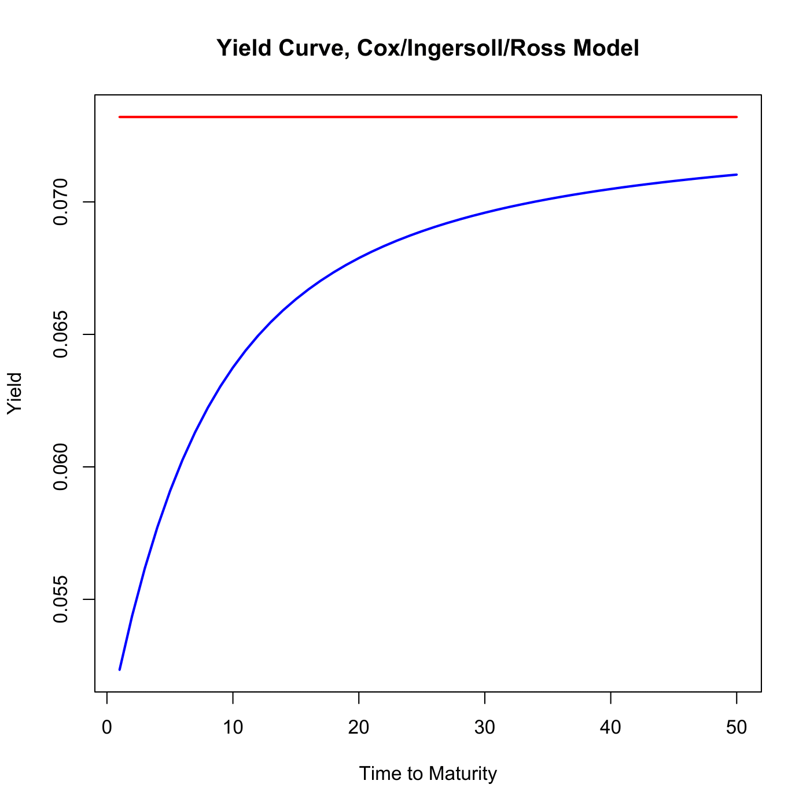
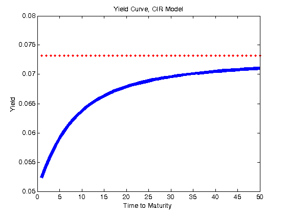
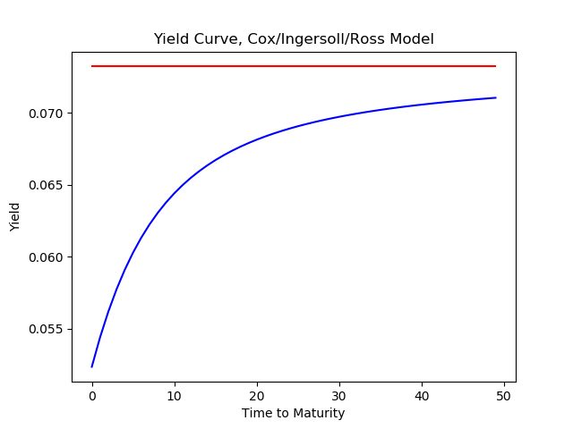

[](http://quantlet.de/)

## [](http://quantlet.de/) **SFEcir** [](http://quantlet.de/)

```yaml

Name of QuantLet: SFEcir

Published in: Statistics of Financial Markets

Description: 'Displays the yield curve for given parameters under the model of Cox-Ingersoll-Ross (CIR).'

Keywords: 'cir, graphical representation, interest-rate, plot, process, short-rate, simulation, time-series, yield, term structure'

See also: SFECIRmle, SFEscomCIR, SFEsimCIR, SFEcirpricing, SFEsimVasi

Author: Joanna Tomanek, Christian M. Hafner

Author[Matlab]: Li Sun

Author[Python]: Justin Hellermann

Submitted: Fri, June 13 2014 by Felix Jung

Submitted[Python]: Thu, Aug 01 2019 by Justin Hellermann

Input: 'Parameters of the CIR model (k,mu,sigma), time horizon, today''s short rate.'

Output: Plot of the CIR term structure

Example[Matlab]: '[k, mu, sigma, n, sr] = [0.1,0.1,0.1,50,0.05].' 

```







### R Code
```r


# clear variables and close windows
rm(list = ls(all = TRUE))
graphics.off()

# parameter settings
r   = 1
k   = 0.1   # reversion rate
mu  = 0.1   # steady state of the short rate
s   = 0.1   # volatility coefficient
n   = 50    # time horizon in years
sr  = 0.05  # today's short rate
tau = 1:n   # vector of maturities in years

if (s == 0) {
    print("Specify Volatility other than zero!")
}

if (k < 0) {
    print("Mean reversion rate should be non-negative!")
}

gam  = sqrt(k^2 + 2 * s^2)
ylim = 2 * k * mu/(gam + k)
g    = 2 * gam + (k + gam) * (exp(gam * tau) - 1)
b    = -(2 * (exp(gam * tau) - 1))/g
a    = 2 * k * mu/s^2 * log(2 * gam * exp((k + gam) * tau/2)/g)
p    = exp(a + b * sr)    # the bond prices
y    = (-1/tau) * log(p)  # the yields
w    = cbind(tau, y)
wlim = cbind(tau, (matrix(1, n, 1) * ylim))
nn   = c(1, 50)
mm   = c(min(wlim[, 2], w[, 2]), max(wlim[, 2], w[, 2]))

# plot
plot(nn, mm, type = "n", main = "Yield Curve, Cox/Ingersoll/Ross Model", xlab = "Time to Maturity", 
    ylab = "Yield")
lines(w, col = 4, lwd = 2)
lines(wlim, col = 2, lwd = 2)

z = cbind(tau, p, y)
list(z = z, ylim = ylim)
```

automatically created on 2019-08-01

### MATLAB Code
```matlab


clear
clc
close all

para = input('[k, mu, sigma, n, sr] (default [0.1,0.1,0.1,50,0.05], press enter): ','s');
if isempty(para)
	k=0.1;  	%reversion rate
	mu=0.1; 	%steady state
	sigma=0.1; 	%volatility
	n=50;      	%time horizon
	sr=0.05;    	%short rate at time t
end
if  sigma<=0
    disp('cir: Specify positive volatility again!');
    disp(' ') ;
    sigma = input('sigma=');
end
if k<0
    disp('cir: Mean reversion rate should be non-negative, please input k again!');
    disp(' ') ;
    k =input('k=');
end
if n<=0
    disp('cir: time must be positive, please input n again!');
    disp(' ') ;
    n =input('n=');
end
  tau  = 1:n;              	% vector of maturities in years
  gam  = sqrt(k^2+2*sigma^2);
  ylim = 2*k*mu/(gam+k);
  g    = 2*gam + (k+gam)*(exp(gam*tau)-1);
  b    = -(2*(exp(gam*tau)-1))./g;
  a    = 2*k*mu/sigma^2*log(2*gam*exp((k+gam)*tau/2)./g);
  p    = exp(a+b*sr);      	% the bond prices
  y    = (-1./tau).*log(p);     % the yields
  w    = [y];
  wlim = [ones(1,max(tau)).*ylim];
  z    = [tau;p;y];
plot(w', 'LineWidth',5)
hold on
plot(wlim', '.r')
hold off
xlabel('Time to Maturity')
ylabel('Yield')
title(sprintf('Yield Curve, CIR Model'))  
```

automatically created on 2019-08-01

### PYTHON Code
```python

import numpy as np 
import pandas as pd 
import matplotlib.pyplot as plt


# parameter settings
r   = 1
k   = 0.1   # reversion rate
mu  = 0.1   # steady state of the short rate
s   = 0.1   # volatility coefficient
n   = 50    # time horizon in years
sr  = 0.05  # today's short rate
tau = np.array(range(1,n+1)).astype(int)   # vector of maturities in years

if (s == 0):
    print("Specify Volatility other than zero!")


if (k < 0):
    print("Mean reversion rate should be non-negative!")


gam  = np.sqrt(k**2 + 2*s**2)
ylim = 2 * k * mu/(gam + k)
g    = 2 * gam + (k + gam) * (np.exp(gam * tau) - 1)
b    = -(2 * (np.exp(gam * tau) - 1))/g
a    = 2 * k * mu/s**2 * np.log(2 * gam * np.exp((k + gam) * tau/2)/g)
p    = np.exp(a+b*sr)    # the bond prices
y    = (-np.ones(tau.shape[0])/tau)*np.log(p)  # the yields

w    = np.concatenate([tau.reshape((-1,1)), y.reshape((-1,1))],axis=1)
wlim = np.concatenate([tau.reshape((-1,1)), np.repeat(ylim,n).reshape((-1,1))],axis=1)

plt.plot(w[:,1],color='blue')
plt.plot(wlim[:,1],color='red')
plt.xlabel('Time to Maturity')
plt.ylabel('Yield')
plt.title('Yield Curve, Cox/Ingersoll/Ross Model')
plt.savefig('SFEcir.png')
plt.show()


```

automatically created on 2019-08-01