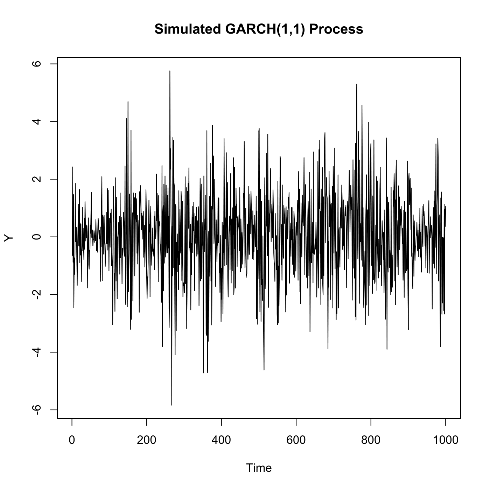
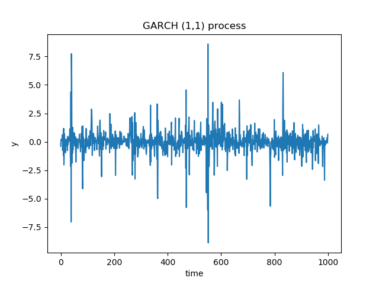

[](http://quantlet.de/)

## [](http://quantlet.de/) **SFETimegarch** [](http://quantlet.de/)

```yaml

Name of QuantLet: SFETimegarch

Published in: Statistics of Financial Markets

Description: 'Plots the time series of a GARCH(1,1) process.'

Keywords: simulation, stochastic-process, process, time-series, plot, graphical representation, estimation, garch, autoregressive, process, stochastic, stochastic-process, volatility

See also: SFEtimewn, SFEtimedax

Author: Joanna Tomanek
Author[Python]: Justin Hellermann

Submitted: Tue, June 17 2014 by Thijs Benschop
Submitted[Python]: Thu, Aug 01 2019 by Justin Hellermann

```





### R Code
```r


# clear variables and close windows
rm(list = ls(all = TRUE))
graphics.off()

# install and load packages
libraries = c("fGarch")
lapply(libraries, function(x) if (!(x %in% installed.packages())) {
install.packages(x)
})
lapply(libraries, library, quietly = TRUE, character.only = TRUE)

time = seq(1, 1000, 1)
x = garchSim(garchSpec(model = list(omega = 0.1, alpha = 0.15, beta = 0.8), rseed = 100), 
    n = 1000)
plot(time, x, type = "l", ylab = "Y", xlab = "Time", main = "Simulated GARCH(1,1) Process")

```

automatically created on 2019-08-02

### PYTHON Code
```python

import numpy as np
import matplotlib.pyplot as plt
#
np.random.seed(1234)


#omega = 0.1, alpha = 0.15, beta = 0.8
n=1000          # number of observations
n1=100          # drop first observations 

alpha=(0.1,0.3)    # GARCH (1,1) coefficients alpha0 and alpha1
beta=0.8 
errors=np.random.normal(0,1,n+n1) 
t=np.zeros(n+n1)
t[0]=np.random.normal(0,np.sqrt(alpha[0]/(1-alpha[1])),1)
#iterate over the oberservations
for i in range(1,n+n1-1): 
    t[i]=errors[i]*np.sqrt(alpha[0]+alpha[1]*errors[i-1]**2+beta*t[i-1]**2)
#
y=t[n1-1:-1]    # drop n1 observations 
plt.title('GARCH (1,1) process')
x=range(n) 
plt.plot(x,y)
plt.xlabel('time')
plt.ylabel('y')

plt.savefig('SFEtimegarch_py.png')
plt.show()
```

automatically created on 2019-08-02