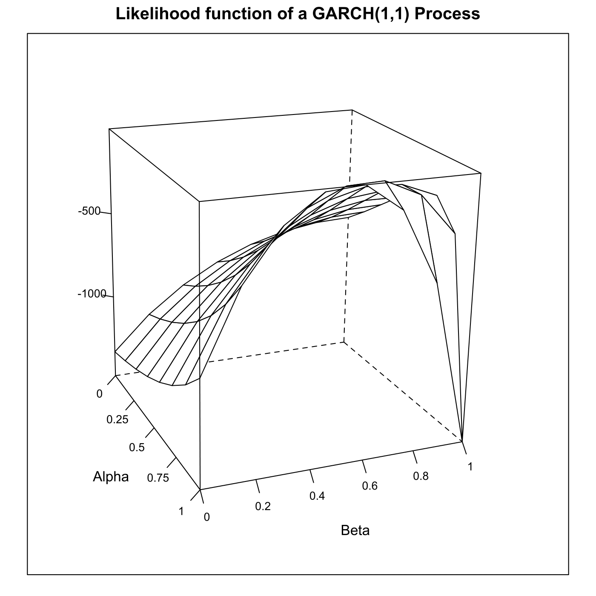
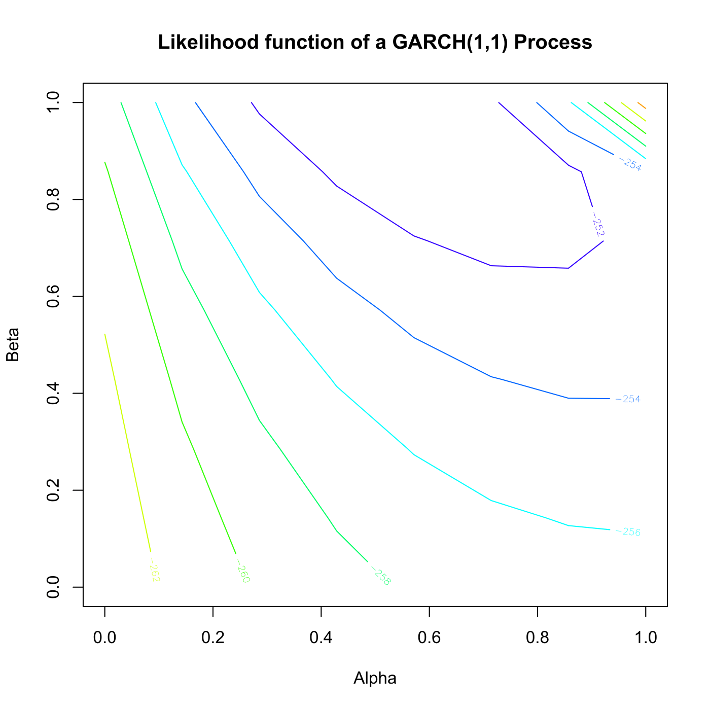

[](http://quantlet.de/)

## [](http://quantlet.de/) **SFElikgarch** [](http://quantlet.de/)

```yaml

Name of QuantLet : SFElikgarch

Published in : Statistics of Financial Markets

Description : Plots the likelihood function of a GARCH(1,1) process.

Keywords : '3D, contour, garch, autoregressive, likelihood, log-likelihood, model, plot, graphical
representation, process, simulation, stochastic, stochastic-process, volatility, contour'

See also : SFEkurgarch, SFElikarch1, SFEtimegarch

Author : Joanna Tomanek

Submitted : Tue, June 17 2014 by Thijs Benschop

Example: 
- 1: Log-likelihood function of a generated GARCH(1,1) process.
- 2: Contour plot of the likelihood function of a generated GARCH(1,1) process.

```






### R Code:
```r

# clear variables and close windows
rm(list = ls(all = TRUE))
graphics.off()

# install and load packages
libraries = c("fGarch", "lattice")
lapply(libraries, function(x) if (!(x %in% installed.packages())) {
install.packages(x)
})
lapply(libraries, library, quietly = TRUE, character.only = TRUE)

# parameter settings
n = 500
k = 8

# garch simulation
x  = garchSim(spec = garchSpec(model = list(omega = 0.1, alpha = 0.1, beta = 0.8), 
    cond.dist = "norm", rseed = 0), n = n + 50)
ms = var(x)
x  = x[51:(n + 50)]
x[1:10]

# values for grid
k  = 8
s1 = 0.02
p1 = 0.02
s2 = 0.5
p2 = 0.05
q1 = seq(s1, by = p1, length.out = k)
q2 = seq(s2, by = p2, length.out = k)
q1 = as.matrix(q1)
q2 = as.matrix(q2)

# computing conditional log likelihood
w = matrix(1, k^2, 2)
for (i in 1:k) {
    for (j in 1:k) {
        w[i + (j - 1) * k, 1] = q1[i]
        w[i + (j - 1) * k, 2] = q2[j]
    }
}

theta = w
l1    = matrix(1, k^2, 1)
sigma = matrix(1, n, 1)
i     = 1
while (i <= k^2) {
    a = theta[i, 1]
    b = theta[i, 2]
    omega = (1 - a - b) * ms
    l = 0
    t = 2
    while (t <= n) {
        sigma[t] = omega + a * x[t - 1]^2 + b * sigma[t - 1]
        l = l - 0.5 * log(sigma[t]) - 0.5 * x[t]^2/sigma[t]
        t = t + 1
    }
    l1[i] = l
    i = i + 1
}

l1
l1res = matrix(l1, 8, 8)

meshgrid = function(a, b) {
    # define meshfunction
    list(x = outer(b * 0, a, FUN = "+"), y = outer(b, a * 0, FUN = "+"))
}

a = meshgrid(seq(0, p1, len = k), seq(0, p2, len = k))  # compute meshgrid
wireframe(l1res ~ a$x + a$y, main = "Likelihood function of a GARCH(1,1) Process", 
    screen = list(z = -70, x = -70, y = 3), aspect = c(1, 1), scales = list(arrows = FALSE, 
        x = list(labels = seq(0, 1, length = 5)), y = list(labels = seq(0, 1, length = 6)), 
        z = list(labels = seq(-1500, 500, 500))), xlab = "Alpha", ylab = "Beta", 
    zlab = "")

c = min(l1) + c(1:19) * (max(l1) - min(l1))/20
maxlik = cbind(theta, l1)
maxlik = maxlik[l1 == max(l1), 1:2]
maxlik = l1[l1 == max(l1), ]
maxlik = sort(maxlik)

dev.new()
contour(l1res, col = rainbow(10), main = "Likelihood function of a GARCH(1,1) Process", 
    xlab = "Alpha", ylab = "Beta")

```
