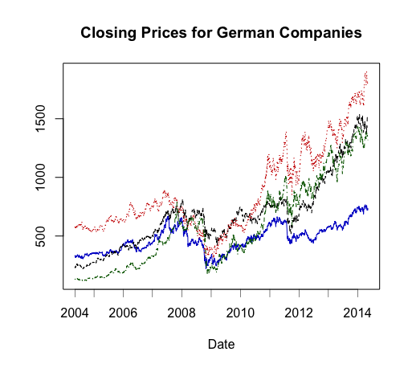
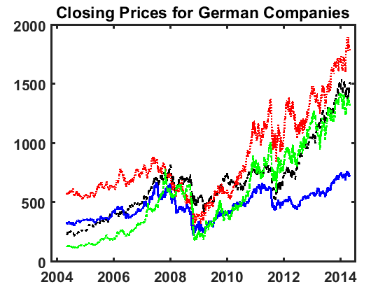

[](http://quantlet.de/)

## [](http://quantlet.de/) **SFEclose** [](http://quantlet.de/)

```yaml

Name of QuantLet: SFEclose

Published in: Statistics of Financial Markets

Keywords: 'Closing prices, time series, German stocks, Financial Markets'

Description: SFEclose plots the closing prices of Bayer (black), BMW (red), Siemens (blue) and Volkswagen (green).

See also: SFEdenport, SFEportfolio, SFEportfolio, SFEportlogreturns, SFEtailGEV_pp, SFEtailGPareto_pp, SFEtailGPareto_pp, SFEtailGPareto_qq, SFEtailGPareto_qq, SFEvar_block_max_backtesting, SFEvar_block_max_params, SFEvar_pot_backtesting, SFEvar_pot_params, block_max, var_block_max_backtesting, var_pot, var_pot_backtesting

Author: Zografia Anastasiadou, Awdesch Melzer

Submitted: Thu, December 15 2016 by Lily Medina
Submitted[Matlab]: Thu, December 15 2016 by Lily Medina

Datafiles: 2004-2014_dax_ftse.csv

Input: The datafile contains daily price data from 07.05.2004 to 07.05.2014 for Bayer, BMW, Siemens and Volkswagen.

Output: Plot of closing prices

```





### R Code
```r

# clear variables and close windows
rm(list=ls(all=TRUE))
graphics.off()

# set working directory
# setwd("C:/...")

# install and load packages
libraries = c("data.table", "tseries")
lapply(libraries, function(x) if (!(x %in% installed.packages())) {
  install.packages(x)
})
lapply(libraries, library, quietly = TRUE, character.only = TRUE)

#load the data
dataset = fread("2004-2014_dax_ftse.csv", select =  c("Date", "BAYER", "BMW", "SIEMENS", "VOLKSWAGEN"))
dataset = as.data.frame(dataset)

x1 = dataset$BAYER
x2 = dataset$BMW
x3 = dataset$SIEMENS
x4 = dataset$VOLKSWAGEN

x1 = as.matrix(x1)
x2 = as.matrix(x2)
x3 = as.matrix(x3)
x4 = as.matrix(x4)

# date variable
date.X       = as.Date(dataset$Date)[-1]
date.X.Years = as.numeric(format(date.X, "%Y"))
where.put    = c(1, which(diff(date.X.Years) == 1)+1)

t  = seq(23,dim(x1)[1],by=261)

# plot 
plot(x3,type="l",ylim=c(min(x1,x2,x3,x4),max(x1,x2,x3,x4)),col="blue3",xlab="Date",ylab="",main='Closing Prices for German Companies',xaxt="n")
lines(x1,lty=2)
lines(x2,col="red3",lty=3)
lines(x4,col="darkgreen",lty=4)

axis(side=1, at = where.put, label = date.X.Years[where.put], lwd=0.5)

```

automatically created on 2018-09-06

### MATLAB Code
```matlab

%% clear all variables
clear all
close all
clc

%% data import
formatSpec = '%{yyyy-MM-dd}D%f%f%f%f%f%f%f%f%f%f%f%f%f%f%f%f%f%f%f%f%f%f%f%f%f%f%f%f%f%f%f%f%f%f%f%f%f%f%f%f%f%f';
dataset    = readtable('2004-2014_dax_ftse.csv','Delimiter',',', 'Format',formatSpec);

%% plot
hold on
plot(dataset.Date,dataset.BAYER,'k','LineStyle','--','LineWidth',2)
plot(dataset.Date,dataset.BMW,'r','LineStyle',':','LineWidth',2)
plot(dataset.Date,dataset.SIEMENS,'b','LineStyle','-','LineWidth',2)
plot(dataset.Date,dataset.VOLKSWAGEN,'g','LineStyle','-.','LineWidth',2)
title('Closing Prices for German Companies','FontSize',16,'FontWeight','Bold')
box on
set(gca,'FontSize',16,'LineWidth',2,'FontWeight','bold');
hold off

```

automatically created on 2018-09-06