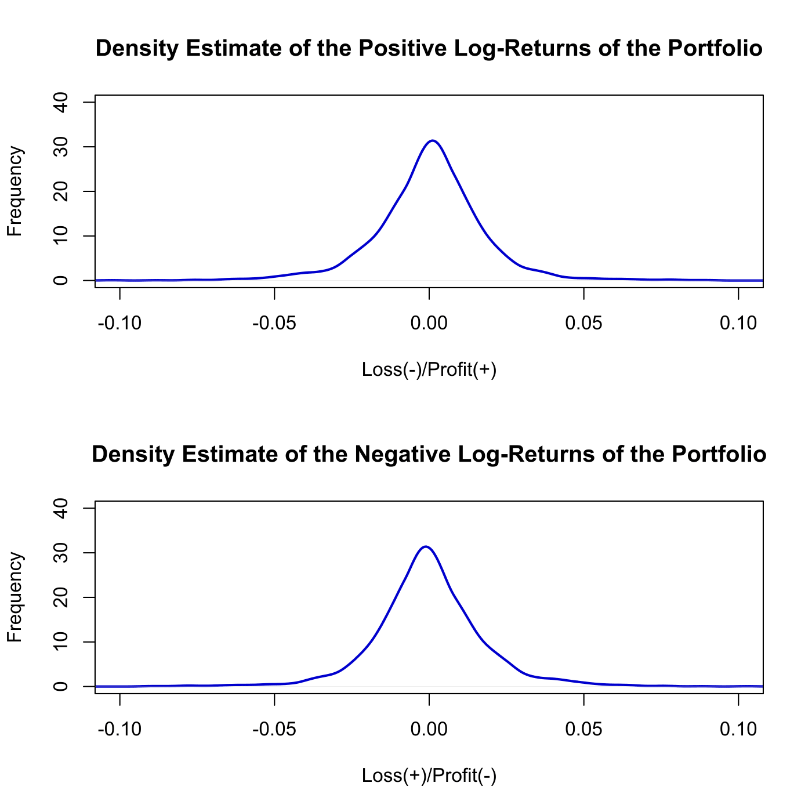

[](http://quantlet.de/)

## [](http://quantlet.de/) **SFEdenport** [](http://quantlet.de/)

```yaml

Name of QuantLet : SFEdenport

Published in : Statistics of Financial Markets

Description : 'Computes and plots the density of the loss-profit function for the variance
efficient portfolio of Bayer, BMW, Siemens and Volkswagen log-returns for the period 1 January 2000
- 31 December 2012.'

Keywords : 'asset, data visualization, dax, financial, graphical representation, plot, portfolio,
returns, log-returns, stock-price, Loss-Profit function, density'

See also : 'SFEportfolio, SFEportlogreturns, SFEclose, SFEtailGEV_pp, SFEtailGEV_qq,
SFEtailGPareto_pp, SFEtailGPareto_qq'

Author : Awdesch Melzer

Submitted : Wed, September 25 2013 by Awdesch Melzer

Datafiles : BAYER_close_0012.dat, BMW_close_0012.dat, SIEMENS_close_0012.dat, VW_close_0012.dat

```




### R Code:
```r

# clear variables and close windows
rm(list = ls(all = TRUE))
graphics.off()

# load data
x1 = read.table("BAYER_close_0012.dat")
x2 = read.table("BMW_close_0012.dat")
x3 = read.table("SIEMENS_close_0012.dat")
x4 = read.table("VW_close_0012.dat")

r1 = diff(as.matrix(log(x1)))
r2 = diff(as.matrix(log(x2)))
r3 = diff(as.matrix(log(x3)))
r4 = diff(as.matrix(log(x4)))

# Variance efficient portfolio
portfolio = cbind(r1, r2, r3, r4)
opti = solve(cov(portfolio)) %*% c(1, 1, 1, 1)
opti = opti/sum(opti)
lrplport = as.matrix(portfolio) %*% opti

# plot
par(mfrow = c(2, 1))
plot(density(lrplport, kernel = "biweight", bw = 0.003), xlim = c(-0.1, 0.1), main = "Density Estimate of the Positive Log-Returns of the Portfolio", 
    lwd = 2, col = "blue3", xlab = "Loss(-)/Profit(+)", ylab = "Frequency", ylim = c(0, 
        40))
plot(density(-lrplport, kernel = "biweight", bw = 0.003), xlim = c(-0.1, 0.1), 
    main = "Density Estimate of the Negative Log-Returns of the Portfolio", lwd = 2, 
    col = "blue3", xlab = "Loss(+)/Profit(-)", ylab = "Frequency", ylim = c(0, 
        40))

```
