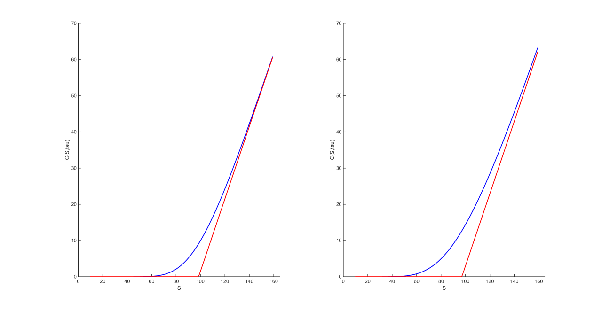
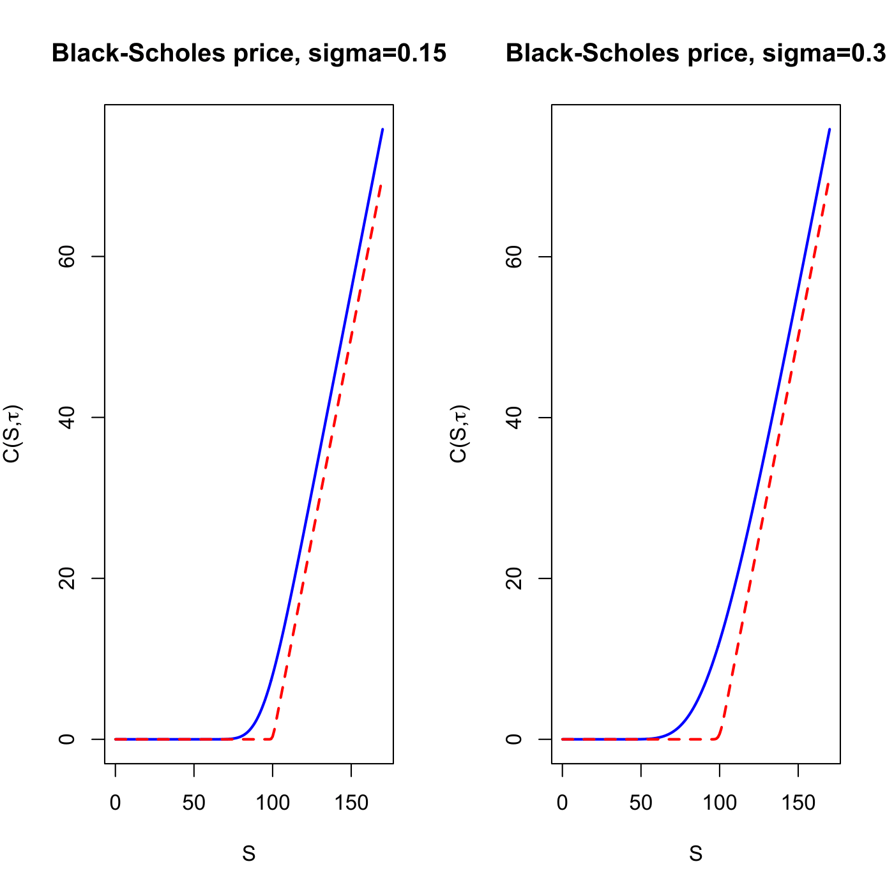

[](http://quantlet.de/)

## [](http://quantlet.de/) **SFEbsprices** [](http://quantlet.de/)

```yaml

Name of QuantLet : SFEbsprices

Published in : Statistics of Financial Markets

Description : 'Calculates and plots BS price as a function of S, K, r, tau, sigma and the payoff at
maturity.'

Keywords : 'asset, black-scholes, call, put, option, option-price, european-option, financial,
plot, graphical representation'

See also : SFEBSCopt1, SFEBSCopt2, SFEbsbm, blsprice

Author : Szymon Borak, Elisabeth Bommes

Author[Matlab] : Szymon Borak, Awdesch Melzer

Submitted : Tue, June 17 2014 by Thijs Benschop

Example: 
- 1: 'The plot is generated for the following parameter values: S = 100, K = 100, r = 0.1, tau =
0.6 and sigma = 0.15.'
- 2: 'The plot is generated for the following parameter values: S = 100, K = 100, r = 0.1, tau2 =
0.03 and sigma2 = 0.3.'

```






### R Code:
```r

# clear variables and close windows
rm(list = ls(all = TRUE))
graphics.off()

bs_call = function(S, K, r, tau, sigma) {
    # Black-Scholes formula for European call price with b = r (costs of carry =
    # risk free interest rate -> the underlying pays no continuous dividend)
    d1 = (log(S/K) + (r + (sigma^2/2)) * tau)/(sigma * sqrt(tau))
    d2 = d1 - (sigma * sqrt(tau))
    C  = S * pnorm(d1) - K * exp(-r * tau) * pnorm(d2)
    return(C)
}

# Input
S      = 100       # stock price
K      = 100       # strike price
r      = 0.1       # risk free interest rate
tau    = 0.6       # time to maturity (blue line)
tau2   = 0.003     # time to maturity (red dotted line)
sigma  = 0.15      # volatility of first plot
sigma2 = 0.3       # volatility of second plot
lb     = 0         # lower limit of x axis 
ub     = 170       # upper limit of x axis

# Calculate Black Scholes prices as a function of S with two different
# volatilities and time to maturity
call1   = bs_call(c(lb:ub), K, r, tau, sigma)
call1_2 = bs_call(c(lb:ub), K, r, tau2, sigma)
call2   = bs_call(c(lb:ub), K, r, tau, sigma2)
call2_2 = bs_call(c(lb:ub), K, r, tau2, sigma2)

par(mfrow = c(1, 2))  # two plots in one graphic
# Plot the Black Scholes call price (blue line) with volatility sigma and time
# to maturity tau
plot(x = c(lb:ub), y = call1, main = "Black-Scholes price, sigma=0.15", xlab = "S", ylab = expression(paste("C(S,", tau, 
    ")")), xlim = c(lb, ub), ylim = c(0, max(call1)), type = "l", col = "blue", 
    lwd = 2)
# Plot the Black Scholes call price (red dotted line) with volatility sigma and
# time to maturity tau2
lines(x = c(lb:ub), y = call1_2, type = "l", col = "red", lwd = 2, lty = 2)

# Plot the Black Scholes call price (blue line) with volatility sigma2 and time
# to maturity tau
plot(x = c(lb:ub), y = call2, main = "Black-Scholes price, sigma=0.3", xlab = "S", ylab = expression(paste("C(S,", tau, 
    ")")), xlim = c(lb, ub), ylim = c(0, max(call2)), type = "l", col = "blue", 
    lwd = 2)
# Plot the Black Scholes call price (red dotted line) with volatility sigma2
# and time to maturity tau2
lines(x = c(lb:ub), y = call2_2, type = "l", col = "red", lwd = 2, lty = 2)

```

### MATLAB Code:
```matlab
clear all;
close all;
clc;

% set parameters
S     = 100;
K     = 100;
r     = 0.1;
tau   = 0.6;
tauu  = 0.003;
sig   = 0.15;
sigg  = 0.3;

% main computation
vS    = (10:1:159)';
vK    = (10:1:159)';
vr    = (0.01:0.005:0.055)';
vtau  = (0.01:0.01:1)';
vsig  = (0.01:0.01:0.6)';

Call1 = zeros(size(vS));
Put1  = zeros(size(vS));
Call2 = zeros(size(vS));
Put2  = zeros(size(vS));
Call3 = zeros(size(vS));
Put3  = zeros(size(vS));
Call4 = zeros(size(vS));
Put4  = zeros(size(vS));


for i=1:length(vS)
[Call1(i,:) Put1(i,:)]= blsprice(vS(i,:), K, r, sig, tau);
end
pp1=[vS,Call1];
for i=1:length(vS)
[Call2(i,:) Put2(i,:)]= blsprice(vS(i,:), K, r, sig,tauu);
end
pp2=[vS,Call2];
for i=1:length(vS)
[Call3(i,:) Put3(i,:)]= blsprice(vS(i,:), K, r, sigg,tau);
end
pp3=[vS,Call3];
for i=1:length(vS)
[Call4(i,:) Put4(i,:)]= blsprice(vS(i,:), K, r, sigg,tauu);
end
pp4=[vS,Call4];

% output
subplot(1,2,1)
hold on
plot(pp1(:,1),pp1(:,2),'b','LineWidth',2.5)
plot(pp2(:,1),pp2(:,2),'r','LineWidth',2.5,'LineStyle','-')
set(gca,'FontSize',16)
set(gca,'LineWidth',1.6)
xlim([0 165])
ylim([0 70])
xlabel('S');
ylabel('C(S,tau)')
hold off
subplot(1,2,2)
hold on
plot(pp3(:,1),pp3(:,2),'b','LineWidth',2.5)
plot(pp4(:,1),pp4(:,2),'r','LineWidth',2.5,'LineStyle','-')
set(gca,'FontSize',16)
set(gca,'LineWidth',1.6)
xlim([0 165])
ylim([0 70])
xlabel('S');
ylabel('C(S,tau)')
hold off

```
