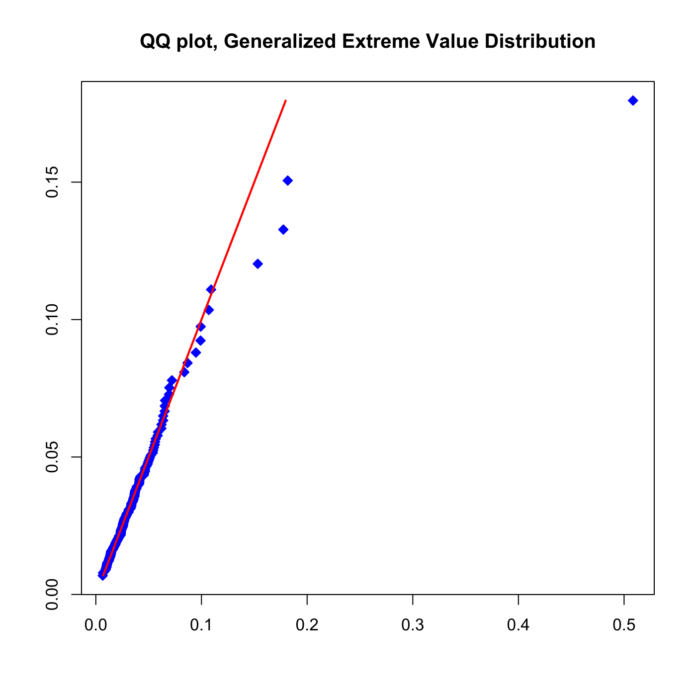

[](http://quantlet.de/)

## [](http://quantlet.de/) **SFEtailGEV_qq** [](http://quantlet.de/)

```yaml

Name of QuantLet : SFEtailGEV_qq

Published in : Statistics of Financial Markets

Description : 'Fits a Generalized Extreme Value distribution to the negative log-returns of a
portfolio (Bayer, BMW, Siemens, VW) for the time period from 2000-01-01 to 2012-12-31 and produces
a Q-Q plot.'

Keywords : 'asset, data visualization, dax, financial, graphical representation, plot, portfolio,
qq-plot, returns, log-returns, stock-price, GEV, pareto, extreme-value'

See also : 'SFEportfolio, SFEportlogreturns, SFEdenport, SFEclose, SFEtailGEV_pp,
SFEtailGPareto_pp, SFEtailGPareto_qq'

Author : Lasse Groth, Awdesch Melzer

Submitted : Fri, November 29 2013 by Awdesch Melzer

Datafiles : BAYER_close_0012.dat, BMW_close_0012.dat, SIEMENS_close_0012.dat, VW_close_0012.dat

```




### R Code:
```r

# clear variables and close windows
rm(list = ls(all = TRUE))
graphics.off()

# install and load packages
libraries = c("fExtremes")
lapply(libraries, function(x) if (!(x %in% installed.packages())) {
install.packages(x)
})
lapply(libraries, library, quietly = TRUE, character.only = TRUE)

# load data
a = read.table("BAYER_close_0012.dat")
b = read.table("BMW_close_0012.dat")
c = read.table("SIEMENS_close_0012.dat")
e = read.table("VW_close_0012.dat")

# Portfolio
d = a + b + c + e

n1 = NROW(d)  # length of portfolio
x = log(d[1:(n1 - 1), ]/d[2:n1, ])  # negative log-returns

# Determine the Block Maxima data
T = length(x)
n = 20
k = T/n
z = matrix(, , , )

for (j in 1:k) {
    r = x[((j - 1) * n + 1):(j * n)]
    z[j] = max(r)
}
w = sort(z)

GEV = gevFit(w, type = "mle")  # Fit the Generalized Extreme Value Distribution

xi = attr(GEV, "fit")$par.ests[1]  # shape parameter
mu = attr(GEV, "fit")$par.ests[2]  # location parameter
sigma = attr(GEV, "fit")$par.ests[3]  # scale parameter

t = (1:k)/(k + 1)

y1 = qgev(t, xi = xi, mu = mu, beta = sigma)
y2 = pgev(w, xi = xi, mu = mu, beta = sigma)

# Plot the QQ plot
plot(w, y1, col = "blue", pch = 23, bg = "blue", xlab = c(""), ylab = c(""))
lines(y1, y1, type = "l", col = "red", lwd = 2)
title("QQ plot, Generalized Extreme Value Distribution")
```
