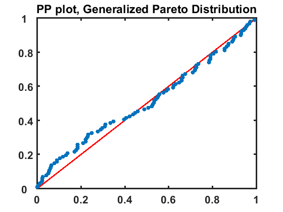

[](http://quantlet.de/)

## [](http://quantlet.de/) **SFEtailGPareto_pp** [](http://quantlet.de/)

```yaml

Name of QuantLet: SFEtailGPareto_pp

Published in: Statistics of Financial Markets

Description: SFEtailGPareto_pp estimates the parameters of Generalized Pareto Distribution for the negative log-returns of portfolio (Bayer, BMW, Siemens)

Keywords: pareto, pp-plot

See also: SFEclose, SFEportfolio, SFEtailGEV_pp, SFEtailGEV_qq, SFEtailGPareto_qq

Author: Awdesch Melzer

Submitted: Thu, December 15 2016 by Lily Medina
Submitted[Matlab]: Thu, December 15 2016 by Lily Medina

Datafiles: 2004-2014_dax_ftse.csv

Input: The datafile contains daily price data from 07.05.2004 to 07.05.2014 for Bayer, BMW, Siemens and Volkswagen.

Output: PP-plot with Generalized Pareto

```




### R Code
```r

# clear all variables
rm(list=ls(all=TRUE))

# set working directory
#setwd("C:/...")

# install and load packages
libraries = c("data.table", "tseries")
lapply(libraries, function(x) if (!(x %in% installed.packages())) {
  install.packages(x)
})
lapply(libraries, library, quietly = TRUE, character.only = TRUE)

install.packages("POT")
library(POT)

# load the data
dataset = fread("2004-2014_dax_ftse.csv", select =  c("Date", "BAYER", "BMW", "SIEMENS", "VOLKSWAGEN"))
dataset = as.data.frame(dataset)

# Portfolio
d    = dataset$BAYER + dataset$BMW + dataset$SIEMENS + dataset$VOLKSWAGEN

n1   = length(d) # length of portfolio
x    = log(d[1:n1-1]/d[2:n1]) #negative log-returns


gpd  = fitgpd(x,quantile(x, 0.95),est="mle") # 
n    = gpd$nat
thr  = gpd$threshold
scale= gpd$param[1]
shape= gpd$param[2]
data = gpd$data
exc  = gpd$exceed
t    = (1:n)/(n+1)
y1   = qgpd(t,scale=scale,shape=shape)                   
 
gpdt = sort(exc)-thr                           
y2   = pgpd(gpdt,scale=scale,shape=shape)          


plot(y2,t,col="blue",pch=15,bg="blue",xlab="",ylab="",main="PP plot, Generalized Pareto Distribution")
lines(y2,y2,type="l",col="red",lwd=2)
```

automatically created on 2018-05-28

### MATLAB Code
```matlab

%% clear all variables
clc
close all
clear all

%% data import
formatSpec = '%{yyyy-MM-dd}D%f%f%f%f%f%f%f%f%f%f%f%f%f%f%f%f%f%f%f%f%f%f%f%f%f%f%f%f%f%f%f%f%f%f%f%f%f%f%f%f%f%f';
dataset    = readtable('2004-2014_dax_ftse.csv','Delimiter',',', 'Format',formatSpec);

%% Portfolio
d  = dataset.BAYER + dataset.BMW + dataset.SIEMENS + dataset.VOLKSWAGEN; 
x  = log(d(1:end-1))-log(d(2:end));%negative log-returns
n  = 100;
zb = sort(x);

%%  estimates of the parameters for the two-parameter generalized Pareto
theta  = zb(end-n);
z      = zb(end-n+1:end)-theta;
params = gpfit(z);
K      = params(1);
sigma  = params(2);
t      = (1:n)/(n+1);

%% plot
figure
y = gpcdf(z,K,sigma);
hold on
plot(y,y,'r','LineWidth',2)
scatter(y,t,'o','filled','LineWidth',3)
t  = [0:0.2:1];
 set(gca,'YTick',t)
 set(gca,'YTickLabel',t)

title('PP plot, Generalized Pareto Distribution','FontSize',16,'FontWeight','Bold')
hold off
 box on
set(gca,'FontSize',16,'LineWidth',1.6,'FontWeight','bold');

```

automatically created on 2018-05-28