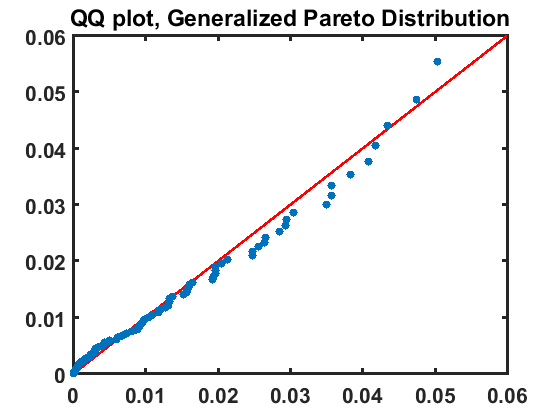

[](http://quantlet.de/)

## [](http://quantlet.de/) **SFEtailGPareto_qq** [](http://quantlet.de/)

```yaml

Name of QuantLet: SFEtailGPareto_qq

Published in: Statistics of Financial Markets

Description: SFEtailGPareto_qq estimates the parameters of Generalized Pareto Distribution for the negative log-returns of portfolio (Bayer, BMW, Siemens)

Keywords: pareto, qq-plot

See also: SFEclose, SFEportfolio, SFEtailGEV_pp, SFEtailGEV_qq, SFEtailGPareto_pp

Author: Awdesch Melzer

Submitted: Wed, December 21 2016 by Lily Medina
Submitted[Matlab]: Wed, December 21 2016 by Lily Medina

Datafiles: 2004-2014_dax_ftse.csv

Input: The datafile contains daily price data from 07.05.2004 to 07.05.2014 for Bayer, BMW, Siemens and Volkswagen.

Output: QQ-plot with Generalized Pareto

```




### R Code
```r

# ---------------------------------------------------------------------
# Book:         SFE
# ---------------------------------------------------------------------
# Quantlet:     SFEtailGPareto_qq
# ---------------------------------------------------------------------
# Description:  SFEtailGPareto_qq estimates the parameters of Generalized 
#               Pareto Distribution for the negative log-returns of 
#               portfolio (Bayer, BMW, Siemens, VW), time period: from 
#               2000-01-01 to 2012-12-31, and produces QQ-plot.
# ---------------------------------------------------------------------
# Usage:        -
# ---------------------------------------------------------------------
# Inputs:       None
# ---------------------------------------------------------------------
# Output:       QQ-plot with Generalized Pareto Distribution.
# ---------------------------------------------------------------------
# Example:     
# ---------------------------------------------------------------------
# Author:       Awdesch Melzer 20131126
# ---------------------------------------------------------------------

rm(list=ls(all=TRUE))
#setwd("C:/...")

install.packages("POT")
library(POT)

# Load data sets
a    = read.table('BAYER_close_0012.dat')
b    = read.table('BMW_close_0012.dat')
c    = read.table('SIEMENS_close_0012.dat')
e    = read.table('VW_close_0012.dat')
# Portfolio
d    = a+b+c+e

n1   = dim(d)[1] # length of portfolio
x    = log(d[1:n1-1,]/d[2:n1,]) #negative log-returns


gpd  = fitgpd(x,quantile(x, 0.95),est="mle") # 
n    = gpd$nat
thr  = gpd$threshold
scale= gpd$param[1]
shape= gpd$param[2]
data = gpd$data
exc  = gpd$exceed
t    = (1:n)/(n+1)
y1   = qgpd(t,scale=scale,shape=shape)                   
 
gpdt = sort(exc)-thr                           
y2   = pgpd(gpdt,scale=scale,shape=shape)            
                                                    
plot(gpdt,y1,col="blue",pch=15,bg="blue",xlab="",ylab="",main="QQ plot, Generalized Pareto Distribution")
lines(y1,y1,type="l",col="red",lwd=2)  

```

automatically created on 2018-05-28

### MATLAB Code
```matlab

%% clear all variables
clc
close all
clear all

%% data import
formatSpec = '%{yyyy-MM-dd}D%f%f%f%f%f%f%f%f%f%f%f%f%f%f%f%f%f%f%f%f%f%f%f%f%f%f%f%f%f%f%f%f%f%f%f%f%f%f%f%f%f%f';
dataset    = readtable('2004-2014_dax_ftse.csv','Delimiter',',', 'Format',formatSpec);

%% Portfolio
d  = dataset.BAYER + dataset.BMW + dataset.SIEMENS + dataset.VOLKSWAGEN; 
x  = log(d(1:end-1))-log(d(2:end));%negative log-returns
n  = 100;
zb = sort(x);

%%  estimates of the parameters for the two-parameter generalized Pareto
theta  = zb(end-n);
z      = zb(end-n+1:end)-theta;
params = gpfit(z);
K      = params(1);
sigma  = params(2);
t      = (1:n)/(n+1);
y      = gpinv(t,K,sigma);

%% plot
hold on
plot(y,y,'r','LineWidth',2)
ylim([0,0.06])
xlim([0,0.06])
scatter(z,y,'o','filled','LineWidth',3)
title('QQ plot, Generalized Pareto Distribution','FontSize',16,'FontWeight','Bold')
hold off
box on
set(gca,'FontSize',16,'LineWidth',1.6,'FontWeight','bold');

```

automatically created on 2018-05-28