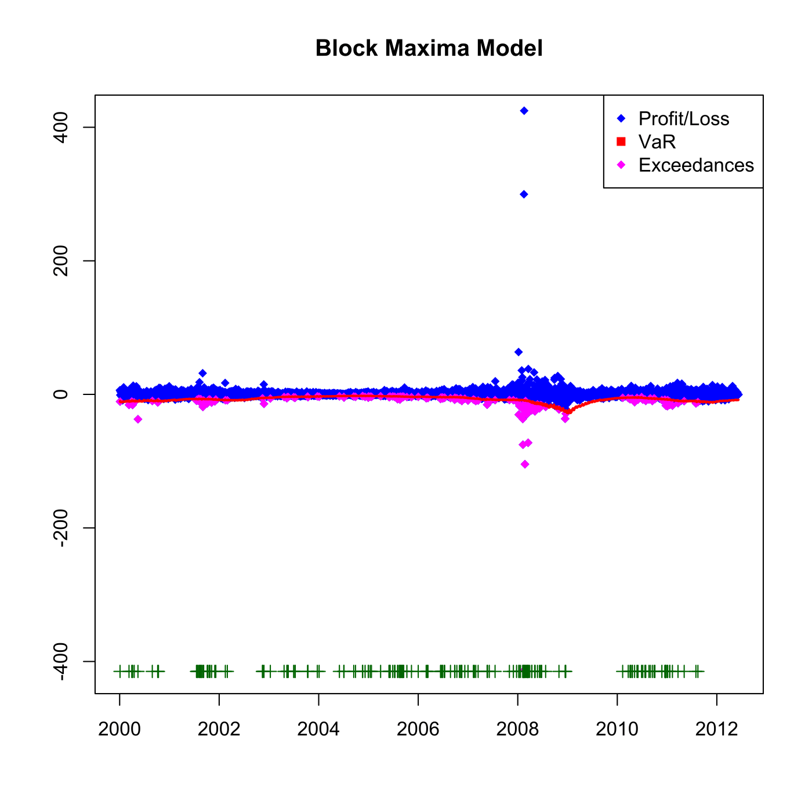

[](http://quantlet.de/)

## [](http://quantlet.de/) **SFEvar_block_max_backtesting** [](http://quantlet.de/)

```yaml

Name of QuantLet : SFEvar_block_max_backtesting

Published in : Statistics of Financial Markets

Description : Provides backtesting results for the Value-at-Risk (VaR) with Block Maxima Model.

Keywords : 'VaR, backtesting, block-maxima, portfolio, estimation, financial, forecast, exceedance,
risk, data visualization, graphical representation, plot, time-series'

See also : 'SFEvar_block_max_params, SFEvar_pot_backtesting, SFEvar_pot_params, block_max,
var_block_max_backtesting, var_pot, var_pot_backtesting'

Author : Awdesch Melzer

Submitted : Fri, November 29 2013 by Awdesch Melzer

Datafiles : 'BAYER_close_0012.dat, BMW_close_0012.dat, SIEMENS_close_0012.dat, VW_close_0012.dat,
VaR0012_bMax_Portf.dat'

Output: 
- p: exceedances ratio

Example : 'Plot for the Value-at-Risk estimation at 0.05 level a portfolio of Bayer, BMW and
Siemens stock for the time period from 2000-01-01 to 2012-12-31.'

```




### R Code:
```r

# clear variables and close windows
rm(list = ls(all = TRUE))
graphics.off()

# install and load packages
libraries = c("fExtremes")
lapply(libraries, function(x) if (!(x %in% installed.packages())) {
install.packages(x)
})
lapply(libraries, library, quietly = TRUE, character.only = TRUE)

# load data
a = read.table("BAYER_close_0012.dat")
b = read.table("BMW_close_0012.dat")
c = read.table("SIEMENS_close_0012.dat")
d = read.table("VW_close_0012.dat")

# Create portfolio
e = a + b + c + d
e = as.matrix(e)               # define as matrix
end = NROW(e)                  # number of observations
x = e[2:end] - e[1:(end - 1)]  # returns
x = -x                         # negative returns
T = length(x)                  # number of observations 
h = 250                        # observation window
p = 0.95                       # quantile for VaR
n = 16                         # observation window for estimating quantile in VaR

v = read.table("VaR0012_bMax_Portf.dat")  # load VaR estimates from maximal block model
v = t(v)
v = -v
V = a + b + c + d
D = dim(V)
L = V[-1, ] - V[1:(D[1] - 1), ]
T = length(L)

outlier = matrix(, 1, T - h)
exceedVaR = matrix(, , )
exceedVaR = (L[(1 + h):(D[1] - 1)] < v[1:(T - h)])  # Check for exceedances
for (j in 1:(T - h)) {
    if (exceedVaR[j] == TRUE) 
        {
            outlier[j] = L[j + h]
        }  # Find exceedances
}

K.1 = which(is.finite(outlier))
K = is.finite(outlier)
outlier = outlier[K.1]
p = round(sum(exceedVaR)/(T - h), 4)  # Calculate the exceedance ratio

# Plot the values, VaR estimation and the exceedances
plot(L[(h + 1):(D[1] - 1)], pch = 18, col = "blue", ylim = c(-415, 415), xlab = c(""), 
    ylab = c(""), axes = FALSE)
box()
axis(1, seq(0, length = 8, by = 500), seq(2000, 2014, by = 2))
axis(2)
title("Block Maxima Model")
points(K.1, outlier, pch = 18, col = "magenta")
lines(v, col = "red", lwd = 2)

yplus = K.1 * 0 + min(L[(h + 1):(D[1] - 1)]) - 2
points(K.1, t(yplus), pch = 3, col = "dark green")
legend("topright", c("Profit/Loss", "VaR", "Exceedances"), pch = c(18, 15, 18), 
    col = c("blue", "red", "magenta"))

# Print the exceedances ratio
print(paste("Exceedances ratio:", "", p))
```
