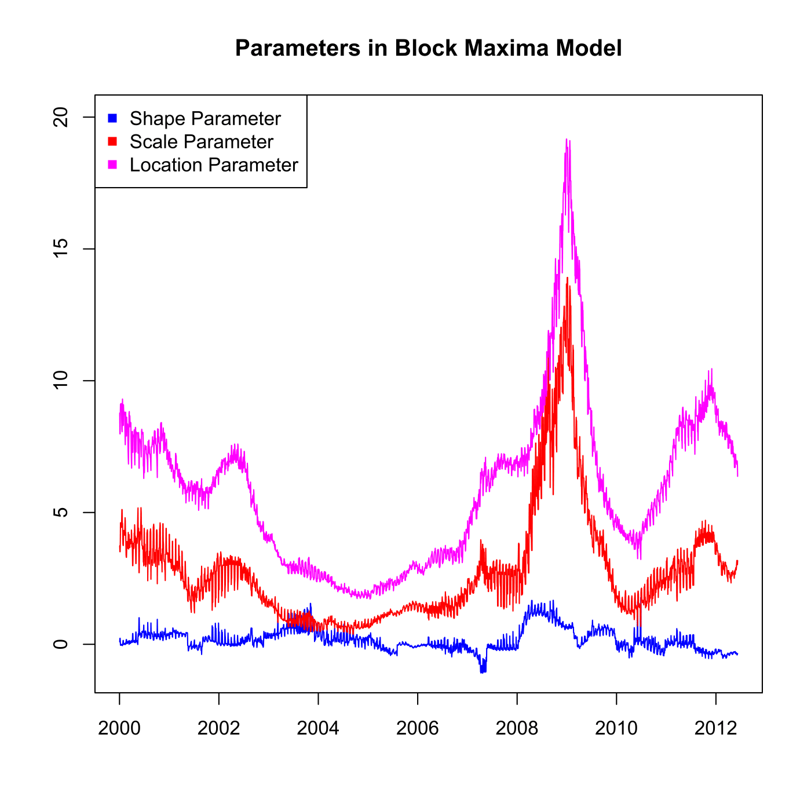

[](http://quantlet.de/)

## [](http://quantlet.de/) **SFEvar_block_max_params** [](http://quantlet.de/)

```yaml

Name of QuantLet : SFEvar_block_max_params

Published in : Statistics of Financial Markets

Description : 'Provides parameters estimated for calculating Value-at-Risk (VaR) with Block Maxima
model.'

Keywords : 'VaR, parameter, block-maxima, portfolio, estimation, financial, forecast, risk, data
visualization, graphical representation, plot, time-series'

See also : 'SFEvar_block_max_backtesting, SFEvar_pot_backtesting, SFEvar_pot_params, block_max,
var_block_max_backtesting, var_pot, var_pot_backtesting'

Author : Lasse Groth, Awdesch Melzer

Submitted : Fri, November 29 2013 by Awdesch Melzer

Datafiles : alpha0012_bMax_Portf.dat, beta0012_bMax_Portf.dat, kappa0012_bMax_Portf.dat

Input: 
- b: location parameter
- k: shape parameter
- a: scale parameter

Example : Plot of the parameters estimated for calculating Value-at-Risk with Block Maxima model.

```




### R Code:
```r

# clear variables and close windows
rm(list = ls(all = TRUE))
graphics.off()

# load data
k = t(read.table("kappa0012_bMax_Portf.dat"))
a = t(read.table("alpha0012_bMax_Portf.dat"))
b = t(read.table("beta0012_bMax_Portf.dat"))

# Plot the shape, scale and location parameter.
plot(k, type = "l", col = "blue", ylim = c(-1, 20), ylab = c(""), xlab = c(""), 
    axes = FALSE)
lines(a, col = "red")
lines(b, col = "magenta")
title("Parameters in Block Maxima Model")
box()
axis(1, seq(0, length = 8, by = 500), seq(2000, 2014, by = 2))
axis(2)
legend("topleft", c("Shape Parameter", "Scale Parameter", "Location Parameter"), 
    pch = c(15, 15, 15), col = c("blue", "red", "magenta"))
```
