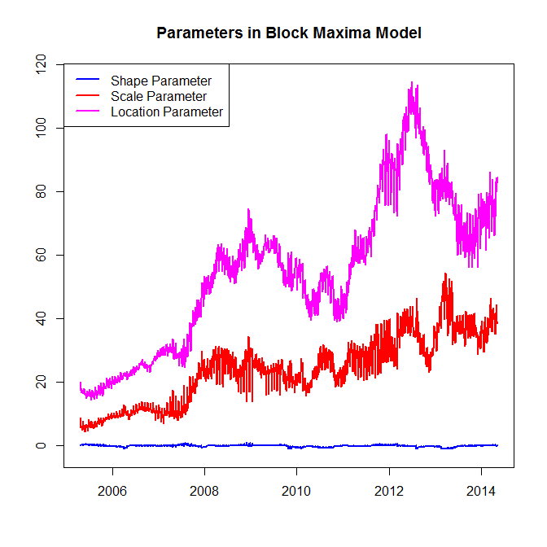
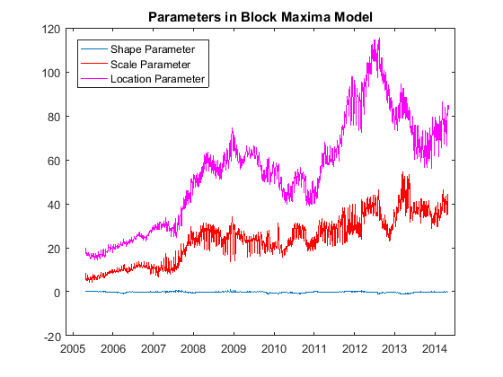

[](http://quantlet.de/)

## [](http://quantlet.de/) **SFEvar_block_max_params** [](http://quantlet.de/)

```yaml

Name of QuantLet : SFEvar_block_max_params

Published in : Statistics of Financial Markets

Description : 'Plots the parameters estimated for calculating Value-at-Risk with block 
               maximal model. These parameters were estimated with a moving window of size 
               250 for the portfolio composed by Bayer, BMW, siemens and Volkswagen.'


Keywords : 'VaR, parameter, block-maxima, portfolio, estimation, financial, forecast, risk, data
visualization, graphical representation, plot, time-series'

See also : 'SFEvar_block_max_backtesting, SFEvar_pot_backtesting, SFEvar_pot_params, block_max,
var_block_max_backtesting, var_pot, var_pot_backtesting'

Author : Lasse Groth, Awdesch Melzer and Piedad Castro
Author[Matlab]: Barbara Choros, Awdesch Melzer and Piedad Castro

Submitted : Thu, December 1 2016 by Piedad Castro

Datafiles : '2004-2014_dax_ftse.csv'

Input: 'The datafile contains daily price data from 07.05.2004 to 07.05.2014 for 
selected companies which are part of DAX30 and FTSE100 as well as the 
corresponding index data. This code makes use of the daily prices for the 
companies Bayer, BMW, Siemens and Volkswagen.'

```





### R Code
```r

# clear all variables and close windows
rm(list = ls(all = TRUE))
graphics.off()

# set working directory
# setwd("C:/...")

# install and load packages
libraries = c("evd")
lapply(libraries, function(x) if (!(x %in% installed.packages())) {
  install.packages(x)
})
lapply(libraries, library, quietly = TRUE, character.only = TRUE)

# data import
Data = read.csv("2004-2014_dax_ftse.csv")

# date variable as variable of class Date
Data$Date = as.Date(Data$Date, "%Y-%m-%d")

# Create portfolio
x       = Data$BAYER + Data$BMW + Data$SIEMENS + Data$VOLKSWAGEN
x       = diff(x)     # returns
minus_x = -x          # negative returns
Obs     = length(x)   # number of observations 
h       = 250         # size of moving window
p       = 0.95        # quantile for the Value at Risk
n       = 16          # observation window for estimating quantile in VaR

# function ----
block_max = function(y,n,p){
  N = length(y)
  k = floor(N/n)
  z = rep(NaN, k)
  for(j in 1:(k-1)){
    r    = y[((j-1)*n+1):(j*n)]
    z[j] = max(r)
  }
  r     = y[((k-1)*n+1):length(y)]
  z[k]  = max(r)
  
  parmhat = fgev(z, std.err = FALSE)$param
  kappa   = parmhat["shape"]
  tau     = -1/kappa
  alpha   = parmhat["scale"]
  beta    = parmhat["loc"]
  
  pext    = p^n
  var     = beta+alpha/kappa*((-log(1-pext))^(-kappa)-1)
  out    = c(var=var,tau=tau,alpha=alpha,beta=beta,kappa=kappa) 
}

# Value at Risk ----
# preallocation
results = data.frame(var=rep(NaN,Obs-h), tau=rep(NaN,Obs-h), alpha=rep(NaN,Obs-h),
                     beta=rep(NaN,Obs-h), kappa=rep(NaN,Obs-h) )

for(i in 1:(Obs-h)){
  y = minus_x[i:(i+h-1)]
  results[i,] = block_max(y,n,p)
}

# plot ----
ylim = c(min(min(results[,-(1:2)]))-1, max(max(results[,-(1:2)]))+1)
windows()
plot(Data$Date[(h+2):length(Data$Date)],results$kappa, xlab = "", 
     ylab = "", col = "blue", type = "l", lwd = 2, ylim = ylim)
lines(Data$Date[(h+2):length(Data$Date)],results$alpha, col = "red", lwd = 2)
lines(Data$Date[(h+2):length(Data$Date)],results$beta, col = "magenta", lwd = 2)
legend("topleft", c("Shape Parameter", "Scale Parameter",  "Location Parameter"), 
       lwd = c(2, 2, 2), col = c("blue", "red", "magenta"))
title("Parameters in Block Maxima Model")

```

automatically created on 2018-05-28

### MATLAB Code
```matlab

%% clear all variables and console 
clear
clc

%% close windows
close all

%% data import
formatSpec = '%{yyyy-MM-dd}D%f%f%f%f%f%f%f%f%f%f%f%f%f%f%f%f%f%f%f%f%f%f%f%f%f%f%f%f%f%f%f%f%f%f%f%f%f%f%f%f%f%f';
Data       = readtable('2004-2014_dax_ftse.csv','Delimiter',',', 'Format',formatSpec);        
Data       = Data(:,{'Date','BAYER','BMW', 'SIEMENS', 'VOLKSWAGEN'});

%% create portfolio
x       = Data.BAYER + Data.BMW + Data.SIEMENS + Data.VOLKSWAGEN;
x       = diff(x);    % returns
minus_x = -x;         % negative returns
Obs     = length(x);  % number of observations
p       = 0.95;       % quantile for the Value at Risk
h       = 250;        % size of moving window
n       = 16;         % size of moving window for estimating quantile in VaR

%% Value at Risk
% preallocation
var   = NaN(1,Obs-h);
tau   = var;
alpha = var;
beta  = var;
kappa = var;

for i = 1:Obs-h
    y = minus_x(i:i+h-1);
    [var(i),tau(i),alpha(i),beta(i),kappa(i)] = block_max(y,n,p);
end;

%% plot
plot(Data.Date(h+2:end),kappa)
hold on
plot(Data.Date(h+2:end),alpha,'Color','red')
plot(Data.Date(h+2:end),beta,'Color','m')
hold off
legend('Shape Parameter','Scale Parameter','Location Parameter','Location','NorthWest')
title('Parameters in Block Maxima Model')

```

automatically created on 2018-05-28