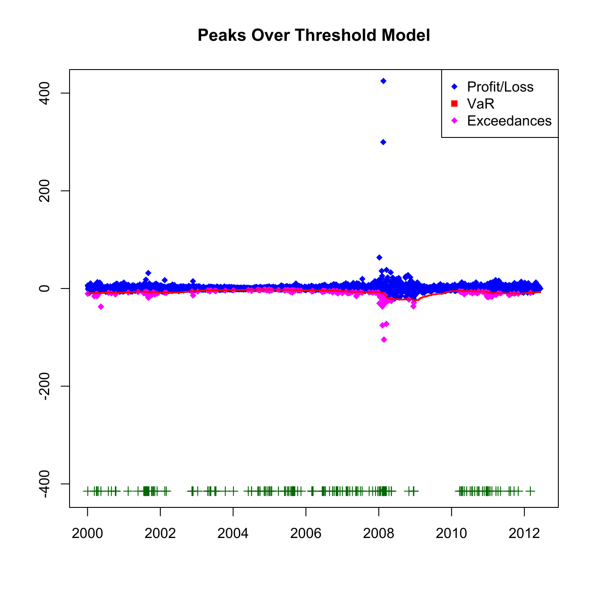

[](http://quantlet.de/)

## [](http://quantlet.de/) **SFEvar_pot_backtesting** [](http://quantlet.de/)

```yaml

Name of QuantLet : SFEvar_pot_backtesting

Published in : Statistics of Financial Markets

Description : 'Provides backtesting results for the Value-at-Risk (VaR) computed with Peaks Over
Treshold model with generalized Pareto distribution.'

Keywords : 'VaR, backtesting, block-maxima, POT, extreme-value, pareto, portfolio, estimation,
financial, forecast, exceedance, risk, data visualization, graphical representation, plot,
time-series'

See also : 'SFEvar_block_max_params, SFEvar_block_max_backtesting, SFEvar_pot_params, block_max,
var_block_max_backtesting, var_pot, var_pot_backtesting'

Author : Lasse Groth, Awdesch Melzer

Submitted : Mon, December 02 2013 by Awdesch Melzer

Datafiles : 'BAYER_close_0012.dat, BMW_close_0012.dat, SIEMENS_close_0012.dat, VW_close_0012.dat,
VaR0012_pot_Portf.dat'

Input: 
- x,y,z: vector of returns
- v: values of Value-at-Risk
- h: size of the window

Output: 
- p: exceedances ratio

Example : 'Plot for the Value-at-Risk estimation at 0.05 level a portfolio of Bayer, BMW and
Siemens stock for the time period from 2000-01-01 to 2012-12-31.'

```




### R Code:
```r

# clear variables and close windows
rm(list = ls(all = TRUE))
graphics.off()

# load data
v = t(read.table("VaR0012_pot_Portf.dat"))
x1 = read.table("BAYER_close_0012.dat")
x2 = read.table("BMW_close_0012.dat")
x3 = read.table("SIEMENS_close_0012.dat")
x4 = read.table("VW_close_0012.dat")

# Size of window
h = 250
v = -v
V = x1 + x2 + x3 + x4
d = dim(V)
L = V[-1, ] - V[1:(d[1] - 1), ]
T = length(L)

outlier = matrix(, 1, T - h)
exceedVaR = matrix(, , )
exceedVaR = (L[(1 + h):(d[1] - 1)] < v[1:(T - h)])  # Check for exceedances
for (j in 1:(T - h)) {
    if (exceedVaR[j] == TRUE) 
        {
            outlier[j] = L[j + h]
        }  # Find exceedances
}

K = which(is.finite(outlier))
outlier = outlier[K]
p = round(sum(exceedVaR)/(T - h), 4)  # Calculate the exceedance ratio

# Plot the values, VaR estimation and the exceedances
plot(L[(h + 1):(d[1] - 1)], pch = 18, col = "blue", ylim = c(-415, 415), xlab = c(""), 
    ylab = c(""), axes = FALSE)
box()
axis(1, seq(0, length = 8, by = 500), seq(2000, 2014, by = 2))
axis(2)
title("Peaks Over Threshold Model")

points(K, outlier, pch = 18, col = "magenta")
lines(v, col = "red", lwd = 2)

yplus = K * 0 + min(L[(h + 1):(d[1] - 1)]) - 2
points(K, yplus, pch = 3, col = "dark green")
legend("topright", c("Profit/Loss", "VaR", "Exceedances"), pch = c(18, 15, 18), 
    col = c("blue", "red", "magenta"))

# Print the exceedances ratio
print(paste("Exceedances ratio:", "", p))
```
