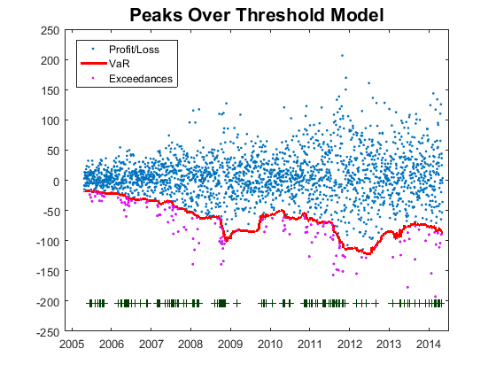
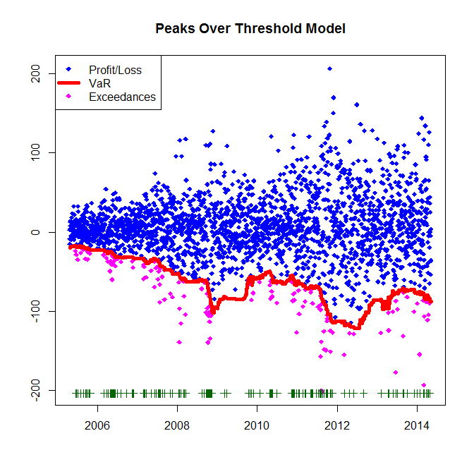

[](http://quantlet.de/)

## [](http://quantlet.de/) **SFEvar_pot_backtesting** [](http://quantlet.de/)

```yaml

Name of QuantLet : SFEvar_pot_backtesting

Published in : Statistics of Financial Markets

Description : 'Plots the Value-at-Risk estimation at 0.05 level for the portfolio composed 
               by Bayer, BMW, siemens and Volkswagen. The Value at Risk is computed by means
               of the Peaks Over Treshold model with generalized Pareto distribution using a 
               moving window of size 250.'

Keywords : 'VaR, backtesting, block-maxima, POT, extreme-value, pareto, portfolio, estimation,
financial, forecast, exceedance, risk, data visualization, graphical representation, plot,
time-series'

See also : 'SFEvar_block_max_params, SFEvar_block_max_backtesting, SFEvar_pot_params, block_max,
var_block_max_backtesting, var_pot, var_pot_backtesting'

Author : Lasse Groth, Awdesch Melzer, Piedad Castro
Author[Matlab]: Barbara Choros

Submitted : Thu, November 24 2016 by Piedad Castro

Datafiles : '2004-2014_dax_ftse.csv'

Input: 'The datafile contains daily price data from 07.05.2004 to 07.05.2014 for 
selected companies which are part of DAX30 and FTSE100 as well as the 
corresponding index data. This code makes use of the daily prices for the 
companies Bayer, BMW, Siemens and Volkswagen.'

Output: 
- p: exceedances ratio

```





### R Code
```r

# clear all variables and close windows
rm(list = ls(all = TRUE))
graphics.off()

# set working directory
# setwd("C:/...")

# install and load packages
libraries = c("ismev")
lapply(libraries, function(x) if (!(x %in% installed.packages())) {
  install.packages(x)
})
lapply(libraries, library, quietly = TRUE, character.only = TRUE)

# data import
Data = read.csv("2004-2014_dax_ftse.csv")

# Date variable as variable of class Date
Data$Date = as.Date(Data$Date, "%Y-%m-%d")

h       = 250         # size of moving window
x       = Data$BAYER + Data$BMW + Data$SIEMENS + Data$VOLKSWAGEN
x       = diff(x)     # returns
minus_x = -x
p       = 0.95        # quantile for the Value at Risk
q       = 0.1 
Obs     = length(x)

# function ----
var_pot = function(y,h,p,q){
  N  = floor(h*q)
  ys = sort(y,decreasing = TRUE)
  u  = ys[N+1]
  z  = y[y>u]-u
  params = gpd.fit(z, threshold = 1 - p)
  ksi    = params$mle[2]
  beta   = params$mle[1]
  var    = u + beta/ksi*((h/N*(1-p))^(-ksi)-1)
  out    = c(var=var,ksi=ksi,beta=beta,u=u) 
}

# Value at Risk ----
# preallocation
results = data.frame(var=rep(NaN,Obs-h), ksi=rep(NaN,Obs-h),
           beta=rep(NaN,Obs-h), u=rep(NaN,Obs-h) )

for(i in 1:(Obs-h)){
  y = minus_x[i:(i+h-1)]
  results[i,] = var_pot(y,h,p,q)
}

# number of exceedances fo Value at Risk, p ----
v = -results$var
L = x

# preallocation
outlier   = rep(NaN,Obs-h)
exceedVaR = outlier

for(j in 1:(Obs-h)){
  exceedVaR[j] = (L[j+h]<v[j])
  if(exceedVaR[j]>0) 
    outlier[j] = L[j+h]
}

p       = sum(exceedVaR)/(Obs-h)
K       = which(is.finite(outlier))
outlier = outlier[K]

date_outlier = Data$Date[(h+2):length(Data$Date)]
date_outlier = date_outlier[K]

# plot ----
windows()
plot(Data$Date[(h+2):length(Data$Date)],L[(h+1):length(L)], xlab = "", 
     ylab = "", col = "blue", pch = 18)
points(date_outlier, outlier, pch = 18, col = "magenta")
points(Data$Date[(h+2):length(Data$Date)], v, col= "red", lwd = 5, type = "l")
yplus = K * 0 + min(L[(h + 1):length(L)]) - 2
points(date_outlier, yplus, pch = 3, col = "dark green")
legend("topleft", c("Profit/Loss", "VaR", "Exceedances"), pch = c(18, NA, 18), 
       lwd = c(NA, 5, NA), col = c("blue", "red", "magenta"))
title("Peaks Over Threshold Model")

# Print the exceedances ratio
print(paste("Exceedances ratio:", "", p))

```

automatically created on 2018-09-04

### MATLAB Code
```matlab

%% clear all variables and console 
clear
clc

%% close windows
close all

%% data import
formatSpec = '%{yyyy-MM-dd}D%f%f%f%f%f%f%f%f%f%f%f%f%f%f%f%f%f%f%f%f%f%f%f%f%f%f%f%f%f%f%f%f%f%f%f%f%f%f%f%f%f%f';
Data       = readtable('2004-2014_dax_ftse.csv','Delimiter',',', 'Format',formatSpec);
Data       = Data(:,{'Date','BAYER','BMW', 'SIEMENS', 'VOLKSWAGEN'});

h       = 250;        % size of moving window
x       = Data.BAYER + Data.BMW + Data.SIEMENS + Data.VOLKSWAGEN;
x       = diff(x);  % returns
minus_x = -x;
p       = 0.95;       % quantile for the Value at Risk
q       = 0.1;
Obs     = length(x);

%% Value at Risk
% preallocation
var  = NaN(1,Obs-h);
ksi  = var;
beta = var;
u    = var;

for i=1:(Obs-h)
    y = minus_x(i:(i+h-1));
    [var(i),ksi(i),beta(i),u(i)] = var_pot(y,h,p,q);
end

%% number of exceedances for Value at Risk, p
v = -var;
L = x;

% preallocation
outlier   = NaN(1,Obs-h);
exceedVaR = outlier;

for j=1:Obs-h
    exceedVaR(j) = (L(j+h)<v(j));
    if exceedVaR(j)>0 
        outlier(j) = L(j+h);
    end;
end;

p       = sum(exceedVaR)/(Obs-h);
K       = find(isfinite(outlier));
outlier = outlier(K);

date_outlier = Data.Date(h+2:end);
date_outlier = date_outlier(K);

%% plot
plot(Data.Date(h+2:end),L(h+1:end), '.')
hold on
plot(Data.Date(h+2:end), v,'Color','red','LineWidth',2)
plot(date_outlier,outlier,'.','Color','m')
yplus   = K.*0+min(L(h+1:end))-2;
plot(date_outlier,yplus,'+','Color',[0,0.25098,0])
legend('Profit/Loss','VaR','Exceedances', 'Location', 'northwest')
title('Peaks Over Threshold Model','FontSize',16,'FontWeight','Bold')

```

automatically created on 2018-09-04