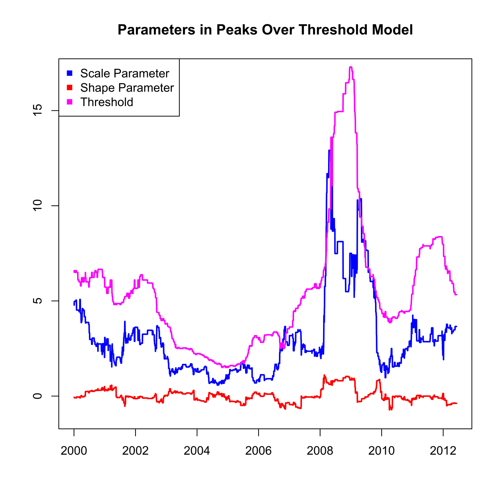

[](http://quantlet.de/)

## [](http://quantlet.de/) **SFEvar_pot_params** [](http://quantlet.de/)

```yaml

Name of QuantLet : SFEvar_pot_params

Published in : Statistics of Financial Markets

Description : 'Provides parameters estimated for calculating Value-at-Risk (VaR) with Peaks Over
Treshold model.'

Keywords : 'VaR, parameter, POT, extreme-value, portfolio, estimation, financial, forecast, risk,
data visualization, graphical representation, plot, time-series'

See also : 'SFEvar_block_max_backtesting, SFEvar_pot_backtesting, SFEvar_block_max_params,
block_max, var_block_max_backtesting, var_pot, var_pot_backtesting'

Author : Lasse Groth, Awdesch Melzer

Submitted : Sat, January 25 2014 by Lukas Borke

Datafiles : beta0012_pot_Portf.dat, ksi0012_pot_Portf.dat, u0012_pot_Portf.dat

Input: 
- beta: scale parameter
- ksi: shape parameter
- u: threshold

Example : 'Plot of the parameters estimated for calculating Value-at-Risk with Peaks Over Treshold
model.'

```




### R Code:
```r

# clear variables and close windows
rm(list = ls(all = TRUE))
graphics.off()

# load data
beta = t(read.table("beta0012_pot_Portf.dat"))
ksi  = t(read.table("ksi0012_pot_Portf.dat"))
u    = t(read.table("u0012_pot_Portf.dat"))

# Plot the shape, scale and treshold parameter.
plot(beta, type = "l", lwd = 2, col = "blue", ylim = c(-1, 17), ylab = c(""), xlab = c(""), 
    axes = FALSE)
lines(ksi, col = "red", lwd = 2)
lines(u, col = "magenta", lwd = 2)
title("Parameters in Peaks Over Threshold Model")
box()
axis(1, seq(0, length = 8, by = 500), seq(2000, 2014, by = 2))
axis(2)
legend("topleft", c("Scale Parameter", "Shape Parameter", "Threshold"), pch = c(15, 
    15, 15), col = c("blue", "red", "magenta"))
```
