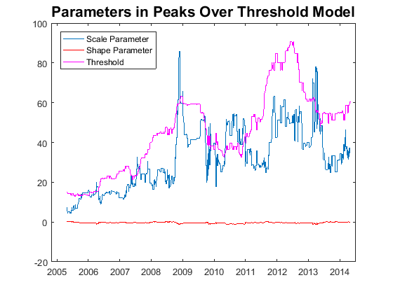

[](http://quantlet.de/)

## [](http://quantlet.de/) **SFEvar_pot_params** [](http://quantlet.de/)

```yaml

Name of QuantLet : SFEvar_pot_params

Published in : Statistics of Financial Markets

Description : 'Plots the parameters estimated for calculating Value-at-Risk with Peaks Over 
               Treshold model. These parameters were estimated with a moving window of size 
               250 for the portfolio composed by Bayer, BMW, siemens and Volkswagen.'


Keywords : 'VaR, backtesting, block-maxima, POT, extreme-value, pareto, portfolio, estimation,
financial, forecast, exceedance, risk, data visualization, graphical representation, plot,
time-series'

See also : 'SFEvar_block_max_params, SFEvar_block_max_backtesting, SFEvar_pot_params, block_max,
var_block_max_backtesting, var_pot, var_pot_backtesting'

Author : Lasse Groth, Awdesch Melzer, Piedad Castro
Author[Matlab]: Barbara Choros, Awdesch Melzer

Submitted : Thu, November 24 2016 by Piedad Castro

Datafiles : '2004-2014_dax_ftse.csv'

Input: 'The datafile contains daily price data from 07.05.2004 to 07.05.2014 for 
selected companies which are part of DAX30 and FTSE100 as well as the 
corresponding index data. This code makes use of the daily prices for the 
companies Bayer, BMW, Siemens and Volkswagen.'

```




### R Code
```r

# clear all variables and close windows
rm(list = ls(all = TRUE))
graphics.off()

# set working directory
# setwd("C:/...")

# install and load packages
libraries = c("ismev")
lapply(libraries, function(x) if (!(x %in% installed.packages())) {
  install.packages(x)
})
lapply(libraries, library, quietly = TRUE, character.only = TRUE)

# data import
Data = read.csv("2004-2014_dax_ftse.csv")

# Date variable as variable of class Date
Data$Date = as.Date(Data$Date, "%Y-%m-%d")

h       = 250         # size of moving window
x       = Data$BAYER + Data$BMW + Data$SIEMENS + Data$VOLKSWAGEN
x       = diff(x)     # returns
minus_x = -x
p       = 0.95        # quantile for the Value at Risk
q       = 0.1 
Obs     = length(x)

# function ----
var_pot = function(y,h,p,q){
  # Inputs:       
  # y - vector of returns
  # p - quantile for at which Value at Risk should be estimated
  # h - size of the window
  # q - scalar, e.g. 0.1
  N  = floor(h*q)
  ys = sort(y,decreasing = TRUE)
  u  = ys[N+1]
  z  = y[y>u]-u
  params = gpd.fit(z, threshold = 1 - p)
  ksi    = params$mle[2]
  beta   = params$mle[1]
  var    = u + beta/ksi*((h/N*(1-p))^(-ksi)-1)
  out    = c(var=var,ksi=ksi,beta=beta,u=u) 
}

# Value at Risk ----
# preallocation
results = data.frame(var=rep(NaN,Obs-h), ksi=rep(NaN,Obs-h),
                     beta=rep(NaN,Obs-h), u=rep(NaN,Obs-h))

for(i in 1:(Obs-h)){
  y = minus_x[i:(i+h-1)]
  results[i,] = var_pot(y,h,p,q)
}

# Plot the shape, scale and treshold parameter.
ylim = c(min(min(results[, -1]))-1, max(max(results[, -1]))+1)
windows()
plot(Data$Date[(h+2):length(Data$Date)],results$beta, xlab = "", 
     ylab = "", col = "blue", type = "l", lwd = 2, ylim = ylim)
lines(Data$Date[(h+2):length(Data$Date)],results$ksi, col = "red", lwd = 2)
lines(Data$Date[(h+2):length(Data$Date)],results$u, col = "magenta", lwd = 2)
legend("topleft", c("Scale Parameter", "Shape Parameter", "Threshold"), 
       lwd = c(2, 2, 2), col = c("blue", "red", "magenta"))
title("Parameters in Peaks Over Threshold Model")

```

automatically created on 2018-05-28

### MATLAB Code
```matlab

%% clear all variables and console 
clear
clc

%% close windows
close all

%% data import
formatSpec = '%{yyyy-MM-dd}D%f%f%f%f%f%f%f%f%f%f%f%f%f%f%f%f%f%f%f%f%f%f%f%f%f%f%f%f%f%f%f%f%f%f%f%f%f%f%f%f%f%f';
Data       = readtable('2004-2014_dax_ftse.csv','Delimiter',',', 'Format',formatSpec);
Data       = Data(:,{'Date','BAYER','BMW', 'SIEMENS', 'VOLKSWAGEN'});

h       = 250;        % size of moving window
x       = Data.BAYER + Data.BMW + Data.SIEMENS + Data.VOLKSWAGEN;
x       = diff(x);  % returns
minus_x = -x;
p       = 0.95;       % quantile for the Value at Risk
q       = 0.1;
Obs     = length(x);

%% Value at Risk
% preallocation
var  = NaN(1,Obs-h);
ksi  = var;
beta = var;
u    = var;

for i=1:(Obs-h)
    y = minus_x(i:(i+h-1));
    [var(i),ksi(i),beta(i),u(i)] = var_pot(y,h,p,q);
end

%% plot
plot(Data.Date(h+2:end),beta)
hold on
plot(Data.Date(h+2:end),ksi,'Color','red')
plot(Data.Date(h+2:end),u,'Color','m')
legend('Scale Parameter','Shape Parameter','Threshold','FontSize',16,'FontWeight','Bold','Location','NorthWest')
title('Parameters in Peaks Over Threshold Model','FontSize',16,'FontWeight','Bold')

```

automatically created on 2018-05-28