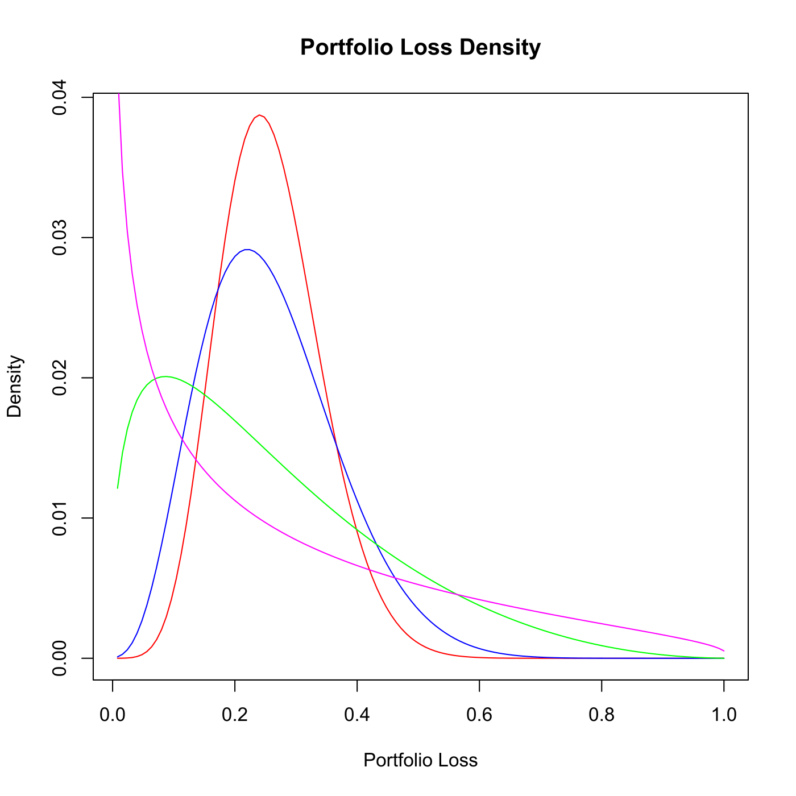

[](http://quantlet.de/)

## [](http://quantlet.de/) **SFEPortfolioLossDensity** [](http://quantlet.de/)

```yaml

Name of QuantLet : SFEPortfolioLossDensity

Published in : Statistics of Financial Markets

Description : 'Computes the density function of the loss in a portfolio of bonds or other credit
instruments using a one-factor Gaussian copula. The marginal densities of default times are
implemented as poisson distributions using constant default intensities. After computing the
portfolio loss densities for various values of the dependence parameter rho, these densities are
plotted.'

Keywords : 'CDO, Credit Risk, One-Factor Gaussian Copula, copula, loss-distribution, loss function,
gaussian, density, asset, bond, financial, poisson, portfolio, plot, graphical representation'

See also : 'BaseCorrGaussModelCDO, CompCorrGaussModelCDO, SFEbaseCorr, SFEcompCorr, SFEgaussCop,
lowerTrLossGauss, SFEETLGaussTr1, ETL'

Author : Felix Jung

Submitted : Mon, February 10 2014 by Felix Jung

```




### R Code:
```r

# clear variables and close windows
rm(list = ls(all = TRUE))
graphics.off()

# Conditional Gaussian default probability
CondDefaultProbGauss = function(rho, market.factor, default.time, hazard.rate) {
    # Determine default probability from hazard rate
    dp = drop(1 - exp(-hazard.rate * default.time))
    
    # Determine quantile for probability in standard normal distribution
    normal.quantile = qnorm(dp, mean = 0, sd = 1, lower.tail = TRUE, log.p = FALSE)
    
    # Determine value of Gaussian random variable according to factor model
    u = (normal.quantile - sqrt(rho) * market.factor)/sqrt(1 - rho)
    
    # Return conditional gaussian default probability
    pnorm(u, mean = 0, sd = 1, lower.tail = TRUE, log.p = FALSE)
}

# Conditional probability for pool loss rate of n/M
CondPoolLossProb = function(rho, market.factor, default.time, hazard.rate, number.defaults, 
    entities) {
    sapply(X = market.factor, FUN = function(market.factor, rho, default.time, 
        hazard.rate, number.defaults, entities) {
        # Compute pool loss probability conditional on market factor
        cond.pool.loss.prob = dbinom(x = number.defaults, size = entities, prob = CondDefaultProbGauss(rho, 
            market.factor, default.time, hazard.rate), log = FALSE)
        
        # Compute the market factor probability
        market.factor.prob = dnorm(market.factor, mean = 0, sd = 1, log = FALSE)
        
        return(cond.pool.loss.prob * market.factor.prob)
    }, rho = rho, default.time = default.time, hazard.rate = hazard.rate, number.default = number.defaults, 
        entities = entities)
}

# Unconditional probability for pool loss rate of n/M
PoolLossProb = function(rho, default.time, hazard.rate, number.defaults, entities) {
    integrate(f = CondPoolLossProb, lower = -Inf, upper = Inf, rho = rho, default.time = default.time, 
        hazard.rate = hazard.rate, number.defaults = number.defaults, entities = entities, 
        rel.tol = 1e-12, stop.on.error = FALSE)[[1]]
}

# Model parameters
rho.parameters = c(0.05, 0.1, 0.3, 0.5)
entities = 125
number.defaults = 1:entities
hazard.rate = 0.06
maturity = 5
default.percentage = number.defaults/entities

densities = sapply(X = rho.parameters, FUN = function(rho) {
    density = sapply(X = number.defaults, FUN = PoolLossProb, rho = rho, default.time = maturity, 
        hazard.rate = hazard.rate, entities = entities)
    return(density)
})

# plot
plot(x = default.percentage, y = densities[, 1], main = "Portfolio Loss Density", type = "l", xlab = "Portfolio Loss", 
    ylab = "Density", col = "red")
lines(x = default.percentage, y = densities[, 2], col = "blue")
lines(x = default.percentage, y = densities[, 3], col = "green")
lines(x = default.percentage, y = densities[, 4], col = "magenta")
```
