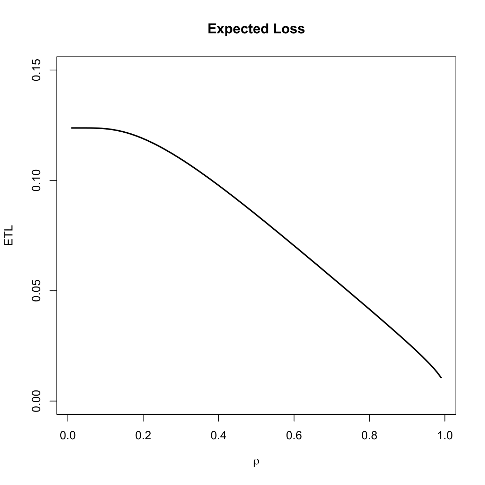
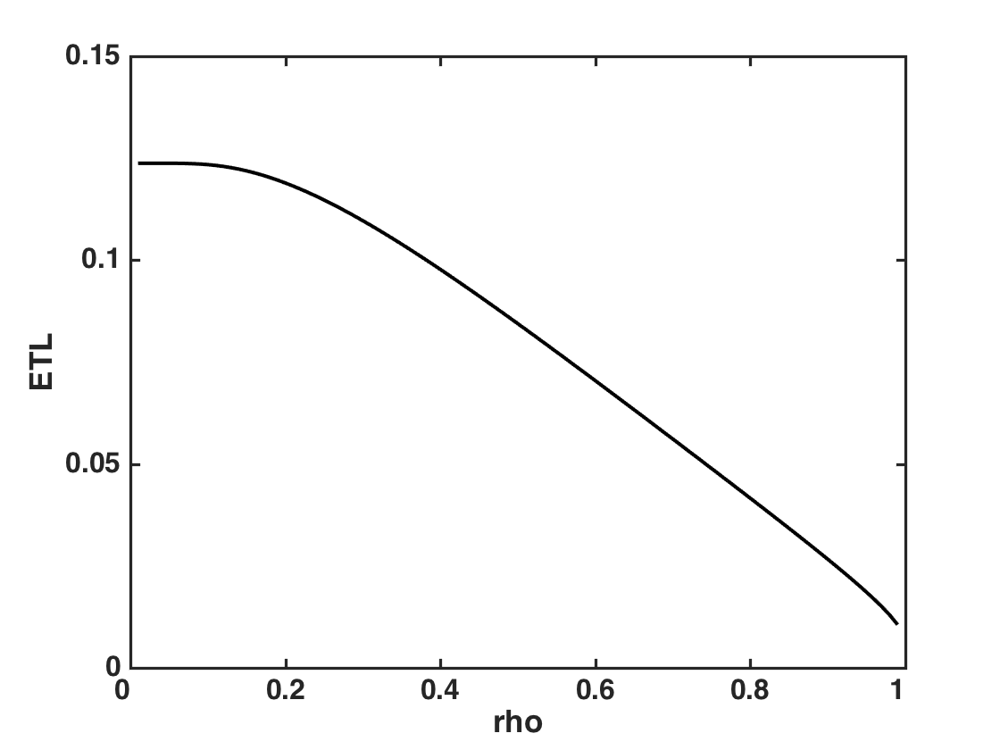

[](http://quantlet.de/)

## [](http://quantlet.de/) **SFEETLGaussTr1** [](http://quantlet.de/)

```yaml

Name of QuantLet : SFEETLGaussTr1

Published in : Statistics of Financial Markets

Description : 'Calculates expected loss of the equity tranche calculated using the one factor
Gaussian model with one-year default probability computed from the iTraxx index Series 8 with 5
years maturity on 20071022.'

Keywords : 'CDO, Credit Risk, Equity tranche, Expected loss,normal, numerical integration,
gaussian, asset, financial, plot, graphical representation'

See also : 'BaseCorrGaussModelCDO, CompCorrGaussModelCDO, SFEPortfolioLossDensity, SFEcompCorr,
SFEgaussCop, lowerTrLossGauss, SFEbaseCorr, ETL'

Author : Awdesch Melzer

Author[Matlab] : Barbara Choros

Submitted : Wed, April 23 2014 by Awdesch Melzer

Submitted[Matlab] : Fri, November 22 2013 by Awdesch Melzer

Example : Plot of expected loss of the equity tranche.

```






### R Code:
```r

# clear variables and close windows
rm(list = ls(all = TRUE))
graphics.off()

# install and load packages
libraries = c("pracma")
lapply(libraries, function(x) if (!(x %in% installed.packages())) {
install.packages(x)
})
lapply(libraries, library, quietly = TRUE, character.only = TRUE)

bvnIntegrand = function(theta, b1, b2) {
    # Bivariate normal distribution | SUBROUNTINE of mvncdf() Integrand is 
    # exp(-(b1^2 + b2^2 - 2*b1*b2*sin(theta))/(2*cos(theta)^2) )
    sintheta = sin(theta)
    cossqtheta = cos(theta)^2  # always positive
    integrand = exp(-((b1 * sintheta - b2)^2/cossqtheta + b1^2)/2)
    return(integrand)
}

mvncdf = function(b, mu, sigma) {
    # MVNCDF Multivariate normal cumulative distribution function.  P = MVNCDF(B,
    # MU, SIGMA) returns the joint cumulative probability using numerical
    # integration. B is a vector of values, MU is the mean parameter vector, and
    # SIGMA is the covariance matrix.
    n = NROW(b)
    b = as.matrix(b)
    if (NCOL(b) != length(mu)) {
        stop("The first two inputs must be vectors of the same length.")
    }
    # Rho = sigma/(sqrt(diag(sigma))%*%t(sqrt(diag(sigma))))
    rho = sigma[2]
    if (rho > 0) {
        p1 = pnorm(apply(b, 2, min))
        p1[any(is.nan(b), 2)] = NaN
    } else {
        p1 = pnorm(b[, 1]) - pnorm(-b[, 2])
        p1[p1 < 0] = 0  # max would drop NaNs
    }
    if (abs(rho) < 1) {
        loLimit = asin(rho)
        hiLimit = sign(rho) * pi/2
        p2 = numeric()
        for (i in 1:n) {
            b1 = b[i, 1]
            b2 = b[i, 2]
            p2[i] = integral(function(x) bvnIntegrand(x, b1, b2), xmin = loLimit, 
                xmax = hiLimit, method = "Kronrod", reltol = 1e-10)
        }
    } else {
        p2 = rep(0, length(p1))
    }
    p = p1 - p2/(2 * pi)
    return(p)
}

ETL = function(a, R, defProb, UAP) {
    C = qnorm(defProb, 0, 1)
    NinvK = qnorm(UAP/(1 - R), 0, 1)
    A = (C - sqrt(1 - a^2) * NinvK)/a
    Sigma = matrix(c(1, -a, -a, 1), 2, 2)  # (1 -a)
    # (-a 1)
    Mu = c(0, 0)
    EL1 = mvncdf(b = cbind(C, -A), mu = Mu, sigma = Sigma)  # mvnormal
    EL2 = pnorm(A)
    EL = EL1/UAP * (1 - R) + EL2
    return(EL)
}

# Main computation
index = 37.2416
recoveryR = 0.4  # Recovery rate
UAP = c(0.03, 0.06, 0.09, 0.12, 0.22)  # Upper attachment points
lam = index/10000/(1 - recoveryR)
tr = 1
defProb = 1 - exp(-lam)  # Default probability
rho = seq(0.01, 0.99, by = 0.01)  # compound correlation
a = sqrt(rho)  # square-root of compound correlation
etl = numeric()
for (i in 1:length(a)) {
    etl[i] = ETL(a[i], recoveryR, defProb, UAP[tr])
}

# Plot
plot(rho, etl, main = "Expected Loss", col = "black", lwd = 2, xlab = expression(rho), ylab = "ETL", type = "l", 
    ylim = c(0, 0.15))
```

### MATLAB Code:
```matlab
clear all
close all
clc

index     = 37.2416;
recoveryR =0.4;                            % Recovery rate
UAP       =[0.03, 0.06, 0.09, 0.12, 0.22]; % Upper attachment points
lam       = index / 10000 / (1 - recoveryR);
tr        = 1;
defProb   = 1 - exp(-lam);                % Default probability
rho       = 0.01:0.01:0.99;               % compound correlation
a         = sqrt(rho);                    % square-root of compound correlation
for i = 1:length(a)
etl(i, 1) = ETL(a(i), recoveryR, defProb, UAP(tr));
end

hold on
plot(rho, etl, 'k', 'LineWidth', 2)
xlabel('rho', 'FontSize', 16, 'FontWeight', 'Bold')
ylabel('ETL', 'FontSize', 16, 'FontWeight', 'Bold')
set(gca, 'YTick', 0:0.05:0.15, 'FontSize', 16, 'FontWeight', 'Bold')
ylim([0, 0.15])
set(gca, 'FontSize', 16, 'FontWeight', 'Bold', 'LineWidth', 1.6)
t1  = [0:0.2:1];
set(gca, 'XTick', t1, 'FontSize', 16, 'FontWeight', 'Bold', 'LineWidth', 1.6)
set(gca, 'XTickLabel', t1, 'FontSize', 16, 'FontWeight', 'Bold', 'LineWidth', 1.6)
box on
hold off

% to save the plot in pdf or png please uncomment next 2 lines:
% print -painters -dpdf -r600 SFEETLGaussTr1.pdf
% print -painters -dpng -r600 SFEETLGaussTr1.png

```
