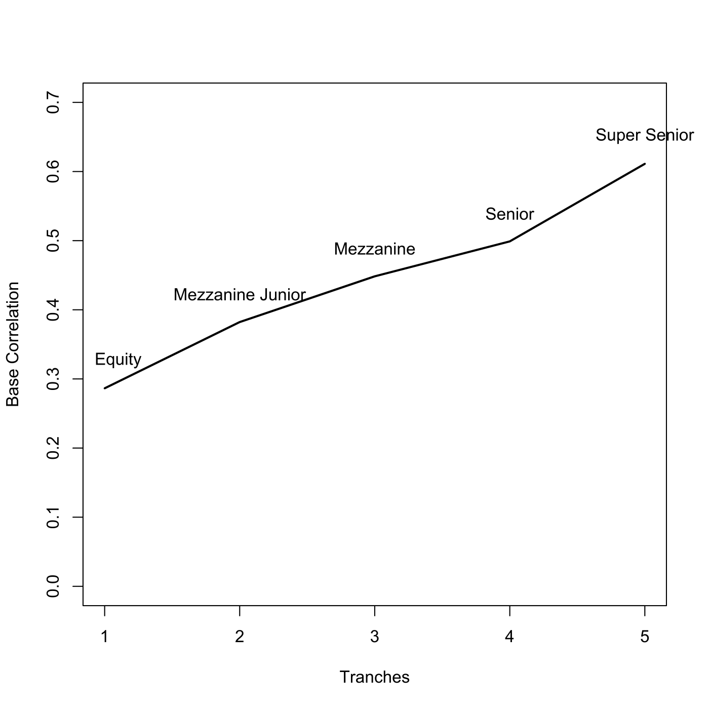
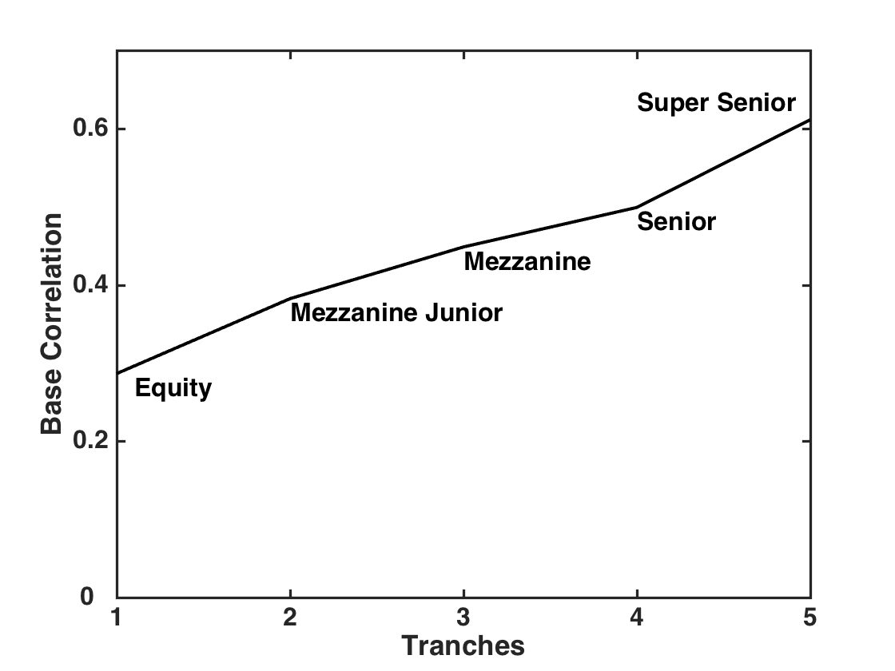

[](http://quantlet.de/)

## [](http://quantlet.de/) **SFEbaseCorr** [](http://quantlet.de/)

```yaml

Name of QuantLet : SFEbaseCorr

Published in : Statistics of Financial Markets

Description : 'Computes base compound correlation smile from the one factor Gaussian model using
data from 20071022, iTraxx Series 8 with 5 years maturity.'

Keywords : 'CDO, Credit Risk, Equity tranche, Expected loss, Gauss Kronrod, bivariate, compound,
correlation, default, integration, multivariate normal, normal, numerical integration, gaussian,
asset, financial, plot, graphical representation'

See also : 'BaseCorrGaussModelCDO, CompCorrGaussModelCDO, SFEPortfolioLossDensity, SFEcompCorr,
SFEgaussCop, lowerTrLossGauss, SFEETLGaussTr1, ETL'

Author : Awdesch Melzer

Author[Matlab] : Barbara Choros

Submitted : Wed, April 23 2014 by Awdesch Melzer

Submitted[Matlab] : Fri, November 22 2013 by Awdesch Melzer

Code warning : 'In fminbnd(function(x) BaseCorrGaussModelCDO(x, recoveryR, defProb, :, No. of max.
iterations exceeded; no convergence reached.'

```






### R Code:
```r

# clear variables and close windows
rm(list = ls(all = TRUE))
graphics.off()

# install and load packages
libraries = c("pracma")
lapply(libraries, function(x) if (!(x %in% installed.packages())) {
install.packages(x)
})
lapply(libraries, library, quietly = TRUE, character.only = TRUE)

bvnIntegrand = function(theta, b1, b2) {
    # Bivariate normal distribution | SUBROUNTINE of mvncdf() Integrand is 
    # exp(-(b1^2 + b2^2 - 2*b1*b2*sin(theta))/(2*cos(theta)^2) )
    sintheta = sin(theta)
    cossqtheta = cos(theta)^2  # always positive
    integrand = exp(-((b1 * sintheta - b2)^2/cossqtheta + b1^2)/2)
    return(integrand)
}

mvncdf = function(b, mu, sigma) {
    # MVNCDF Multivariate normal cumulative distribution function.  P = MVNCDF(B,
    # MU, SIGMA) returns the joint cumulative probability using numerical
    # integration. B is a vector of values, MU is the mean parameter vector, and
    # SIGMA is the covariance matrix.
    n = NROW(b)
    b = as.matrix(b)
    if (NCOL(b) != length(mu)) {
        stop("The first two inputs must be vectors of the same length.")
    }
    # Rho = sigma/(sqrt(diag(sigma))%*%t(sqrt(diag(sigma))))
    rho = sigma[2]
    if (rho > 0) {
        p1 = pnorm(apply(b, 2, min))
        p1[any(is.nan(b), 2)] = NaN
    } else {
        p1 = pnorm(b[, 1]) - pnorm(-b[, 2])
        p1[p1 < 0] = 0  # max would drop NaNs
    }
    if (abs(rho) < 1) {
        loLimit = asin(rho)
        hiLimit = sign(rho) * pi/2
        p2 = numeric()
        for (i in 1:n) {
            b1 = b[i, 1]
            b2 = b[i, 2]
            p2[i] = integral(function(x) bvnIntegrand(x, b1, b2), xmin = loLimit, 
                xmax = hiLimit, method = "Kronrod", reltol = 1e-10)
        }
    } else {
        p2 = rep(0, length(p1))
    }
    p = p1 - p2/(2 * pi)
    return(p)
}

BaseCorrGaussModelCDO = function(a, R, defProb, UAP, LAP, DF, DayCount, trueSpread, 
    LowerTLoss) {
    C = qnorm(defProb, 0, 1)
    NinvK = qnorm(UAP/(1 - R), 0, 1)
    A = (C - sqrt(1 - a^2) * NinvK)/a
    Sigma = matrix(c(1, -a, -a, 1), 2, 2)
    Mu = c(0, 0)
    EL1 = mvncdf(cbind(C, -A), Mu, Sigma)
    EL2 = pnorm(A)
    if (LAP == 0) {
        EL = EL1/UAP * (1 - R) + EL2
    } else {
        UpperETL = EL1 + EL2 * UAP/(1 - R)
        EL = (UpperETL - LowerTLoss)/(UAP - LAP) * (1 - R)
    }
    ProtectLeg = sum(diff(c(0, EL)) * DF)
    PremiumLeg = sum((1 - EL) * DF * DayCount)
    spread = ProtectLeg/PremiumLeg * 10000
    if (LAP == 0) {
        spread = (ProtectLeg - 0.05 * PremiumLeg) * 100
    }
    y = abs(spread - trueSpread)
    return(y)
}

lowerTrLossGauss = function(sqrtBCbef, R, defProb, LAP) {
    C = qnorm(defProb, 0, 1)
    NinvK = qnorm(LAP/(1 - R), 0, 1)
    A = (C - sqrt(1 - sqrtBCbef^2) * NinvK)/sqrtBCbef
    Sigma = matrix(c(1, -sqrtBCbef, -sqrtBCbef, 1), 2, 2)
    Mu = c(0, 0)
    EL1 = mvncdf(cbind(C, -A), Mu, Sigma)
    EL2 = pnorm(A)
    LowerETL = EL1 + EL2 * LAP/(1 - R)
    return(LowerETL)
}

# Main computation
index = 37.2416
trueSpread = c(20.45, 131.7, 59, 37.48, 22.7)
date = "10-22-2007"  # Date
Mat = "12-20-2012"  # Date of maturity
EffD = "9-20-2007"
recoveryR = 0.4  # recovery rate
discountR = 0.03  # discount rate
daysYear = 365  # number of days per year
periodspa = 4  # period span
UAP = c(0.03, 0.06, 0.09, 0.12, 0.22)  # Upper attachment points
LAP = c(0, 0.03, 0.06, 0.09, 0.12)  # Lower attachment points
day = as.Date(date, "%m-%d-%Y")
Mat = as.Date(Mat, "%m-%d-%Y")
EffD = as.Date(EffD, "%m-%d-%Y")
dayFoY = (day - EffD)/daysYear
delta = 1/periodspa
firstDayCount = delta - dayFoY
yn = floor((Mat - EffD)/daysYear)
DayCount = c(firstDayCount, rep(delta, periodspa * yn))
time = cumsum(DayCount)
lambda = index/10000/(1 - recoveryR)
DF = (1 + discountR/periodspa)^(-periodspa * time)
defProb = 1 - exp(-lambda * time)
sqrtBC = matrix(0, 5, 1)
for (tr in 1:5) {
    if (tr < 2) {
        sqrtBC[tr] = fminbnd(function(x) BaseCorrGaussModelCDO(x, recoveryR, defProb, 
            UAP[tr], LAP[tr], DF, DayCount, trueSpread[tr]), 0, 1)$x
    } else {
        LowerTLoss = lowerTrLossGauss(sqrtBC[tr - 1], recoveryR, defProb, LAP[tr])
        sqrtBC[tr] = fminbnd(function(x) BaseCorrGaussModelCDO(x, recoveryR, defProb, 
            UAP[tr], LAP[tr], DF, DayCount, trueSpread[tr], LowerTLoss), 0, 1)$x
    }
}
plot(c(1:5), sqrtBC^2, col = "black", lwd = 2, ylab = "Base Correlation", xlab = "Tranches", 
    xlim = c(1, 5), ylim = c(0, 0.7), type = "l")
txt = c("Equity", "Mezzanine Junior", "Mezzanine", "Senior", "Super Senior")
text(1 + 0.1, sqrtBC[1]^2 + 0.04, txt[1])
text(2, sqrtBC[2]^2 + 0.04, txt[2])
text(3, sqrtBC[3]^2 + 0.04, txt[3])
text(4, sqrtBC[4]^2 + 0.04, txt[4])
text(5, sqrtBC[5]^2 + 0.04, txt[5], xpd = NA)

```

### MATLAB Code:
```matlab
clear all
close all
clc

index          = 37.2416;
trueSpread     = [20.45, 131.7, 59, 37.48, 22.7];
date           = '10/22/2007';  % Date
Mat            = '12/20/2012';  % Date of maturity
EffD           = '9/20/2007'; 
recoveryR      = 0.4;     % recovery rate
discountR      = 0.03;    % discount rate
daysYear       = 365;     % number of days per year
periodspa      = 4;
UAP            = [0.03, 0.06, 0.09, 0.12, 0.22]; % Upper attachment points
LAP            = [0, 0.03, 0.06, 0.09, 0.12];    % Lower attachment points
day            = datenum(date);
Mat            = datenum(Mat);
EffD           = datenum(EffD);
dayFoY         = (day - EffD) / daysYear;
delta          = 1 / periodspa;
firstDayCount  = delta - dayFoY;
yn             = floor((Mat - EffD) / daysYear);
DayCount       = [firstDayCount; delta * ones(periodspa * yn, 1)];
time           = cumsum(DayCount);
lambda         = index / 10000/(1 - recoveryR);
DF             = (1 + discountR / periodspa) .^ (-periodspa * time);
defProb        = 1 - exp(-lambda .* time);
sqrtBC         = zeros(5, 1);
for tr = 1:5;
    if tr < 2
    sqrtBC(tr) = fminbnd(@(x)BaseCorrGaussModelCDO(x, recoveryR, defProb, UAP(tr), LAP(tr), DF, DayCount, trueSpread(tr)), 0, 1);
    else
    LowerTLoss = lowerTrLossGauss(sqrtBC(tr - 1), recoveryR, defProb, LAP(tr));
    sqrtBC(tr) = fminbnd(@(x)BaseCorrGaussModelCDO(x, recoveryR, defProb, UAP(tr), LAP(tr), DF, DayCount, trueSpread(tr), LowerTLoss), 0, 1);
    end
end
plot([1:5]', sqrtBC .^ 2, 'k', 'LineWidth', 2)
ylabel('Base Correlation', 'FontSize', 16, 'FontWeight', 'Bold')
xlabel('Tranches', 'FontSize', 16, 'FontWeight', 'Bold')
set(gca, 'XTick', 1:5, 'FontSize', 16, 'FontWeight', 'Bold', 'LineWidth', 1.6)
xlim([1, 5]);
txt = ['Equity          '; 'Mezzanine Junior'; 'Mezzanine       '; 'Senior          '; 'Super Senior    '];
text(1 + 0.1, sqrtBC(1) .^ 2 - 0.02, txt(1, :), 'FontSize', 16, 'FontWeight', 'Bold')
text(2, sqrtBC(2) .^ 2 - 0.02, txt(2, :), 'FontSize', 16, 'FontWeight', 'Bold')
text(3, sqrtBC(3) .^ 2 - 0.02, txt(3, :), 'FontSize', 16, 'FontWeight', 'Bold')
text(4, sqrtBC(4) .^ 2 - 0.02, txt(4, :), 'FontSize', 16, 'FontWeight', 'Bold')
text(5 - 1, sqrtBC(5) .^ 2 + 0.02, txt(5, :), 'FontSize', 16, 'FontWeight', 'Bold')
ylim([0, 0.7])
t1  = [0:0.2:0.7];
set(gca, 'YTick', t1, 'FontSize', 16, 'FontWeight', 'Bold', 'LineWidth', 1.6)
set(gca, 'YTickLabel', t1, 'FontSize', 16, 'FontWeight', 'Bold', 'LineWidth', 1.6)
box on
hold off

% to save the plot in pdf or png please uncomment next 2 lines:

% print -painters -dpdf -r600 SFEbaseCorr.pdf
% print -painters -dpng -r600 SFEbaseCorr.png

```
