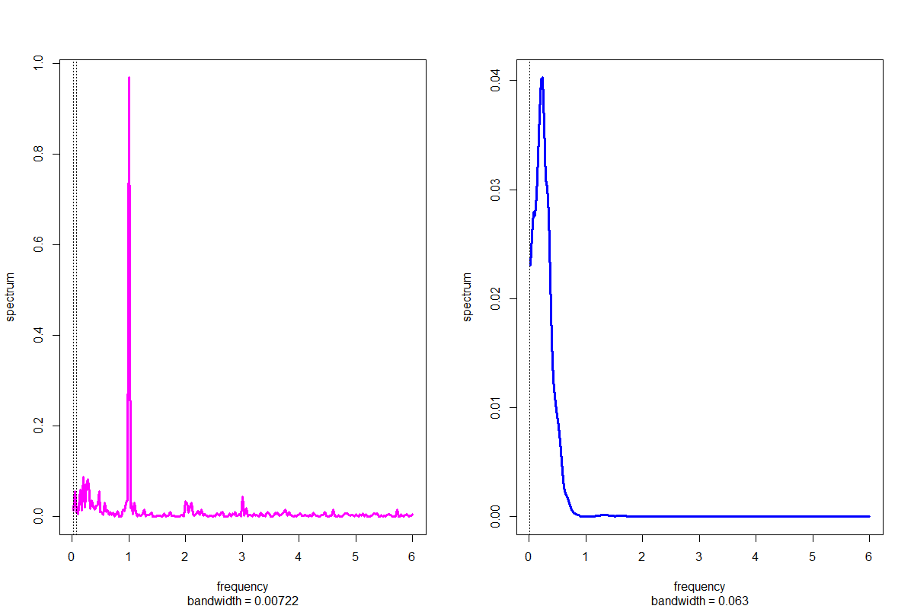
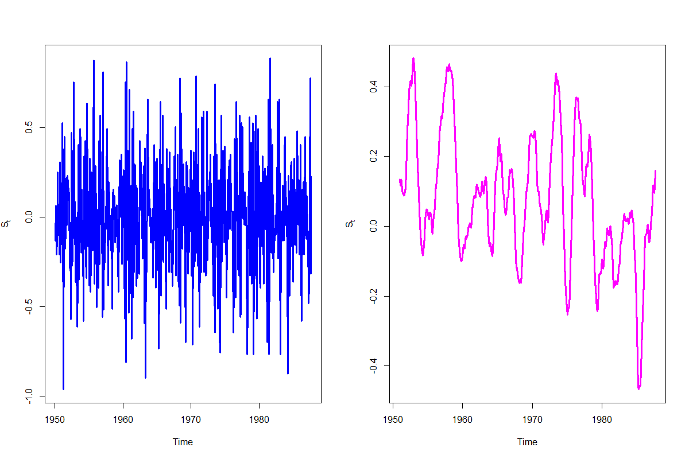

[](http://quantlet.de/)

## [](http://quantlet.de/) **SFEFreqFilt** [](http://quantlet.de/)

```yaml

Name of QuantLet : SFEFreqFilt

Published in : Statistics of Financial Markets

Description : 'Applies first differencing and 12-month centered moving average filter to SOI data
and plots the results in time and frequency representation'

Keywords : time-series, spectral, filter, frequency, plot, spectral-decomposition

See also : SFEPer, SFESignal, SFESpecSim, SFESpecWN, SFETsDecomp

Author : Dedy D. Prastyo, Elisabeth Bommes

Submitted : Mon, May 09 2016 by Christoph Schult

Input : Data for the Southern Oscillation Index from the package astsa.

Output : Two plots for the time and frequency domain of the Southern Oscillation Index.

```






### R Code:
```r
# install and load packages
libraries = c("astsa")
lapply(libraries, function(x) if (!(x %in% installed.packages())) {
  install.packages(x)
})
lapply(libraries, library, quietly = TRUE, character.only = TRUE)

# attach data
data(soi)

# Time domain
par(mfrow = c(1, 2))
plot.ts(diff(soi), col = "blue", lwd = 3, ylab = expression(S[t])) # plot 1st difference of soi data
k    = kernel("modified.daniell", 6)                               # 12 month filter
MA12 = kernapply(soi, k)
plot.ts(MA12, col = "magenta", lwd = 3, ylab = expression(S[t]))

# Frequency domain
spectrum(soi,log = "no", main = "", col = "magenta", lwd = 3)		
abline(v = 1 / 12, lty = "dotted")
abline(v = 1 / 48, lty = "dotted")

spectrum(MA12, spans = 9, log = "no", main = "", col = "blue", lwd = 3) 
abline(v = 1 / 52, lty = "dotted")

```
