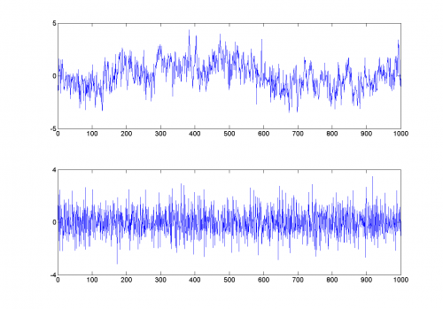
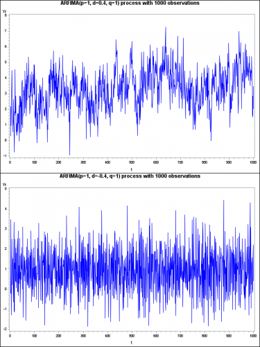

[](http://quantlet.de/)

## [](http://quantlet.de/) **SFE_arfima** [](http://quantlet.de/)

```yaml

Name of QuantLet: SFE_arfima

Published in: Statistics of Financial Markets

Description: ‚Computes the arfima(p,d,q) time series and plots two examples with different n and d‘

Keywords: FARIMA, arfima, plot, time-series, polynomial

Author: Daniel T. Pele

Submitted: Wed, November 30, 2016 by Lusine Nazaretyan

Input:
-d: fractionally differencing parameter (long memory)
-AR: coefficients of the AR polynomial
-N: Length of the generated time series
-MA: coefficients of the MA polynomial

Example: ‚Plot two examples with n1=1000, n2=1000, d1=0.4, d2=-04  p = q = 1, AR = {1}, MA = {1}‘
```





### MATLAB Code
```matlab

%--------------------------------------------------------------------------
%Book:     SFE
%--------------------------------------------------------------------------
%Quantlet: SFE_arfima
%--------------------------------------------------------------------------
%Description: Computes the arfima(p,d,q) time series.
%--------------------------------------------------------------------------
%Usage: SFE_arfimaplot
%--------------------------------------------------------------------------
%Inputs: 
%N - Length of the generated time series
%AR - coefficients of the AR polynomial
%MA - coefficients of the MA polynomial
%d -  fractionally differencing parameter (long memory)
%--------------------------------------------------------------------------
%Output: ARFIMA(AR,d,MA) time series
%--------------------------------------------------------------------------
%Example:
%--------------------------------------------------------------------------
% Author: Piotr Majer 20100715
%--------------------------------------------------------------------------
function [Z] = SFE_arfima(N,AR,MA,d)


X=zeros(1,N); Y=zeros(1,N); Z=zeros(1,N); 


e=normrnd(0,1,N,1); 
%%%%% N =length
MA_ord=length(MA);
AR_ord=length(AR);
%%%%%%%%%%%% Computing part: MA(q)
i=0;
if MA_ord >= 1
    for i=1:N
        j=0;map=0;
        for j=1:MA_ord
            if i > j
                map = map + MA(j)*e(i-j);
            end
        end
        X(i)= e(i)+ map;
    end
else
    X=e;
end
t=0;
%%%%%%%%%%% Computing part: d
if d == 0
    Y=X;
else
    infi =100; s=0;
    for s=0:infi
        b(s+1)=gamma(s+d)/(gamma(s+1)*gamma(d));
    end
    for t=1:N
        Y(t)=0;
        for s=0:infi
            if t > s
                Y(t)= Y(t)+ b(s+1)*X(t-s);
            end
        end
    end
end
%%%%%%%%%%%%% Computing part: AR(p)
t  = 0;
if AR_ord >= 1
    for t=1:N
        j=0; arp=0;
        for j=1:AR_ord
            if t > j
                arp = arp - AR(j)*Z(t-j);
            end
        end
        Z(t)= Y(t)+ arp;
    end
else
    Z=Y;
end

Z=Z';
end
```

automatically created on 2018-05-28

### SAS Code
```sas

* ---------------------------------------------------------------------
* Book:         SFE3
* ---------------------------------------------------------------------
* Quantlet:     SFEarfima
* ---------------------------------------------------------------------
* Description:  Computes the arfima(p,d,q) time series.
* ---------------------------------------------------------------------
* Usage:        -
* ---------------------------------------------------------------------
* Keywords:		fractional brownian motion, simulation, stochastic,process,
*				Hurst exponent, fractional, gaussian noise, ARFIMA,long memory.
* ---------------------------------------------------------------------
* Inputs:      N - Length of the generated time series
*              AR - coefficients of the AR polynomial
*              MA - coefficients of the MA polynomial
*              d -  fractionally differencing parameter (long memory)
* --------------------------------------------------------------------------
* Output:      ARFIMA(p,d,q) time series
* --------------------------------------------------------------------------
* Example:     Plot two examples with n1=1000, n2=1000, d1=0.4, d2=-04
				p = q = 1, AR = {1}`, MA = {1}`.
* ------------------------------------------------------------------------
* Author:       Daniel Traian Pele
* -----------------------------------------------------------------------;

* Reset the working evironment;
goptions reset  =  all;
proc datasets lib  =  work nolist kill;
run;
proc greplay nofs igout = work.gseg;
  delete _all_;
run;

* Input the parameters;
%let d  = 0.4;  		    *long memory parameter;
%let n	= 1000; 		    *number of observations;
%let p  = 1;			    *Order of AR polynomial;
%let q  = 1;			    *Order of MA polynomial;

%let AR = {1}`;   *AR polynomial coefficients;
%let MA = {1}`;  *MA polynomial coefficients;

%macro arfima(n = , d = , AR = , MA = );
proc iml;

   call farmasim(yt, &d, &AR, &MA, 0, 1, &n);  
   * Generates ARFIMA(p,d,q) process with Gaussian white noise N(0,1);
  t = (1:&n)`;

  plot = t||yt;

  create plot from plot; append from plot;
  close plot;
	
quit;

* The dataset plot contains the ARFIMA process motion Yt;

 data plot;set plot;
 rename col1 = t;
 rename col2 = Yt;
 run;


 *Plot the ARFIMA graph;


 title 'ARFIMA(p='&p', d='&d, q=&q) process with &n observations;


symbol i = line interpol = join c = blue w = 1.5;
goptions device = png nodisplay ;*xpixels = 200 ypixels = 100;

proc gplot data = plot;
plot Yt*t;
run;
quit;


%mend;


%arfima(n = 1000 , d = 0.4, AR = &AR, MA = &MA );  *ARFIMA with d = 0.4;

%arfima(n = 1000 , d = -0.4, AR = &AR, MA = &MA ); *ARFIMA with d = -0.4;

 
* Overlay the two graphs;

goptions device = png display xpixels = 600 ypixels = 800;

proc greplay igout = gseg tc = sashelp.templt nofs;
template = v2;
treplay 1:gplot 2:gplot1 ;
run;
quit;

```

automatically created on 2018-05-28