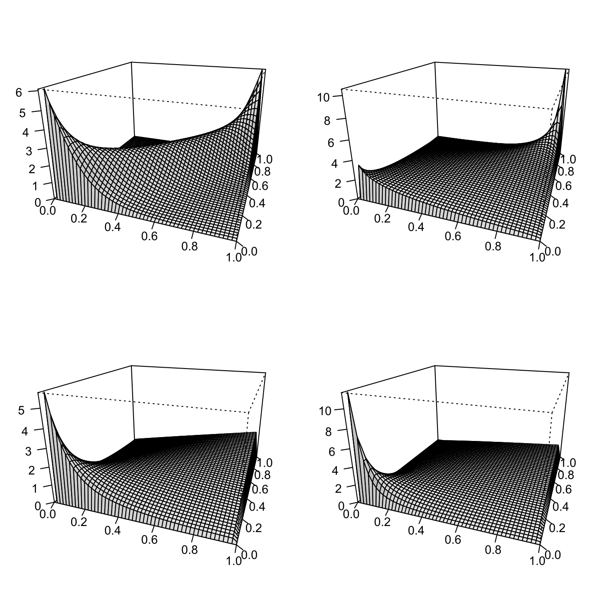

[](http://quantlet.de/)

## [](http://quantlet.de/) **SFEArchCopDensity** [](http://quantlet.de/)

```yaml

Name of QuantLet : SFEArchCopDensity

Published in : Statistics of Financial Markets

Description : 'Creates a grid of perspective plots of the densities of the Frank, Gumbel, AMH, and
Clayton copulae. The chosen copula parameters are 8, 1.5, 0.9, and 0.9, respectively.'

Keywords : archimedean, copula, density, plot, graphical representation, Frank, gumbel, clayton

See also : 'SFEclaytonMC, SFEstaticCop, SFEplotCop, SFEVaRcopulaSIM2ptv, SFEtCop, BCS_ClaytonMC,
SFEfrechet, SFEgaussCop, SFEresDens, SFEtMC, SFScontourgumbel, SFEgaussCop'

Author : Felix Jung

Submitted : Mon, November 10 2014 by Felix Jung

```




### R Code:
```r

# clear variables and close windows
rm(list = ls(all = TRUE))
graphics.off()

# install and load packages
libraries = c("copula")
lapply(libraries, function(x) if (!(x %in% installed.packages())) {
install.packages(x)
})
lapply(libraries, library, quietly = TRUE, character.only = TRUE)

# Set up plotting grid
layout(matrix(c(1, 2, 3, 4), 2, 2, byrow = TRUE))
par(mar = c(2, 2, 2, 2))

# Initialize copulas
frank.cop   = frankCopula(param = 8, dim = 2)
gumbel.cop  = gumbelCopula(param = 1.5, dim = 2)
amh.cop     = amhCopula(param = 0.9, dim = 2)
clayton.cop = claytonCopula(param = 0.9, dim = 2)

# Create perspective plots of densities
persp(frank.cop, dCopula, phi = 20, theta = 20, ticktype = "detailed", ylab = "", 
    xlab = "", zlab = "", shade = 0.1)
persp(gumbel.cop, dCopula, phi = 20, theta = 20, ticktype = "detailed", ylab = "", 
    xlab = "", zlab = "", shade = 0.1)
persp(amh.cop, dCopula, phi = 20, theta = 20, ticktype = "detailed", ylab = "", 
    xlab = "", zlab = "", shade = 0.1)
persp(clayton.cop, dCopula, phi = 20, theta = 20, ticktype = "detailed", ylab = "", 
    xlab = "", zlab = "", shade = 0.1)
```
