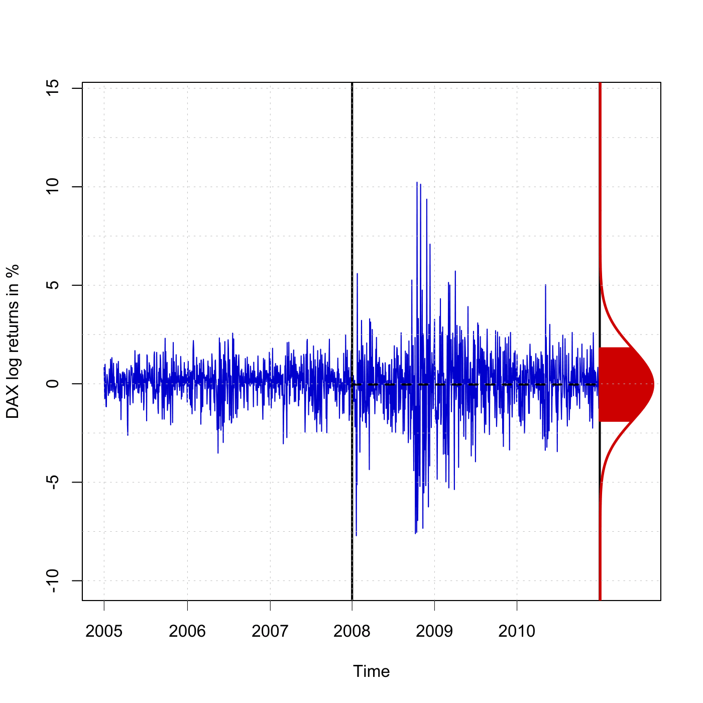

[](http://quantlet.de/)

## [](http://quantlet.de/) **SFEDAXlogreturns** [](http://quantlet.de/)

```yaml

Name of QuantLet : SFEDAXlogreturns

Published in : Statistics of Financial Markets

Description : 'Plots the time series of daily DAX log returns with a window from 2005 to 2010 and
the density function for daily DAX log returns from 2008 to 2010.'

Keywords : 'data visualization, dax, density, financial, graphical representation, log-returns,
plot, returns, time-series, visualization'

Author : Derrick Kanngiesser

Submitted : Wed, June 03 2015 by Lukas Borke

Datafiles : DAXlogreturns.txt

Example : Plot of daily DAX logreturns data from 2005 to 2010 with density plot

```




### R Code:
```r

# clear variables and close windows
rm(list = ls(all = TRUE))
graphics.off()

# install and load packages
libraries = c("tseries")
lapply(libraries, function(x) if (!(x %in% installed.packages())) {install.packages(x)} )
lapply(libraries, library, quietly = TRUE, character.only = TRUE)

# load the data
data = read.table("DAXlogreturns.txt")
x = data[, 4]
x = 100 * x
y = data[, 1]
# the year 2008 starts with observation 765, 2010 ends with observation 1528
max1 = max(x)
min1 = min(x)

time = strptime(data[, 2], format = "%Y%m%d")
labels = as.numeric(format(as.Date(time, "%Y-%m-%d"), "%Y"))
where.put = c(1, which(diff(labels) == 1) + 1)

plot(y, x, type = "l", col = "blue3", frame = TRUE, axes = FALSE, ylim = c(min1 - 
    0.3 * abs(min1), max1 + 0.4 * abs(max1)), xlim = c(0, 1650), xlab = "Time", 
    ylab = "DAX log returns in %")

line1 = cbind(c(7.65, 7.65), c(max1 + 0.5 * abs(max1), min1 - 0.5 * abs(min1)))
lines(c(line1[1, 1] * 100, line1[2, 1] * 100), c(line1[1, 2], line1[2, 2]), col = "black", lwd = 2)
line2 = cbind(c(15.28, 15.28), c(max1 + 0.5 * abs(max1), min1 - 0.5 * abs(min1)))
lines(c(line2[1, 1] * 100, line2[2, 1] * 100), c(line2[1, 2], line2[2, 2]), col = "black", lwd = 2)

# the mean and the standard deviation for the observation in the years 2008-2010 are derived
m  = x[765:1528]
mu = mean(m)
variance = var(m)
sigma = sqrt(variance)
ndata = seq(min1 - sigma^2, sigma^2 * (max1 - min1), 0.1)
f = 750 * 1/sqrt(2 * pi * sigma * sigma) * exp(-(ndata - mu)^2/(2 * sigma^2)) + 15.28
fndata = cbind(f, ndata)

lines(1514 + fndata[, 1], fndata[, 2], col = "red3", lwd = 2.5)
line3 = cbind(c(7.65, 15.28), c(mu, mu))
lines(c(line3[1, 1] * 100, line3[2, 1] * 100), c(line3[1, 2], line3[2, 2]), col = "black", lwd = 2, lty = "dashed")

a = mu - sigma
b = mu + sigma
i = a

while (i < b) {
    line8 = cbind(c(15.28, 7.5 * 1/sqrt(2 * pi * sigma * sigma) * exp(-(i - mu)^2/(2 * sigma^2)) + 15.28), c(i, i))
    lines(c(line8[1, 1] * 100, line8[2, 1] * 100), c(line8[1, 2], line8[2, 2]), col = "red3", lwd = 2)
    i = i + 0.025
}

axis(side = 2, at = seq(-15, 15, by = 5), label = seq(-15, 15, by = 5), lwd = 1)
axis(side = 1, at = where.put, label = labels[where.put], lwd = 0.5)
abline(h = seq(-15, 15, by = 2.5), lty = "dotted", lwd = 0.5, col = "grey")
abline(v = where.put, lty = "dotted", lwd = 0.5, col = "grey") 

```
