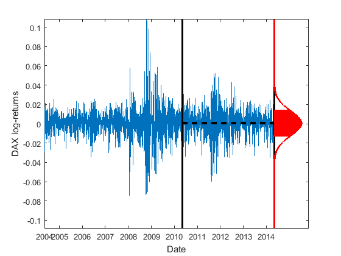
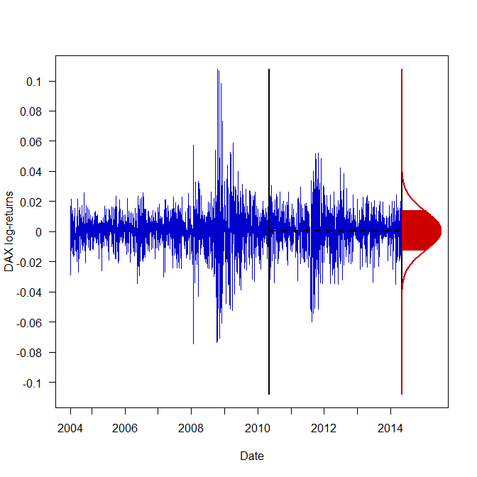

[](http://quantlet.de/)

## [](http://quantlet.de/) **SFEDAXlogreturns** [](http://quantlet.de/)

```yaml

Name of QuantLet: SFEDAXlogreturns

Published in: Statistics of Financial Markets

Description: 'plots the DAX daily log-returns from 10.05.2004 to 07.05.2014 
              toghether with the normal density for the log-returns of the 
              last four years of the time series.'

Keywords: log-returns, density, normal, time-series, plot

Author: Derrick Kanngiesser and Piedad Castro

Submitted: Fri, July 01 2016 by Piedad Castro

Datafile: 2004-2014_dax_ftse.csv

Input: 'The datafile contains daily price data from 07.05.2004 to 07.05.2014 for 
selected companies which are part of DAX30 and FTSE100 as well as the 
corresponding index data. This code makes only use of the date and DAX variables.'

```





### R Code
```r

# clear variables and close windows
rm(list=ls(all=TRUE))
graphics.off()

# set working directory
# setwd("C:/...")

# install and load packages
libraries = c("data.table", "tseries")
lapply(libraries, function(x) if (!(x %in% installed.packages())) {
  install.packages(x)
})
lapply(libraries, library, quietly = TRUE, character.only = TRUE)

# load the data
dataset = fread("2004-2014_dax_ftse.csv", select =  c("Date", "DAX 30", "DEUTSCHE TELEKOM"))
dataset = as.data.frame(dataset)

# log-returns
X = diff(log(dataset$`DAX 30`))

# limits for the y-axis in the plot
yLimUp = max(abs(c(min(X), max(X))) - 0)
yLims  = c(-yLimUp, yLimUp)

# Date variable
date.X       = as.Date(dataset$Date)[-1]
date.X.Years = as.numeric(format(date.X, "%Y"))
where.put    = c(1, which(diff(date.X.Years) == 1)+1)

# for the density we take the log-returns of the last four years available in the dataset
# i.e from 10.05.2010 to 10.05.2014
start      = which(date.X == "2010-05-10")
end        = length(X) 
X.lastfour = X[start:end]

# these objects will be later required to plot the density
mu.X      = mean(X.lastfour)
sigma2.X  = var(X.lastfour)
sigma.X   = sd(X.lastfour)
ndata     = seq(-yLimUp, yLimUp, length.out = 100000)

density    = function(x, mu, sigma2){
  (sqrt(2*pi*sigma2))^(-1)*exp(-(x - mu)^2/(2*sigma2))
}

# plot of the DAX log-returns with the normal density for the observations 
# of the last four years available
par(las = 1)
plot(1:end, X, type="l", col="blue3", frame = TRUE, axes = FALSE, 
     ylim = yLims, xlim = c(0, end + 250), 
     xlab = "Date", ylab = "DAX log-returns")
lines(c(start, start), yLims, col = 'black', lwd=2) 
lines(c(end, end), yLims, col = 'black', lwd = 2)    

# the density is here mulplied by 10 because otherwise the scale of the plot 
# would not alloud us to see it
lines(end + density(ndata, mu.X, sigma2.X)*10, ndata, col='red3', lwd=2.5) 
lines(c(start, end), c(mu.X, mu.X), col='black', lwd=2, lty='dashed')

# fill the area betwenn the area under the density curve between (mu - sigma) and (mu + sigma)
a = mu.X - sigma.X
b = mu.X + sigma.X
i = a
while (i<b){
  lines(c(end,end + density(i, mu.X, sigma2.X)*10), c(i, i), col = 'red3', lwd = 2)
  i=i+((b-a)/100)
}

# names of the axes
axis(side=2, at = seq(-1, 1, by = 0.02), label = round(seq(-1, 1, by = 0.02), 2), lwd=1)
axis(side=1, at = where.put, label = date.X.Years[where.put], lwd=0.5)

```

automatically created on 2018-09-04

### MATLAB Code
```matlab

%% clear variables and console and close windows
clear
clc
close all

%% set directory
%cd('C:/...')

%% data import
formatSpec = '%{yyyy-MM-dd}D%f%f%f%f%f%f%f%f%f%f%f%f%f%f%f%f%f%f%f%f%f%f%f%f%f%f%f%f%f%f%f%f%f%f%f%f%f%f%f%f%f%f';
dataset    = readtable('2004-2014_dax_ftse.csv','Delimiter',',', 'Format',formatSpec);

%% DAX log-returns
X = diff(log(dataset{:, 'DAX30'}));

%% limits for the y-axis in the plot
yLimUp = max(abs([min(X) max(X)]) - 0);
yLims  = [-yLimUp, yLimUp];

%% Date variable
date_X      = dataset{2:end, 'Date'};
date_X_Year = year(date_X);
where_put   = [true; (diff(date_X_Year) == 1)];

%% for the density we take the log-returns of the last four years available in the dataset 
% i.e from 10.05.2010 to 10.05.2014
Index = 1:size(X, 1);
start = Index(date_X == '2010-05-10');
End   = Index(end);
X_lastfour = X(start:End);

%% these objects will be later required to plot the density
mu_X      = mean(X_lastfour);
sigma2_X  = var(X_lastfour);
sigma_X   = std(X_lastfour);
ndata     = linspace(-yLimUp, yLimUp, 10000);

density = [];
for i = ndata
     d       = (sqrt(2*pi*sigma2_X))^(-1)*exp(-(i - mu_X)^2/(2*sigma2_X));     
     density = [density d];
end

%% plot of the DAX log-returns with the normal density for the observations 
% of the last four years available
plot(Index, X)
set(gcf,'color','w') % set the background color to white
hold on
line([start, start], yLims, 'Color','k','LineWidth', 2)
line([End, End], yLims,'Color','k','LineWidth',2)
plot(End + density*10, ndata, 'Color', 'r', 'LineWidth',2.5)
line([start, End], [mu_X, mu_X],'Color','k','LineWidth',2,'LineStyle','--')

%% fill the area betwenn the area under the density curve between (mu - sigma) and (mu + sigma)
a = mu_X - sigma_X;
b = mu_X + sigma_X;
i = a;
while i<b 
  to   = End + ((sqrt(2*pi*sigma2_X))^(-1)*exp(-(i - mu_X)^2/(2*sigma2_X)))*10;
  line([End, to], [i, i], 'Color', 'r', 'Linewidth', 2, 'LineStyle', '-')
  i = i + ((b - a) / 100);
end

%% names of the axes
ylim(yLims)
xlabel('Date')
ylabel('DAX log-returns')
set(gca,'XTick', Index(where_put))
set(gca,'XTickLabels', date_X_Year(where_put))
set(gcf,'color','w')

hold off
```

automatically created on 2018-09-04