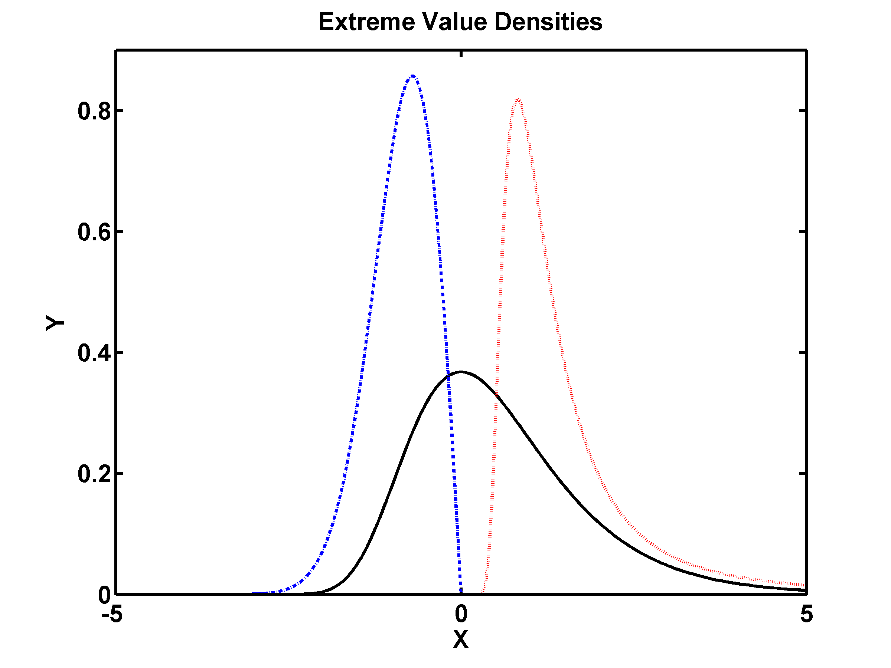
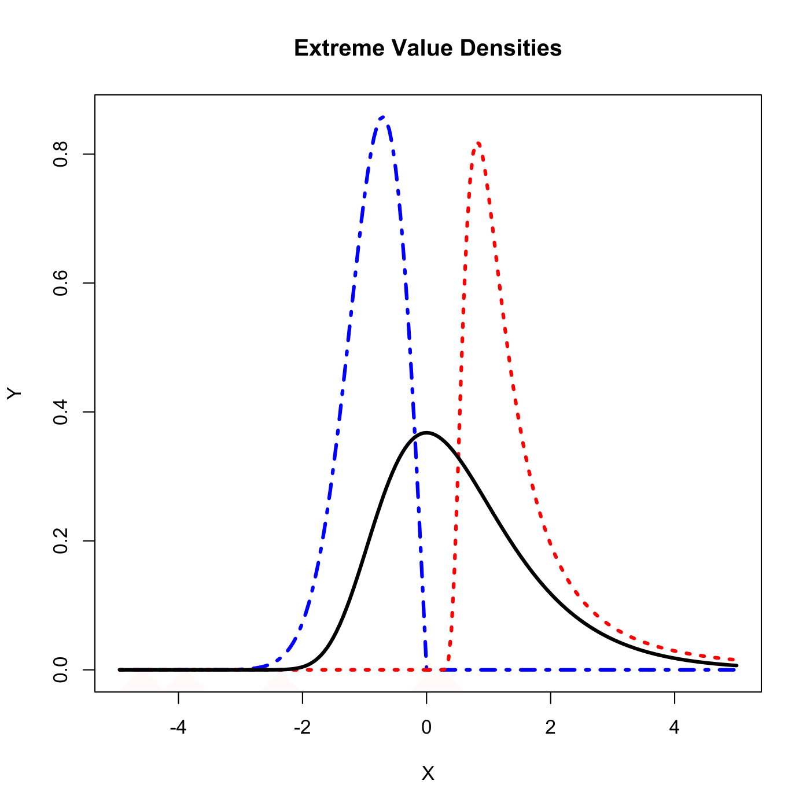

[](http://quantlet.de/)

## [](http://quantlet.de/) **SFEevt1** [](http://quantlet.de/)

```yaml

Name of QuantLet : SFEevt1 

Published in: Statistics of Financial Markets

Description: 'Computes and displays extreme value distributions using the pdf (probability density functions) with adjusted parameter alpha: Frechet, Gumbel and Weibull.'

Keywords: Frechet, GEV, Weibull, density, distribution, extreme-value, gumbel

See also: SFEevt2, SFEevt2, SFEevt3

Author: Zografia Anastasiadou

Author [Matlab]: Juergen Franke

Submitted: Thu, June 04 2015 by Lukas Borke

Example: 'Gumbel distribution (solid line), Frechet distribution with parameter alpha=1/2 (dotted line) and Weibull distribution with parameter alpha=-1/2 (dash-dot line).'
```





### R Code
```r


rm(list = ls(all = TRUE))

# install and load packages
libraries = c("evd")
lapply(libraries, function(x) if (!(x %in% installed.packages())) {install.packages(x)} )
lapply(libraries, library, quietly = TRUE, character.only = TRUE)

# parameter settings
n     = 100
sp    = 5
xpos  = sp * (1:n)/n
xneg  = -sp + xpos
x     = c(xneg, xpos)
alpha = 1/2

# Creating 3 types of densities via function "dgev" from package "evd"
gumb = cbind(x, dgev(x))
frec = cbind(x, dgev(x, 1, 0.5, alpha))
weib = cbind(x, dgev(x, -1, 0.5, -alpha))

# Plot
plot(weib, type = "l", col = "blue", lwd = 3, lty = 4, xlab = "X", ylab = "Y", main = "Extreme Value Densities")
lines(frec, type = "l", col = "red", lwd = 3, lty = 3)
lines(gumb, type = "l", col = "black", lwd = 3) 

```

automatically created on 2018-05-28

### MATLAB Code
```matlab

clear all
close all
clc

n     = 100;
sp    = 5;
xpos  = sp * (1:n)/n;
xneg  = - sp + xpos;
x     = [xneg,xpos]';
alpha = 1 / 2;
gumb  = [x gevpdf(x)];
frec  = [x gevpdf(x,alpha,0.5,1)];
weib  = [x gevpdf(x,-alpha,0.5,-1)];

hold on
plot(gumb(:,1), gumb(:,2), 'k', 'LineWidth', 2, 'LineStyle','-')
plot(frec(:,1), frec(:,2), 'r', 'LineWidth', 2, 'LineStyle',':')
plot(weib(:,1), weib(:,2), 'b', 'Linewidth', 2, 'LineStyle','-.')
title('Extreme Value Densities', 'FontSize', 16, 'FontWeight', 'Bold')
xlabel('X', 'FontSize', 16, 'FontWeight', 'Bold')
ylabel('Y', 'FontSize', 16, 'FontWeight', 'Bold')
t  = 0: 0.2: 1;
t1 = 0: 0.2: 1;
set(gca, 'YTick', t)
set(gca, 'YTickLabel', t1)
box on
set(gca, 'FontSize', 16, 'LineWidth', 2, 'FontWeight', 'bold');
hold off

% print -painters -dpdf -r300 SFEevt1.pdf
% print -painters -dpng -r300 SFEevt1-1Matlab.png


```

automatically created on 2018-05-28