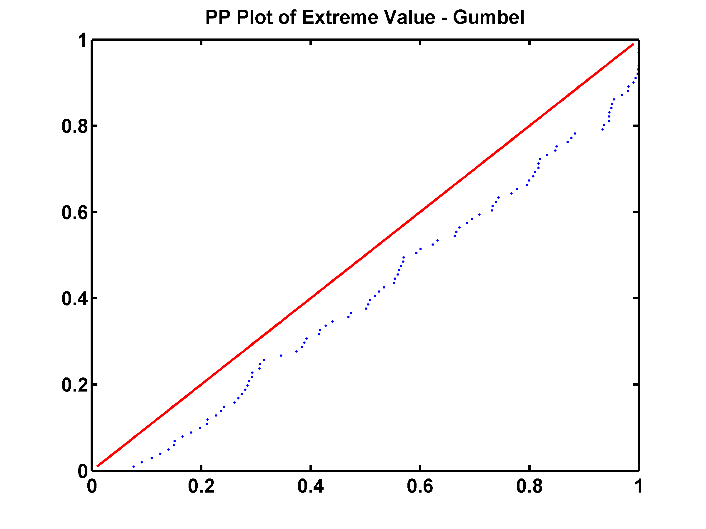
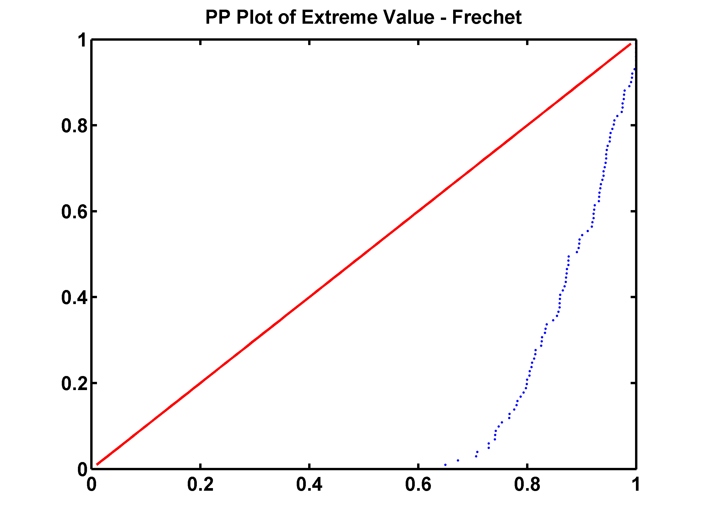
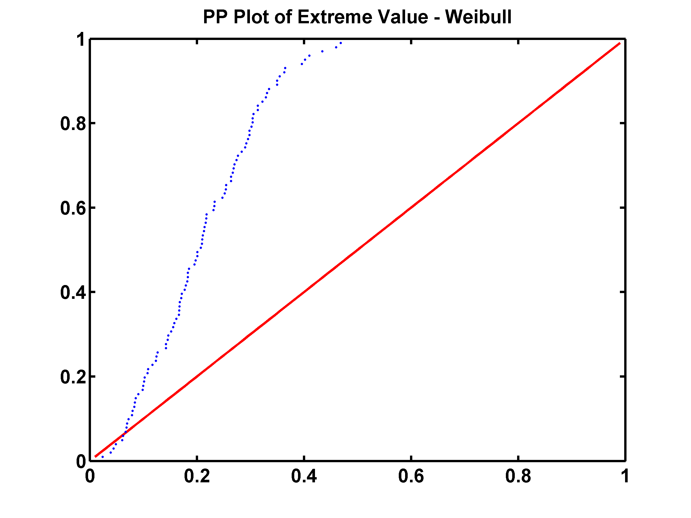
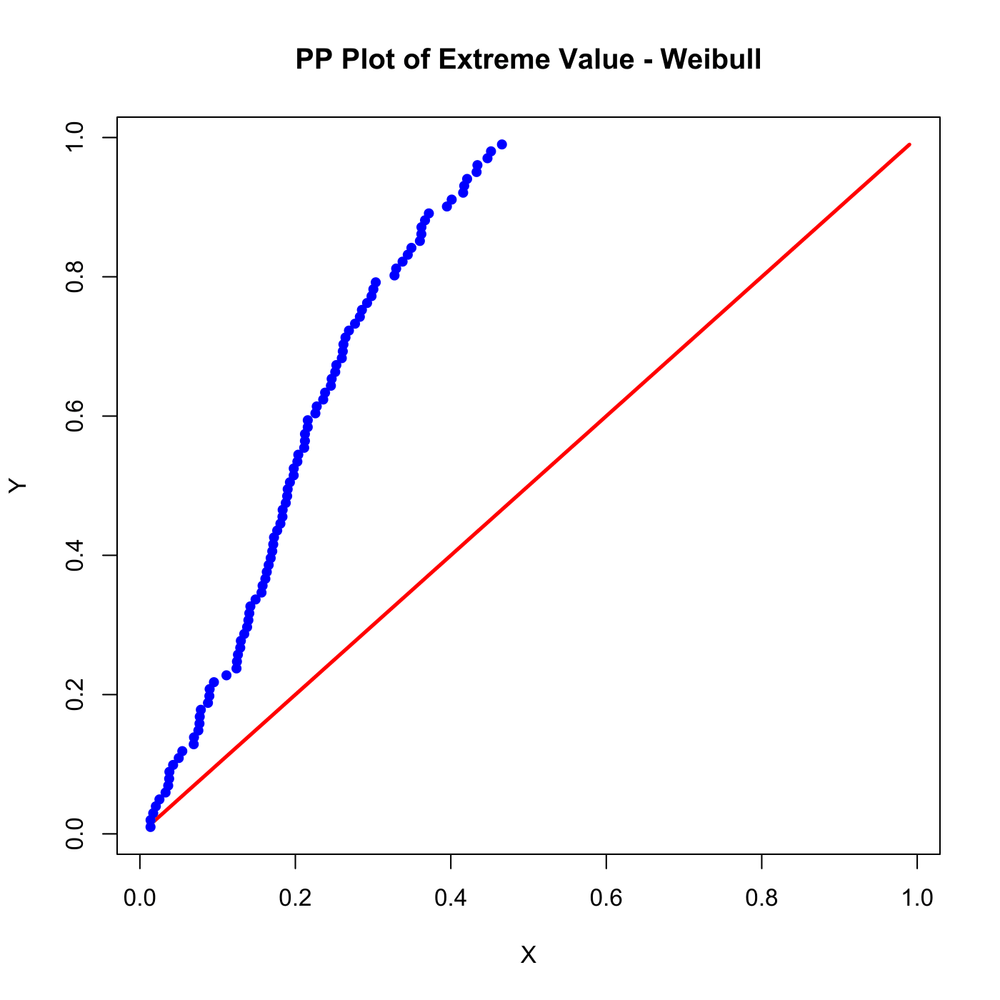
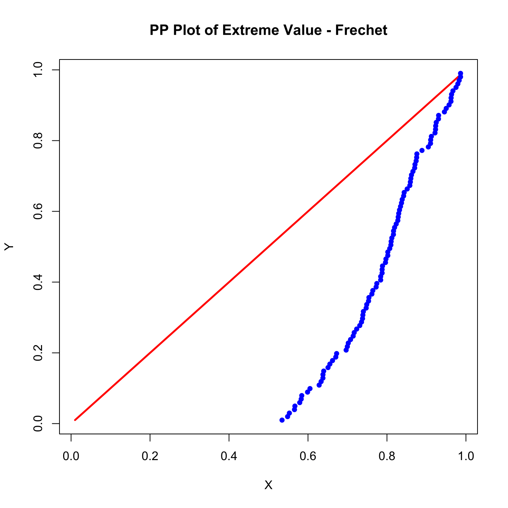

[](http://quantlet.de/)

## [](http://quantlet.de/) **SFEevt2** [](http://quantlet.de/)

```yaml

Name of QuantLet : SFEevt2 

Published in: Statistics of Financial Markets

Description: 'Shows the normal probability plot (PP Plot) of the pseudo random variables with extreme value distributions: Weibull, Frechet and Gumbel.'

Keywords: Frechet, GEV, Weibull, distribution, edf, extreme-value, gumbel, normal, normal-distribution, plot, pp-plot, random, random-number-generation

See also: SFEevt1, SFEevt3

Author: Wolfgang K. Haerdle

Author [Matlab]: Juergen Franke

Submitted: Fri, June 05 2015 by Lukas Borke

Input: 
- n : number of observations

Output: 'Normal plot of the pseudo random variables with Weibull, Frechet and Gumbel distributions.'

Example: 'User inputs the number of observations like 100, then 3 PP Plots of the random distributions are given via the interactive selection menu. The PP line shows the difference of the distributions.'
```












### R Code
```r


# clear variables and close windows
rm(list = ls(all = TRUE))
graphics.off()

# install and load packages
# user should install 'fExtremes' package for the Gumbel distribution
libraries = c("fExtremes")
lapply(libraries, function(x) if (!(x %in% installed.packages())) {install.packages(x)} )
lapply(libraries, library, quietly = TRUE, character.only = TRUE)

# fix pseudo random numbers for reproducibility
set.seed(20080605)

# interactive selection menu
selitem = c("Weibull", "Frechet", "Gumbel")
sel     = select.list(selitem, title = "Please choose")

# global parameter settings
n = 100
y = (1:n) / (n + 1)

# Weibull
if (sel == "Weibull") {
    x        = -rweibull(100, 2, scale = 1)
    x        = sort(x)
    quantile = pnorm(x)
    plot(y, y, col = "red", type = "line", lwd = 2.5, main = "PP Plot of Extreme Value - Weibull", 
        xlab = "X", ylab = "Y", xaxt = "n", yaxt = "n")
    axis(1, at = seq(0, 1, 0.2))
    axis(2, at = seq(0, 1, 0.2))
    points(quantile, y, col = "blue", pch = 19, cex = 0.8)
}

# Frechet
if (sel == "Frechet") {
    x        = rweibull(100, 2, scale = 1)
    x        = sort(x)
    quantile = pnorm(x)
    plot(y, y, col = "red", type = "line", lwd = 2.5, main = "PP Plot of Extreme Value - Frechet", 
        xlab = "X", ylab = "Y", xaxt = "n", yaxt = "n")
    axis(1, at = seq(0, 1, 0.2))
    axis(2, at = seq(0, 1, 0.2))
    points(quantile, y, col = "blue", pch = 19, cex = 0.8)
}

# Gumbel
if (sel == "Gumbel") {
    x        = rnorm(100)
    gumbel   = exp(-2.7182^(-x))
    gumbel   = sort(gumbel)
    mu       = 0
    sigma    = 1
    s        = rgev(100, 0, mu, sigma)
    s        = sort(s)
    quantile = pnorm(s)
    plot(y, y, col = "red", type = "l", lwd = 2.5, main = "PP Plot of Extreme Value - Gumbel", 
        xlab = "X", ylab = "Y", xaxt = "n", yaxt = "n")
    axis(1, at = seq(0, 1, 0.2))
    axis(2, at = seq(0, 1, 0.2))
    points(quantile, y, col = "blue", pch = 19, cex = 0.8)
} 
```

automatically created on 2018-05-28

### MATLAB Code
```matlab

clear all
close all
clc

n = 100;

% Gumbel
gumb1 = gevrnd(0, 1, 0, 100, 1);
gumb2 = sort(gumb1);
gumb  = normcdf(gumb2, 0, 1);
t     = (1 : n) / (n + 1);

hold on
figure(1)
plot(t, t, 'r', 'LineWidth', 2)
scatter(gumb, t, '.', 'b')
t  = 0 : 0.2 : 1;
t1 = 0 : 0.2 : 1;
set(gca, 'YTick', t)
set(gca, 'YTickLabel', t1)
title('PP Plot of Extreme Value - Gumbel','FontSize', 16, 'FontWeight', 'Bold')
box on
set(gca, 'FontSize', 16, 'LineWidth', 2, 'FontWeight', 'bold');
hold off
% print -painters -dpdf -r600 SFEevt2_01.pdf
% print -painters -dpng -r600 SFEevt2_01.png

% Frechet
frec1 = gevrnd(0.5, 0.5, 1, 100, 1);
frec2 = sort(frec1);
frec  = normcdf(frec2, 0, 1);
t     = (1 : n) / (n + 1);

figure(2)
hold on
plot(t, t, 'r', 'LineWidth', 2)
scatter(frec, t, '.', 'b')
xlim([0 1])
ylim([0 1])
t  = 0 : 0.2 : 1;
t1 = 0 : 0.2 : 1;
set(gca, 'YTick', t)
set(gca, 'YTickLabel', t1)
title('PP Plot of Extreme Value - Frechet', 'FontSize', 16, 'FontWeight', 'Bold')
box on
set(gca, 'FontSize', 16, 'LineWidth', 2, 'FontWeight', 'bold');
hold off
% print -painters -dpdf -r600 SFEevt2_02.pdf
% print -painters -dpng -r600 SFEevt2_02.png

% Weibull
weib1 = gevrnd(-0.5, 0.5, -1, 100, 1);
weib2 = sort(weib1);
weib  = normcdf(weib2, 0, 1);
t     = (1 : n) / (n + 1);

figure(3)
hold on
plot(t, t, 'r', 'LineWidth', 2)
scatter(weib, t, '.', 'b')
xlim([0 1])
ylim([0 1])
title('PP Plot of Extreme Value - Weibull', 'FontSize', 16, 'FontWeight', 'Bold')
t  = 0 : 0.2 : 1;
t1 = 0 : 0.2 : 1;
set(gca, 'YTick', t)
set(gca, 'YTickLabel', t1)
box on
set(gca, 'FontSize', 16, 'LineWidth', 2, 'FontWeight', 'bold');
hold off

% print -painters -dpdf -r600 SFEevt2_03.pdf
% print -painters -dpng -r600 SFEevt2_03.png

```

automatically created on 2018-05-28