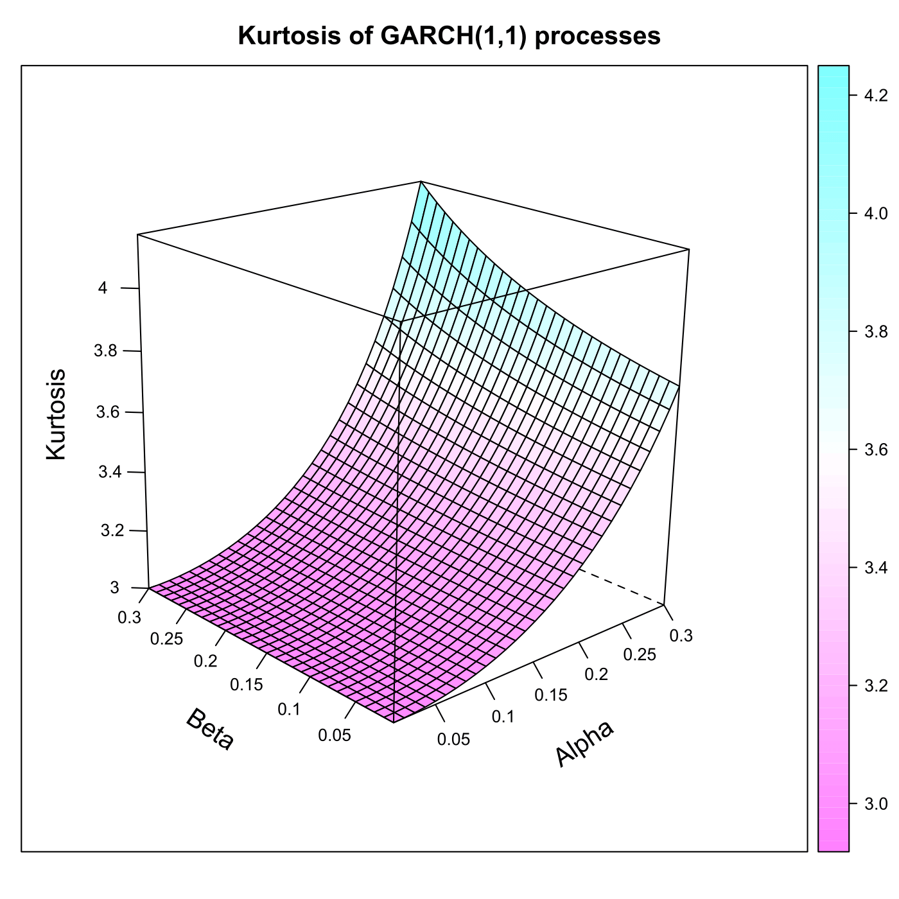
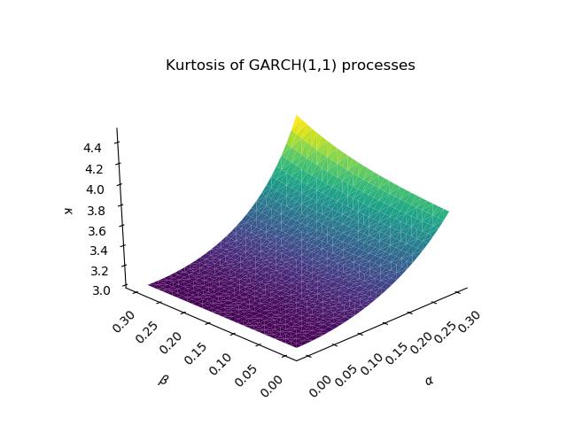

[](http://quantlet.de/)

## [](http://quantlet.de/) **SFEkurgarch** [](http://quantlet.de/)

```yaml

Name of QuantLet : SFEkurgarch
Published in: Statistics of Financial Markets
Description: 'Computes and plots the kurtosis function of a GARCH(1,1) (generalised autoregressive conditional heteroscedasticity) process for different parameters.'
Keywords:
- autoregressive
- discrete
- financial
- garch
- graphical representation
- heteroskedasticity
- kurtosis
- plot
- process
- simulation
- stochastic
- stochastic-process
- time-series
- volatility
See also:
- SFElikarch1
- SFElikgarch
- SFEtimegarch
- SFEvolnonparest
Author:
- Joanna Tomanek
- Awdesch Melzer
- Christian M. Hafner
Author[Python]:
- Justin Hellermann
Submitted: Mon, June 08 2015 by Lukas Borke
Submitted[Python]: Thu, Aug 01 2019 by Justin Hellermann

```





### R Code
```r


# clear history and close windows
rm(list = ls(all = TRUE))
graphics.off()

# install and load packages
libraries = c("lattice")
lapply(libraries, function(x) if (!(x %in% installed.packages())) {install.packages(x)} )
lapply(libraries, library, quietly = TRUE, character.only = TRUE)

# parameter settings
nop = 30  # number of grid points (in the book = 31)
k   = nop
s   = 0.31/nop
q   = seq(0, by = s, length.out = k)
q   = as.matrix(q)

# computing grid
w = matrix(1, k^2, 2)
for (i in 1:k) {
    for (j in 1:k) {
        w[i + (j - 1) * k, 1] = q[i]
        w[i + (j - 1) * k, 2] = q[j]
    }
}

x = matrix(w, ncol = 2)
a = x[, 1]
b = x[, 2]

# kurtosis, formula from the book SFE: Fourth moment of a GARCH(1,1) process
f = 3 + 6 * a^2/(1 - b^2 - 2 * a * b - 3 * a^2)

# reshape
ff = matrix(f, 30, 30)

# plot
wireframe(ff, drape = T, main = "Kurtosis of GARCH(1,1) processes", screen = list(z = 40, 
    x = -70, y = 3), aspect = c(1, 1), scales = list(arrows = FALSE, x = list(labels = round(seq(0, 
    0.3, len = 7), digits = 2)), y = list(labels = seq(0, 0.3, len = 7)), z = list(labels = seq(round(min(f), 
    digits = 1), round(max(f), digits = 1), len = 7))), ylab = list("Beta", 
    rot = -34, cex = 1.2), xlab = list("Alpha", rot = 34, cex = 1.2), zlab = list("Kurtosis", 
    rot = 90, cex = 1.2)) 

```

automatically created on 2019-08-01

### PYTHON Code
```python

import numpy as np 
import pandas as pd 
import matplotlib.pyplot as plt
import mpl_toolkits
from mpl_toolkits import mplot3d

nop = 30  # number of grid points (in the book = 31)
k   = nop
s   = 0.31/nop
q   = np.arange(0,s*k,s)
q   = np.array(q)


# computing grid
w = np.zeros((k**2, 2))
for i in range(k):
    for j in range(k):
        w[i + (j - 1) * k, 0] = q[i]
        w[i + (j - 1) * k, 1] = q[j]

a = w[:,0]
b = w[:,1]

# kurtosis, formula from the book SFE: Fourth moment of a GARCH(1,1) process
def kurtosis(a,b):
	f = 3 + 6 * a**2/(1 - b**2 - 2 * a * b - 3 * a**2)
	return(f)

df = pd.DataFrame({'x': a, 'y': b, 'z': kurtosis(a,b)}, index=range(len(a)))
ax = plt.axes(projection='3d')
c    = ((1, 1, 1),(1, 1.0, 1))
ax.plot_trisurf(df.x, df.y, df.z,linewidth=0.2,cmap='viridis',facecolors=c)
ax.grid(False)

ax.view_init(30, 225)
ax.set_xlabel(r'$\alpha$')
ax.set_ylabel(r'$\beta$')
ax.set_zlabel(r'$\kappa$')
ax.set_title('Kurtosis of GARCH(1,1) process')
ax.set_zlim(3,4.5)
plt.xticks(rotation=45)
ax.xaxis.labelpad = 20
ax.yaxis.labelpad = 20
plt.yticks(rotation=45)
ax.w_xaxis.set_pane_color((1.0, 1.0, 1.0, 1.0))
ax.w_zaxis.set_pane_color((1.0, 1.0, 1.0, 1.0))
ax.w_yaxis.set_pane_color((1.0, 1.0, 1.0, 1.0))
plt.savefig('SFEkurgarch_py.png')
plt.show()


```

automatically created on 2019-08-01