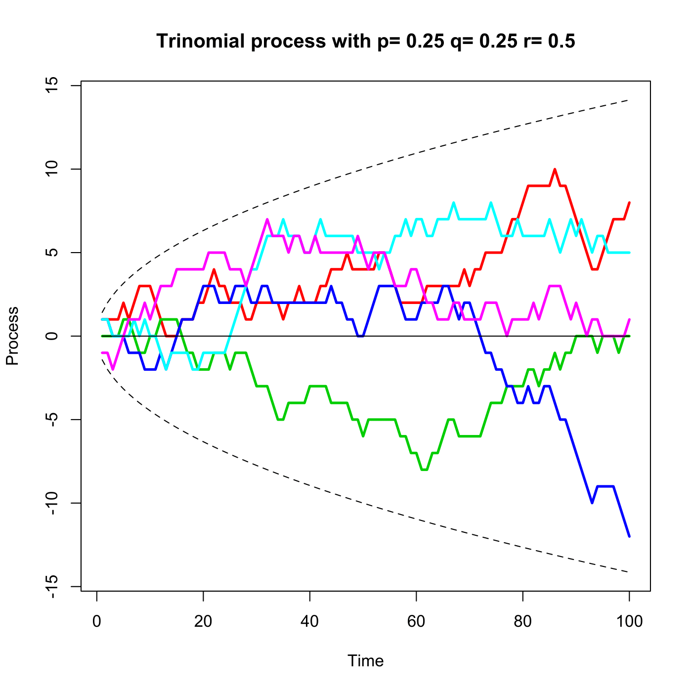

[](http://quantlet.de/)

## [](http://quantlet.de/) **SFEtrinomp** [](http://quantlet.de/)

```yaml

Name of QuantLet : SFEtrinomp

Published in : Statistics of Financial Markets

Description : 'Generates and plots five paths of a trinomial process with p = q = 0.25.
(2sigma)-intervals around the trend (which is zero) are given as well.'

Keywords : 'discrete, graphical representation, plot, process, random, random-number-generation,
random-walk, simulation, stochastic, stochastic-process, time-series, trinomial'

See also : SFEBinomp

Author : Cindy Lamm, Christian M. Hafner

Submitted : Mon, June 08 2015 by Lukas Borke

Example : 'User inputs the parameters [observations, trajectories, probability of up movement,
probability of down movement] like [100, 5, 0.25, 0.25], then 5 paths of a trinomial process with p
= q = 0.25 and (2sigma)-intervals around the trend are given.'

```




### R Code:
```r

rm(list = ls(all = TRUE))
graphics.off()

# Function definition
SFEtrinomp = function(n, k, p, q) {
    if (as.numeric(p) + as.numeric(q) > 1 | as.numeric(p) + as.numeric(q) < 
        0) {
        stop("SFEtrinomp: p and q must be smaller than 1 and in sum larger 0 but smaller 1!")
    }
    if (n <= 0 | k <= 0) {
        stop("SFEtrinomp: Please input a positive number of steps (n) and number of trajectories (k)!")
    }
    n = floor(n)    # makes sure number of steps is integer
    k = floor(k)    # makes sure number of path	is integer
    
    # Main simulation
    set.seed(0)     # pseudo random numbers
    u = 1           # n of t increments Z_1,...,Z_t take value u
    d = 1           # m of t increments Z_1,...,Z_t take value d
    t = 1:n
    trend = t * (p * u - q * d)
    std = sqrt(t * (p * (1 - p) + q * (1 - q) + 2 * p * q * u * d))
    s1 = trend + 2 * std                    # upper confidence band
    s2 = trend - 2 * std                    # lower confidence band
    z = matrix(runif(n * k), n, k)          # uniform random numbers
    z = (-1) * (z < q) + (z > (1 - p))
    x = apply(z, MARGIN = 2, FUN = cumsum)
    
    # Plot of trinomial process
    matplot(x, lwd = 2.5, main = paste("Trinomial process with p=", p, "q=", 
        q, "r=", 1 - p - q), xlab = "Time", ylab = "Process", type = "l", lty = 1, 
        ylim = c(min(x, s2), max(x, s1)), col = 2:(k + 1))
    lines(trend)
    lines(s1, lty = 2)
    lines(s2, lty = 2)
}

# enter parameters as n = 100 (number of steps), k = 5 (number of paths), p = 0.25 (probability of up movement), q = 0.25 (probability of down movement)
SFEtrinomp(n = 100, k = 5, p = 0.25, q = 0.25) 

```
