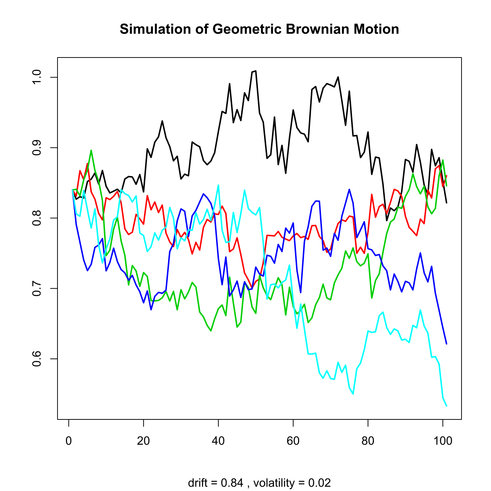

[](http://quantlet.de/)

## [](http://quantlet.de/) **SFEsimGBM** [](http://quantlet.de/)

```yaml

Name of QuantLet : SFEsimGBM

Published in : Statistics of Financial Markets

Description : 'Simulates and plots a path of a geometric Brownian motion (GBM) using 4 different
methods: direct integration, Euler scheme, Milstein scheme, second order Milstein scheme.'

Keywords : 'Euler, brownian-motion, direct integration, discrete, geometric-brownian-motion,
graphical representation, normal-distribution, plot, process, random-number-generation, simulation,
stochastic, stochastic-process, wiener-process'

See also : SFEGBMProcess, SFEsimCIR

Author : Rafal Weron, Awdesch Melzer

Submitted : Mon, June 08 2015 by Lukas Borke

Example : Plots 5 paths of a geometric Brownian motion using the Euler scheme.

```




### R Code:
```r

# clear variables and close windows
rm(list = ls(all = TRUE))
graphics.off()

# simulation routine
# simGBM returns a vector of a sample trajectory of Geometric Brownian Motion on the time interval [0,N]
simGBM = function(n, x0, mu, sigma, delta, no, method) {
    # Set default value
    if (missing(method)) {
        method = 0  # direct integration
    }
    # Generate normal random numbers if not provided in 'no'
    if (missing(no)) {
        no = rnorm(ceiling(n/delta), 0, 1)
    # Check whether length of 'no' is appropriate
    } else {
        no = no
        if (length(no) != ceiling(n/delta)) {
            stop("Error: length(no) <> n/delta")
        }
    }
    if (method == 1) {
        # Euler scheme
        x = x0 * cumprod(1 + mu * delta + sigma * delta^0.5 * no)
    } else if (method == 2) {
        # Milstein scheme
        x = x0 * cumprod(1 + mu * delta + sigma * delta^0.5 * no + 0.5 * sigma^2 * 
            delta * (no^2 - 1))
    } else if (method == 3) {
        # 2nd order Milstein scheme
        x = x0 * cumprod(1 + mu * delta + sigma * delta^0.5 * no + 0.5 * sigma^2 * 
            delta * (no^2 - 1) + mu * sigma * no * (delta^1.5) + 0.5 * (mu^2) *  (delta^2))
    } else {
        # Direct integration
        x = x0 * exp(cumsum((mu - 0.5 * sigma^2) * delta + sigma * delta^0.5 * no))
    }
    # Add starting value
    x = c(x0, x)
}

set.seed(100)
# parameter settings
step = 100    # number of steps of the motion
k    = 5      # number of trajectories
mu   = 0.84
sig  = 0.02

path = matrix(0, step + 1, k)
for (i in 1:k) {
    path[, i] = simGBM(1, mu, sig, sqrt(0.1), 1/100, rnorm(step, 0, 1), 1)
}

# plot
plot(path[, 1], col = 1, lwd = 2, ylab = "", xlab = "", type = "l", ylim = c(min(path), 
    max(path)), sub = paste("drift =", mu, ", volatility =", sig))
title(paste("Simulation of Geometric Brownian Motion"))
for (i in 2:k) {
    lines(path[, i], col = i, lwd = 2)
} 

```
