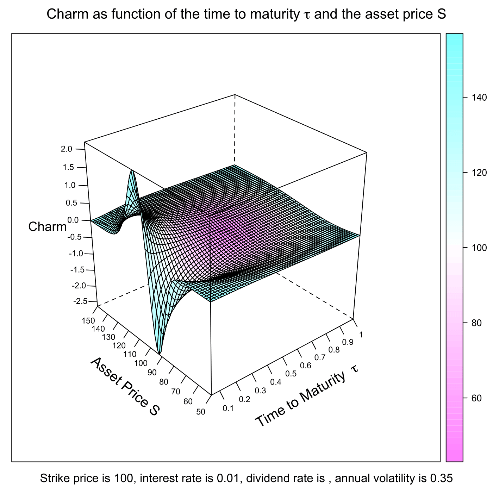
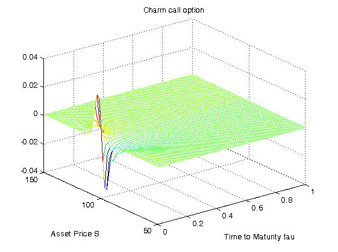

[](http://quantlet.de/)

## [](http://quantlet.de/) **SFEcharmcall** [](http://quantlet.de/)

```yaml

Name of QuantLet : SFEcharmcall

Published in : Statistics of Financial Markets

Description : 'Plots the Charm of a call option (Charm or Delta bleed). Charm is divided by 365 to
reflect the effect of a single day passing by.'

Keywords : 'asset, black-scholes, call, delta, european-option, financial, graphical
representation, greeks, maturity, option, option-price, plot, price'

Author : Andreas Golle, Awdesch Melzer

Author[Matlab] : Andreas Golle

Submitted : Wed, June 10 2015 by Lukas Borke

Input[Matlab] : 'S_min: Lower Bound of Asset Price S, tau_min: Lower Bound of Time to Maturity tau,
S_max: Upper Bound of Asset Price S, tau_max: Upper Bound of Time to Maturity tau'

Output[Matlab] : plot of the Charm of a call option

Example : 'User inputs [lower, upper] bound of asset price S like [50,150], [lower, upper] bound of
time to maturity tau like [0.01, 1], then the plot of the Delta of a call option is given.'

```






### R Code:
```r

# clear variables and close windows
rm(list = ls(all = TRUE))
graphics.off()

# install and load packages
libraries = c("lattice")
lapply(libraries, function(x) if (!(x %in% installed.packages())) {install.packages(x)} )
lapply(libraries, library, quietly = TRUE, character.only = TRUE)

# parameter settings
s1    = 50      # lower bound of Asset Price
s2    = 150     # upper bound of Asset Price 
t1    = 0.05    # lower bound of Time to Maturity
t2    = 1       # upper bound of Time to Maturity
K     = 100     # exercise price 
r     = 0.01    # interest rate
sig   = 0.35    # volatility
d     = 0       # dividend rate
b     = r - d   # cost of carry
steps = 60

meshgrid = function(a, b) {
    list(x = outer(b * 0, a, FUN = "+"), y = outer(b, a * 0, FUN = "+"))
}

first  = meshgrid(seq(t1, t2, -(t1 - t2)/(steps - 1)), seq(t1, t2, -(t1 - t2)/(steps - 1)))
tau    = first$x
dump   = first$y
second = meshgrid(seq(s1, s2, -(s1 - s2)/(steps - 1)), seq(s1, s2, -(s1 - s2)/(steps - 1)))

dump2  = second$x
S      = second$y

# Black Scholes formula
d1 = (log(S/K) + (r - d + sig^2/2) * tau)/(sig * sqrt(tau))
d2 = d1 - sig * sqrt(tau)

delta = exp((b - r) * tau) * pnorm(d1)
charm = -exp((b - r) * tau) * c(dnorm(d1) * (b/(sig * sqrt(tau)) - d2/(2 * tau)) + (b - r) * pnorm(d1))

# plot
title = bquote(expression(paste("Strike price is ", .(K), ", interest rate is ", .(r), ", dividend rate is ", .(q), ", annual volatility is ", .(sig))))

wireframe(charm ~ tau * S, drape = T, ticktype = "detailed", 
	main = expression(paste("Charm as function of the time to maturity ", tau, " and the asset price S")), 
	sub = title, scales = list(arrows = FALSE, col = "black", distance = 1, tick.number = 8, cex = 0.7, x = 		list(labels = round(seq(t1, t2, length = 11), 1)), y = list(labels = round(seq(s1, s2, length = 11), 1))), 
    xlab = list(expression(paste("Time to Maturity  ", tau)), rot = 30, cex = 1.2), 
    ylab = list("Asset Price S", rot = -40, cex = 1.2), zlab = list("Charm", cex = 1.1)) 

```

### MATLAB Code:
```matlab

% user inputs parameters

disp('Please input [lower, upper] bound of Asset price S as: [50,150]') ;
disp(' ');
para = input('[lower, upper] bound of S =');
while length(para) < 2
  disp('Not enough input arguments. Please input in 1*2 vector form like [50,150] or [50 150]');
  para=input('[lower, upper] bound of S=');
end
S_min = para(1);
S_max = para(2);

disp(' ');
disp('Please input [lower, upper] bound of time to maturity tau as: [0.01, 1]');
disp(' ');
para2 = input('[lower, upper] bound of tau =');
while length(para2) < 2
  disp('Not enough input arguments. Please input in 1*2 vector form like [0.01, 1] or [0.01 1]');
  para2=input('[lower, upper] bound of tau =');
end
tau_min = para2(1);
tau_max = para2(2);

% main computation 

K     = 100;                %exercise price
r     = 0.01;               % interest rate
sig   = 0.35;               % volatility
d     = 0;                  % dividend rate
b     = r-d;                %cost of carry
steps = 60;

[tau,dump] = meshgrid([tau_min:(tau_max-tau_min)/(steps-1):tau_max]);
[dump2,S]  = meshgrid([S_max:-(S_max-S_min)/(steps-1):S_min]);

d1    = (log(S/K)+(r-d+sig^2/2).*tau)./(sig.*sqrt(tau));
d2    = d1 - sig.*sqrt(tau);
delta = exp((b-r).*tau).*normcdf(d1);
charm = -exp((b-r).*tau).*[normpdf(d1).*(b./(sig.*sqrt(tau)) - d2./(2.*tau) ) + (b - r).*normcdf(d1)];


% plot

mesh(tau,S,charm/365);
title('Charm call option')
ylabel('Asset Price S');
xlabel('Time to Maturity tau');
 
```
