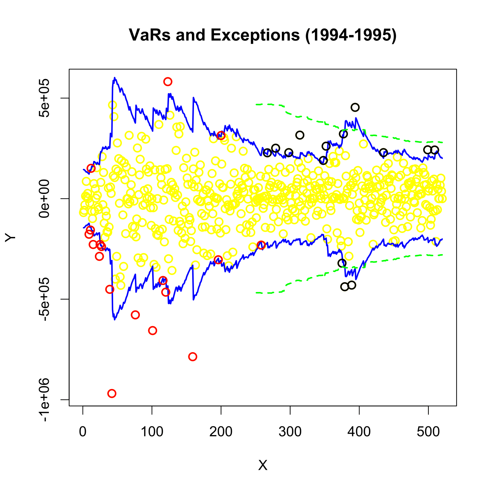
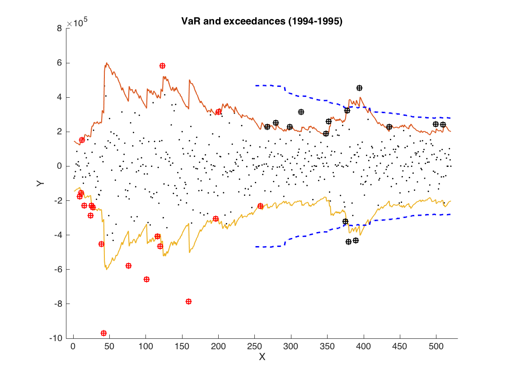

[](http://quantlet.de/)

## [](http://quantlet.de/) **SFEVaRbank** [](http://quantlet.de/)

```yaml

Name of QuantLet : SFEVaRbank

Published in : Statistics of Financial Markets

Description : 'Shows the time plot of the Value at Risk (VaR) forecasts and exceedances based on
Rectangular Moving Average (RMA), Exponentially Moving Average (EMA) and Delta-Normal model.'

Keywords : 'VaR, bond, data visualization, estimation, exceedance, financial, forecast, graphical
representation, multivariate normal, normal-distribution, plot, portfolio, risk, time-series'

See also : SFEVaRqqplot, SFEVaRtimeplot, SFEVaRtimeplot2, VaRest, VaRqqplot

Author : Joanna Tomanek, Awdesch Melzer, Ying Chen

Author[Matlab] : Wolfgang K. Härdle, Ying Chen

Submitted : Thu, June 11 2015 by Lukas Borke

Submitted[Matlab] : Thu, February 04 2010 by Lasse Groth

Datafiles : SFEVaRBank.dat

Example : 'The dots show the observed changes Lt in the value of the portfolio. The dashed line
represents the forecasted VaRs based on RMA (99% and 1%). The solid red line represents the same
for EMA. The solid blue line shows estimation results of the Delta-Normal model.'

```






### R Code:
```r

# clear variables and close windows
rm(list = ls(all = TRUE))
graphics.off()

# install and load packages
libraries = c("fExtremes")
lapply(libraries, function(x) if (!(x %in% installed.packages())) {install.packages(x)})
lapply(libraries, library, quietly = TRUE, character.only = TRUE)

data = read.table("SFEVaRbank.dat")

x = matrix(data[, 2])
v = matrix(1.96 * data[, 4])
t = matrix(1:nrow(x))

dat  = matrix(c(t, x), ncol = 2)
dat2 = matrix(c(t, v), ncol = 2)
dat3 = matrix(c(t, -v), ncol = 2)

# Plot part 1
par(c(1, 1), cex = 1.2)
plot(dat, col = "yellow", type = "p", ylab = "Y", xlab = "X", cex = 1.2, lwd = 2)
lines(dat2, col = "blue", lwd = 2)
lines(dat3, col = "blue", lwd = 2)
title("VaRs and Exceptions (1994-1995)")

dat94 = matrix(dat[1:260, 1:2], ncol = 2)
(exceed94 = matrix(dat94[(dat94[, 2] > dat2[1:260, 2]) | (dat94[, 2] < dat3[1:260, 2])], ncol = 2))
points(exceed94, col = "red", cex = 1.2, lwd = 2)

dat95 = matrix(dat[260:nrow(x), 1:2], ncol = 2)
(exceed95 = matrix(dat95[(dat95[, 2] > dat2[260:nrow(x), 2]) | (dat95[, 2] < dat3[260:nrow(x), 2])], ncol = 2))
points(exceed95, col = "black", cex = 1.2, lwd = 2)

# VaR with method: RMA rectangular moving average
VaRrma = function(y, h, alpha) {
    y    = as.matrix(y)
    w    = 1
    n    = nrow(y)
    d    = ncol(y)
    w    = w * matrix(1, 1, d)
    sigh = matrix(0, n - h, 1)
    tmp  = cumsum(y^2)
    wtr  = t(w)
    tmp  = (tmp[(h + 1):n] - tmp[1:(n - h)])/h
    tmp  = as.matrix(tmp)
    sigh = sqrt(tmp)
    qf   = qnorm(alpha)
    qf   = matrix(qf, nrow = nrow(sigh), 1)
    VaR  = qf * sigh
    VaR  = cbind(VaR, (-VaR))
    VaR  = VaR
}

# VaR with method: EMA exponential moving average
VaRema = function(y, h, alpha) {
    lam  = 0.96
    dist = 0
    y    = as.matrix(y) # w = 1
    n    = nrow(y)
    d    = ncol(y)      # w = w*matrix(1,1,d)
    grid = seq((h - 1), 0, -1)
    sigh = matrix(0, n - h, 1)
    j    = h
    while (j < n) {
        j           = j + 1
        tmp         = (lam^grid) * y[(j - h):(j - 1)]
        tmp1        = sum(tmp * tmp)
        sigh[j - h] = sqrt(sum(sum(tmp1), 2) * (1 - lam))
    }
    qf  = qnorm(alpha)
    qf  = matrix(qf, nrow = nrow(sigh), 1)
    VaR = qf * sigh
    VaR = cbind(VaR, (-VaR))
    VaR = VaR
} 

# Plot part 2
# VaR EMA (red solid lines)
y = x
h = 250
alpha = 0.01
VaRe  = VaRema(y, h, alpha)

VaR1 = matrix(c(251:nrow(x), VaRe[(1:270), 1]), ncol = 2)
VaR2 = matrix(c(251:nrow(x), VaRe[(1:270), 2]), ncol = 2)
lines(VaR1, col = "red", lwd = 2)
lines(VaR2, col = "red", lwd = 2)

# VaR RMA (green dashed lines)
y = x
h = 250
alpha = 0.01
vrma  = VaRrma(y, h, alpha)

VaR1 = matrix(c(251:nrow(x), vrma[(1:270), 1]), ncol = 2)
VaR2 = matrix(c(251:nrow(x), vrma[(1:270), 2]), ncol = 2)
points(VaR1, col = "green", type = "l", lty = "dashed", lwd = 2)
points(VaR2, col = "green", type = "l", lty = "dashed", lwd = 2) 

```

### MATLAB Code:
```matlab
clear
data = load('SFEVaRBank.dat');
x    = data(:, 2);
v    = 1.96 * data(:, 4);
t    = 1:length(x);
dat  = [t', x];
dat2 = [t', v];
dat3 = [t', -v];

hold on
scatter(dat(:, 1), dat(:, 2), '.', 'k')
plot(dat2(:, 1), dat2(:, 2), 'LineWidth', 1)
plot(dat3(:, 1), dat3(:, 2), 'LineWidth', 1)

% In VaRest(y,method) "method" is:
%1 for RMA (rectangular moving average),
%2 for EMA (exponential moving average)
VaRma  = VaRest(x, 1);
k      = 251:(length(VaRma) + 250);

VaRma1 = [k', VaRma(:, 2)];
plot(VaRma1(:, 1), VaRma1(:, 2), 'Color', 'b', 'LineStyle', '--', 'LineWidth', 1)
VaRma2 = [k', VaRma(:,1)];
plot(VaRma2(:, 1), VaRma2(:, 2), 'Color', 'b', 'LineStyle', '--', 'LineWidth', 1)

% Exceedances from the year 1994
dat94  = dat(1:260, :);
l      = 1;
for i  = 1:length(dat94)
    if  or(dat94(i, 2) > dat2(i, 2), dat94(i, 2) < dat3(i, 2))
        exceed94(l, :) = dat94(i, 1:2);
        l = l + 1;
    end
end

scatter(exceed94(:, 1), exceed94(:, 2), '+', 'r')
scatter(exceed94(:, 1), exceed94(:, 2), 's', 'r')


% Exceedances from the year 1995
m = 1;
for i = 260:(length(x))
    if  or(dat(i, 2) > dat2(i, 2), dat(i, 2) < dat3(i, 2))
        exceed95(m, :) = dat(i, 1:2);
        m = m + 1;
    end
end

scatter(exceed95(:, 1), exceed95(:, 2), '+', 'k')
scatter(exceed95(:, 1), exceed95(:, 2), 's', 'k')

title('VaR and exceedances (1994-1995)')
xlabel('X')
ylabel('Y')
xlim([-10, 530])
hold off


```
