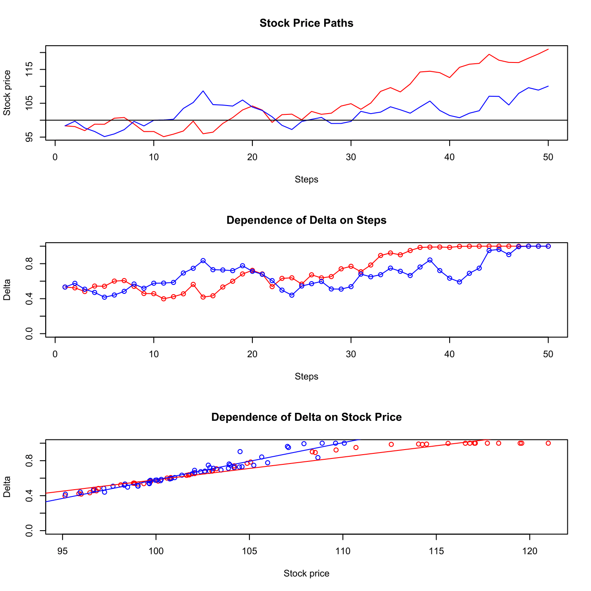

[](http://quantlet.de/)

## [](http://quantlet.de/) **SFEDeltahedgingLogic** [](http://quantlet.de/)

```yaml

Name of QuantLet : SFEDeltahedgingLogic

Published in : Statistics of Financial Markets

Description : 'Simulates 2 stock price paths, including the Black-Scholes Delta depending on n=50
time steps and the stock price S1/S2 for given exercise price K=100, initial stock price S0=98,
volatility sig=0.2, interest rate r=0.05, and the time interval (T-t0) = 20 weeks. In the second
part it plots delta dependencies on steps and stock prices.'

Keywords : 'black-scholes, brownian-motion, delta, dependence, financial,
geometric-brownian-motion, graphical representation, hedging, plot, simulation, stock-price,
wiener-process'

See also : SFEDeltaHedging, SFEDeltaHedging, SFEDeltahedgingdepend, SFSdeltahedging

Author : Juliane Tomzik, Gagandeep Singh, Christoph Jährling

Submitted : Thu, June 11 2015 by Lukas Borke

Example : Plots of 2 stock price paths and Delta dependencies on steps and stock prices.

```




### R Code:
```r

rm(list = ls(all = TRUE))
graphics.off()

# parameter settings
n   = 50                    # periods (steps)
K   = 100                   # exercise price
S0  = 98                    # initial stock price
sig = 0.2                   # volatility (uniform distributed on 0.1 to 0.5)
r   = 0.05                  # interest rate (uniform distributed on 0 to 0.1)
t0  = 6/52                  # current time (1 week = 1/52)
T   = 26/52                 # maturity
dt  = (T - t0)/n            # period between steps n 
t   = seq(t0, T, l = n)     # T-t0 divided in n intervals
tau = T - t                 # time to maturity

# Standard Wiener Process for path of the stock price S
Wt1	= c(0, sqrt(dt) * cumsum(rnorm(n - 1, 0, 1)))
S1  = S0 * exp((r - 0.5 * sig^2) * t + sig * Wt1)

# 1st path
y1     = (log(S1/K) + (r - sig^2/2) * tau)/(sig * sqrt(tau))
delta1 = pnorm(y1 + sig * sqrt(tau))

# 2nd path
Wt2    = c(0, sqrt(dt) * cumsum(rnorm(n - 1, 0, 1)))
S2     = S0 * exp((r - 0.5 * sig^2) * t + sig * Wt2)
y2     = (log(S2/K) + (r - sig^2/2) * tau)/(sig * sqrt(tau))
delta2 = pnorm(y2 + sig * sqrt(tau))

# 3 Plots
par(mfrow = c(3, 1))

# Plot S(t) vs. tau
plot(S1 ~ seq(1, n), main = "Stock Price Paths", xlab = "Steps", ylab = "Stock price", 
    ylim = c(min(S1, S2), max(S1, S2)), type = "l", col = "red")
lines(S2 ~ seq(1, n), col = "blue")
abline(h = K, col = 1)

# Plot Delta vs. tau
plot(delta1 ~ seq(1, n), main = "Dependence of Delta on Steps", xlab = "Steps", 
    ylab = "Delta", ylim = c(0, 1), type = "o", col = "red")
lines(delta2 ~ seq(1, n), type = "o", col = "blue")

# Plot Delta vs. S(t)
plot(delta1 ~ S1, main = "Dependence of Delta on Stock Price", xlab = "Stock price", 
    ylab = "Delta", xlim = c(min(S1, S2), max(S1, S2)), ylim = c(0, 1), type = "p", 
    col = "red")
points(delta2 ~ S2, col = "blue")
abline(lm(delta1 ~ S1), col = "red")
abline(lm(delta2 ~ S2), col = "blue")

```
