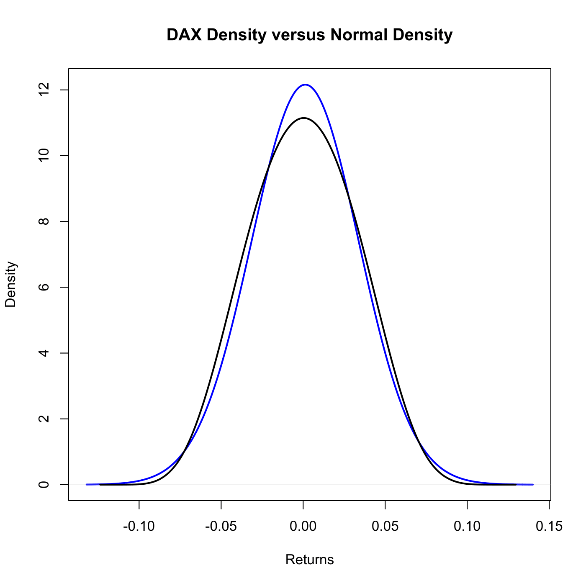
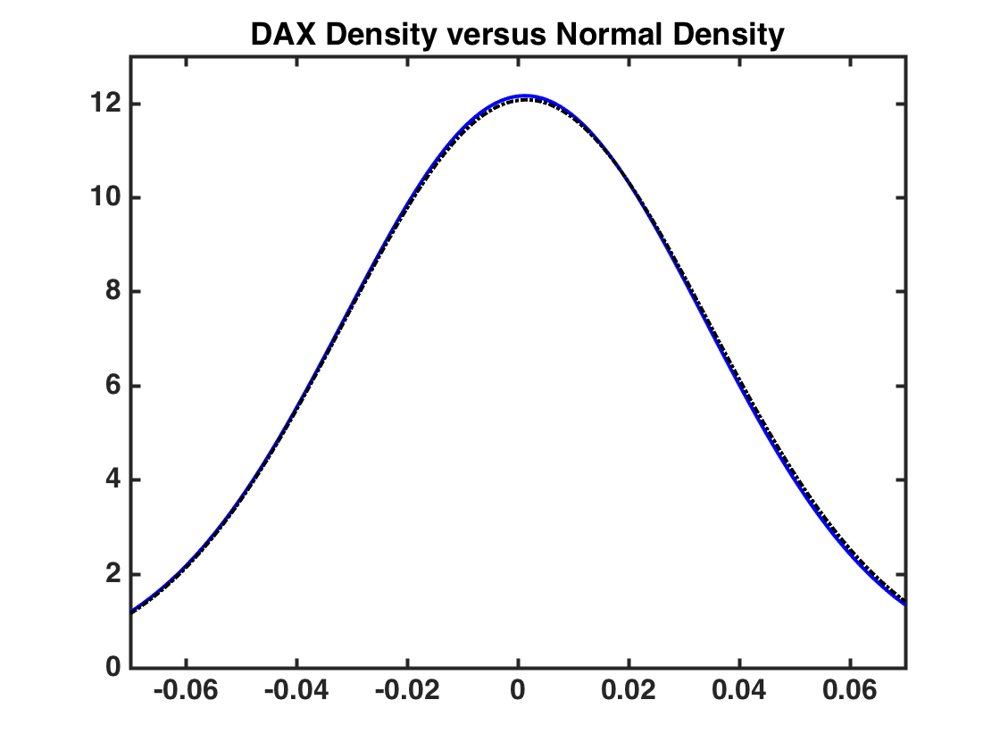

[](http://quantlet.de/)

## [](http://quantlet.de/) **SFEDaxReturnDistribution** [](http://quantlet.de/)

```yaml

Name of QuantLet : SFEDaxReturnDistribution

Published in : Statistics of Financial Markets

Description : 'Compares a kernel estimation of the density of DAX returns distribution with a
kernel estimation of a normal distribution with the same mean and variance. The data is taken from
the Xetra-DAX 1999.'

Keywords : 'data visualization, dax, density, distribution, estimation, financial, graphical
representation, kernel, log-returns, normal, normal-distribution, plot, random-number-generation,
returns'

See also : MMSTATdistribution_normal

Author : Joanna Tomanek

Author[Matlab] : Awdesch Melzer

Submitted : Fri, June 12 2015 by Lukas Borke

Submitted[Matlab] : Wed, April 24 2013 by Maria Osipenko

Datafiles : dax99.dat

Example : DAX Density (blue) versus Normal Density (black)

```






### R Code:
```r

# clear variables and close windows
rm(list = ls(all = TRUE))
graphics.off()

# load data
data  = read.table("dax99.dat")
dax99 = data[, 2]                   # first line is date, second XetraDAX 1999
ret   = diff(log(dax99))
fh    = density(ret, bw = 0.03)     # estimate Dax return density

mu = mean(ret)                      # empirical mean
si = sqrt(var(ret))                 # empirical standard deviation (std)
x  = si * rnorm(400) + mu           # generate artificial data from the same mean and std
f  = density(x, bw = 0.03, kernel = "biweight") # estimate its density

# plot
plot(fh, col = "blue", lwd = 2, main = "DAX Density versus Normal Density", xlab = "Returns", ylab = "Density")
lines(f, lwd = 2, col = "black") 

```

### MATLAB Code:
```matlab
data    = load('dax99.dat');
dax99   = data(:,2);     % first line is date, second XetraDAX 1999
lndax99 = log(dax99);
ret     = diff(lndax99);

f = 'qua';% kernel function: quartic
N = 400;  % length of estimation vector
h = 0.03; % bandwidth

hold on
[xi fh] = kerndens(ret, h, N, f);

%[fh, xi] = ksdensity(ret, 'kernel','quartic','npoints', 400, 'width',0.03);
set(gca, 'ylim', [0 13], 'FontWeight', 'bold', 'FontSize', 16);
plot(xi, fh, 'b', 'LineWidth', 2)
xlim([-0.07 0.07])
title('DAX Density versus Normal Density', 'FontWeight', 'bold', 'FontSize', 16)

mu = mean(ret);                   %; empirical mean
si = sqrt(var(ret));              %; empirical standard deviation (std)
randn('seed', 100);
x  = normrnd(mu, si, 400, 1);     %; generate artifical data from the same mean and std

[xj, f]  = kerndens(x, h, N, f);  %; estimate its density
plot(xj, f, 'k', 'LineStyle', '-.', 'Linewidth', 2)
hold off
box on
set(gca, 'FontSize', 16, 'LineWidth', 2, 'FontWeight', 'bold');

print -painters -dpdf -r600 SFEdaxretDenNew.pdf
print -painters -dpng -r600 SFEdaxretDenNew.png

```
