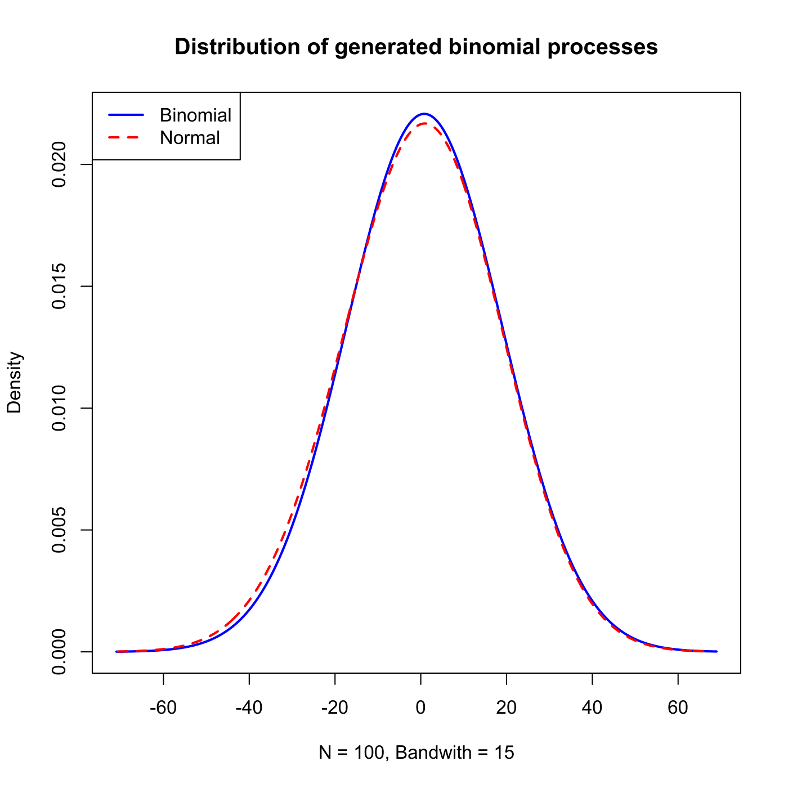
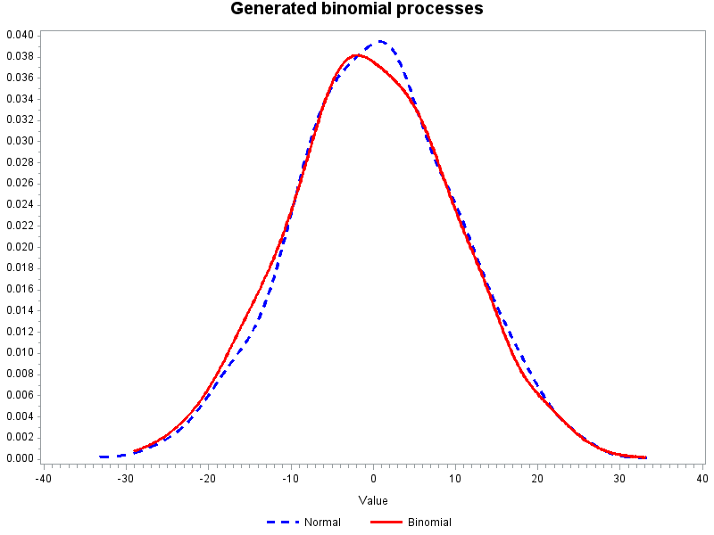

[](http://quantlet.de/)

## [](http://quantlet.de/) **SFEbinomv** [](http://quantlet.de/)

```yaml

Name of QuantLet : SFEbinomv

Published in : Statistics of Financial Markets

Description : 'Plots and compares the density of generated binomial processes with the density of
normally distributed random variables.'

Keywords : 'binomial, density, distribution, estimation, graphical representation, kernel, normal,
normal-distribution, plot, process, random-number-generation, simulation, stochastic-process'

See also : SFEBinomp, SFEWienerProcess, SFEbinomv_log

Author : Cindy Lamm, Ying Chen, Christian M. Hafner

Author[Matlab] : Ying Chen, Christian M. Hafner

Author[SAS] : Daniel T. Pele

Submitted : Sat, June 13 2015 by Lukas Borke

Submitted[Matlab] : Wed, April 27 2016 by Ya Qian

Submitted[SAS] : Mon, June 30 2014 by Philipp Gschoepf

Input: 
- n: number of steps
- k: number of paths
- p: probability of up movement

Example : 'User inputs the parameters n, k, p, then the density of generated binomial processes
with the normal density is plotted.'

```

.png)






### R Code:
```r

# clear variables and close windows
graphics.off()
rm(list = ls(all = TRUE))

# Define function
SFEbinomv = function(n, k, p) {
    if (n <= 0) {
        stop("please input n > 0!")
    }
    if (k <= 0) {
        stop("please input k > 0!")
    }
    if (p <= 0 | p >= 1) {
        stop("please choose p in the interval of (0,1)!")
    }
    
    n = floor(n)  # makes sure number of steps is integer
    k = floor(k)  # makes sure number of path is integer
    
    # main computation
    set.seed(0)
    z        = matrix(runif(n * k), n, k)
    z        = ((floor(-z + p)) + 0.5) * 2      # scale ordinary binomial processes
    x        = apply(z, MARGIN = 2, FUN = sum)  # end values of the k binomial processes
    h        = 0.3 * (max(x) - min(x))          # bandwidth used to estimate the density of end values
    xdens    = density(x, bw = h)               # Kernel-based density estimation with specified bandwidth
    trend    = n * (2 * p - 1)
    std      = sqrt(4 * n * p * (1 - p))
    norm     = std * rnorm(k) + trend
    normdens = density(norm, bw = h)
    
    # plot of densities
    plot(xdens$x, xdens$y,xlab='N = 100, Bandwith = 15', ylab='Density', type = "l", lwd = 2, col = 4, 
		xlim = c(min(xdens$x, normdens$x), max(xdens$x, normdens$x)), ylim = c(min(xdens$y, normdens$y), 
		max(xdens$y, normdens$y)), main = "Distribution of generated binomial processes")
    lines(normdens$x, normdens$y, col = 2, lwd = 2, lty = 2)
    legend("topleft", c("Binomial", "Normal"), col = c(4, 2), lwd = 2, lty = 1:2)
}

# enter parameters as n = 100 (number of steps), k = 100 (number of paths), p = 0.5 (probability of up movement)
SFEbinomv(n = 100, k = 100, p = 0.5) 

```

### MATLAB Code:
```matlab

clear
close all
clc

% user inputs parameters
disp('Please input steps n, paths k, Probability of up p as: [100, 1000, 0.5]');
disp(' ') ;

para=input('[n k p]=');

while length(para) < 3
  disp('Not enough input arguments. Please input in 1*3 vector form like [100, 1000, 0.5] or [100 1000 0.5]');
  disp(' ') ;
  para=input('[n k p]=');
end

n=para(1);
k=para(2);
p=para(3);
if (p>1)|(p<0)
  disp('Probability is to be between 0 and 1, please input p again!')
  p=input('p=');
end

% main computation
t=1:n;
trend=n*(2*p-1);
std=sqrt(4*n*p*(1-p));
rand('state',0);
z=rand(n,k);
z=((floor(-z+p))+0.5)*2;
x=sum(z); 
h = 0.3*(max(x)-min(x));
[f,xi] = ksdensity(x, 'width', h);      % Kernel-based density estimation with specified bandwidth
norm=std*randn(k,1)+trend;
[nf,nxi] = ksdensity(norm, 'width', h);

% plot
hold on
plot(xi, f,'LineWidth',2,'Color','b');
plot(nxi, nf,'LineWidth',2,'Color','r','LineStyle','-.');
legend('Normal','Binomial',2);
title(sprintf('Distribution of generated binominal processes'))  
hold off

```

### SAS Code:
```sas

goptions reset=all;
*************************************************
**** enter parameters as                    *****
**** number of steps:            n = 100    *****
**** number of path:             k = 1000    *****
**** probability of up movement: p = 0.5    *****
*************************************************;

%let n 	= 100;		*Input number of steps;
%let k 	= 1000;	*Input number of path;
%let p 	= 0.5;		*Input probability of up movement;

* main computation;

proc iml;
 
n =  &n ; 
k =  &k  ;		
p =  &p ; 

* main simulation;

call randseed(123);
trend  =  n*(2*p - 1);
std  =  sqrt(4*n*p*(1-p));
z = j(n,k,0);  
call randgen(z, "Uniform");	*Create a matrix of uniform random variables on [0,1];
z =  ((floor(-z+p))+0.5)*2 ;  
 rw = j(n,k,0);
do i = 2 to n;
rw[i,] = rw[i-1,]+z[i,];
end;
x = rw[nrow(rw),]`;
norm = j(k,1,0);

call randgen(norm, "Normal");	*Create a matrix of normal random variables;
norm = std*norm+trend;
x = x||norm;			  		*x contains the binomial random walk;

create data from x;append from x;
close data;

quit;
data data;set data;
rename col1 = x col2 = norm;


proc kde data = data;*Compute kernel density estimate;
univar x/ out = density_x  ;
 
run;
quit;

proc kde data = data;*Compute kernel density estimate;
univar norm/ out = density_y  ;
 
run;
quit;

data density_x;set density_x;
rename value = x density = f_x;
data density_y;set density_y;
rename value = y density = f_y;

data kde(keep = x f_x y f_y);merge density_x density_y;
run;

*Plot the density of generated binomial processes with the normal density;

title 'Generated binomial processes';
legend label = none value = ('Normal' 'Binomial' );
axis1 label = none;
symbol1 i = line line = 2 interpol = join c = blue w = 2;
symbol2 i = line interpol = join c = red w = 2;

proc gplot data = kde;
plot f_y*y f_x*x /overlay vaxis = axis1 legend = legend;

run;
quit;

```
