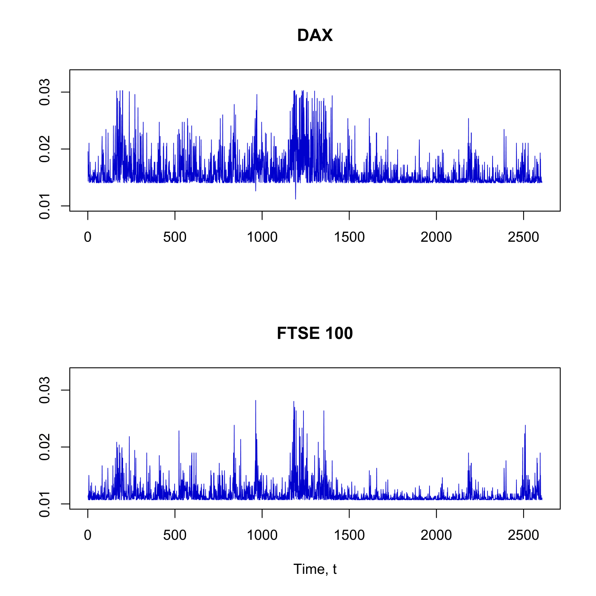
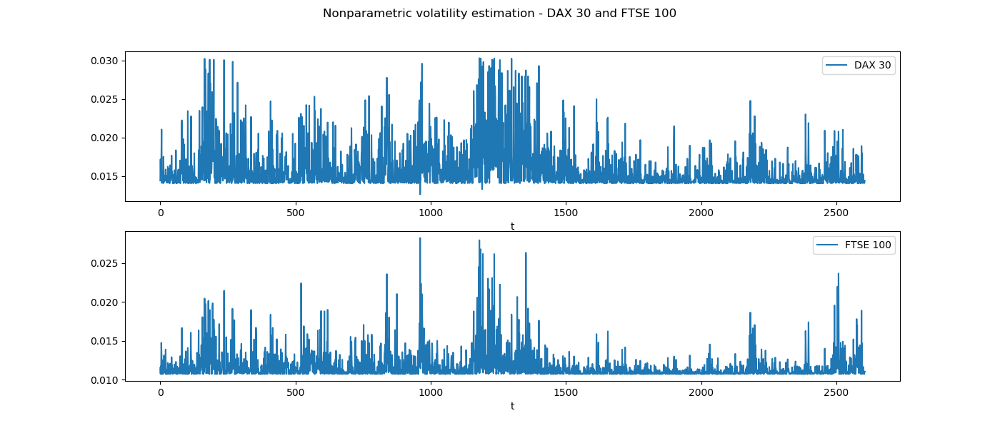

[](http://quantlet.de/)

## [](http://quantlet.de/) **SFEvolnonparest** [](http://quantlet.de/)

```yaml

Name of QuantLet: SFEvolnonparest

Published in: Statistics of Financial Markets

Description: 'Reads the date, DAX index values, stock prices of 20 largest companies at Frankfurt Stock Exchange (FSE), FTSE 100 index values and stock prices of 20 largest companies at London Stock Exchange (LSE) and estimates the volatility of the DAX and FTSE 100 daily return processes from 1998 to 2007.'

Keywords: conditional mean, conditional variance, interpolation, kernel, Nonparametric, nonparametric estimation, estimation, quadratic kernel, smoothing, volatility, plot, graphical representation, data visualization, dax, ftse100, financial, returns, index, asset, stock-price, time-series

See also: SFEgarchest, SFElshill, SFEmvol01, SFEmvol03, SFEtail, SFEtimeret, SFEvolgarchest

Author: Andrija Mihoci, Maria Osipenko, Awdesch Melzer

Submitted: Thu, July 02 2015 by Awdesch Melzer

Datafiles: FSE_LSE.dat

Example: 'Nonparametric estimation of conditional variance of DAX and FSE.'
```





### R Code
```r


# clear variables and close windows
rm(list = ls(all = TRUE))
graphics.off()

# install and load packages
libraries = c("fGarch", "tseries", "pracma")
lapply(libraries, function(x) if (!(x %in% installed.packages())) {
    install.packages(x)
})
lapply(libraries, library, quietly = TRUE, character.only = TRUE)

# load data
DS  = read.table("FSE_LSE.dat")
D   = DS[, 1]                     # date
S   = DS[, 2:43]                  # S(t)
s   = log(S)                      # log(S(t))
end = nrow(s)
r   = s[-1, ] - s[1:(end - 1), ]  # r(t)
n   = nrow(r)                     # sample size
t   = 1:n                         # time index, t

rdax  = r[, 1]                    # DAX returns
rftse = r[, 22]                   # FTSE 100 returns

# Nonparametric volatility estimation, DAX
end1 = nrow(r)
y    = cbind(r[1:(end1 - 1), 1], r[-1, 1])
yy   = cbind(y[, 1], y[, 2]^2)
hm   = 0.04  # bandwidth
hs   = 0.04  # bandwidth
X    = y[, 1]
Y    = y[, 2]
p    = 1
h    = hm

# compute quadratik kernel
quadk = function(x) {
    # Usage : y = quadk(x); Returns: y = (15/16).*(x.*x.<1).*(1- x.*x).^2 ) ;
    I = as.numeric(x * x < 1)
    x = x * I
    y = (15/16) * I * (1 - x * x)^2
    return(y)
}

lpregest = function(X, Y, p, h) {
    n    = length(X)
    x    = seq(min(X), max(X), (max(X) - min(X))/(100))  # grid
    m    = length(x)
    bhat = matrix(0, p + 1, m)
    for (i in 1:m) {
        dm = matrix(1, n, 1)
        dd = NULL
        xx = X - x[i]
        if (p > 0) {
            for (j in 1:p) {
                dm = cbind(dm, (xx)^j)
            }
        }
        w  = diag(quadk(xx/h)/h)
        mh = solve(t(dm) %*% w %*% dm) %*% t(dm) %*% w
        bhat[, i] = mh %*% Y
    }
    return(list(bhat, x))
}

first   = lpregest(y[, 1], y[, 2], 1, hm)    # estimate conditional mean function
m1h     = first[[1]]
yg      = first[[2]]
second  = lpregest(yy[, 1], yy[, 2], 1, hs)  # estimate conditional second moment 
m2h     = second[[1]]
yg      = second[[2]]
sh      = rbind(yg, m2h[1, ] - m1h[1, ]^2)   # conditional variance
m1hx    = interp1(yg, m1h[1, ], y[, 1])      # interpolate mean
shx_DAX = interp1(yg, sh[2, ], y[, 1])       # interpolate variance

# plot
par(mfrow = c(2, 1))
plot(shx_DAX^0.5, type = "l", col = "blue3", lwd = 0.7, xlab = "", ylab = "", frame = T, 
    axes = F, ylim = c(0.01, 0.033))
axis(1, seq(0, 3000, 500), seq(0, 3000, 500))
axis(2, seq(0, 0.04, 0.01), seq(0, 0.04, 0.01))
title("DAX")

# Nonparametric volatility estimation, FTSE 100
y = cbind(r[1:(end1 - 1), 22], r[2:end1, 22])
yy = cbind(y[, 1], y[, 2]^2)
hm = 0.04  # bandwidth
hs = 0.04  # bandwidth
first = lpregest(y[, 1], y[, 2], 1, hm)     # estimate conditional mean function
m1h = first[[1]]
yg = first[[2]]
second = lpregest(yy[, 1], yy[, 2], 1, hs)  # estimate conditional second moment 
m2h = second[[1]]
yg = second[[2]]
sh = rbind(yg, m2h[1, ] - m1h[1, ]^2)       # conditional variance
m1hx = interp1(yg, m1h[1, ], y[, 1])        # interpolate mean
shx_FTSE = interp1(yg, sh[2, ], y[, 1])     # interpolate variance

# plot
plot(shx_FTSE^0.5, type = "l", col = "blue3", lwd = 0.7, xlab = "Time, t", ylab = "", 
    frame = T, axes = F, ylim = c(0.01, 0.033))
axis(1, seq(0, 3000, 500), seq(0, 3000, 500))
axis(2, seq(0, 0.04, 0.01), seq(0, 0.04, 0.01))
title("FTSE 100")

```

automatically created on 2019-08-01

### PYTHON Code
```python

import numpy as np 
import pandas as pd 
import matplotlib.pyplot as plt
from arch import arch_model
from arch.univariate import GARCH
from statsmodels.tsa.arima_model import ARMA
import datetime

np.set_printoptions(suppress=True)

ds = pd.read_table("FSE_LSE.dat",header=None)

def log_returns(df):
	logs=np.log((df.pct_change()+1).dropna())
	logs=pd.DataFrame(logs)
	return(logs)

S = ds.iloc[:,1:42]	#stocks
r = log_returns(S) #log returns
D = ds.iloc[:,0] #date

n   = r.shape[0] #observations
t   = np.arange(0,n) #time steps
rdax  = r.iloc[:,1] #dax returns 
rftse = r.iloc[:,22] #ftse returns


y1 = r.iloc[np.arange(r.shape[0]-1),0].values.reshape((-1,1))
y2 = r.iloc[1:,0].values.reshape((-1,1))
y = np.concatenate([y1,y2],axis=1)
yy = np.concatenate([y[:,0].reshape((-1,1)),(y[:,1]**2).reshape((-1,1))],axis=1)

hm   = 0.04  # bandwidth
hs   = 0.04  # bandwidth
X    = y[:,0]
Y    = y[:,1]
p    = 1
h    = hm

def quadk(x):#compute quadratic kernel
	I =np.array([(x*x)<1]).astype(int)#true:1, false:0
	x=x*I
	y=I*((1-x*x)**2)*(15)/(16)
	return(y)


def lpregest(X,Y,p,h):
	
	n = X.shape[0]
	x = np.arange(np.min(X),np.max(X),(np.max(X)-np.min(X))/(100))
	m = x.shape[0]
	bhat = []
	for i in range(m):
		dm = np.ones((n,1))
		xx = X-x[i]
		
		if p>0:
			for j in range(1,p+1):
				dm=np.concatenate([dm,np.array((xx)**j).reshape((-1,1))],axis=1).astype(float)
				
	
		val =  np.array([quadk(arg)/h for arg in xx/h])
		w = np.zeros((val.shape[0],val.shape[0]))
		np.fill_diagonal(w,val)
		
		mh = np.linalg.solve(np.transpose(dm).dot(w).dot(dm),np.identity(np.transpose(dm).shape[0])).dot(np.transpose(dm)).dot(w)
		bhat.append(mh.dot(Y))
	return(np.array(bhat),np.array(x))


#estimate conditional first moment
m1h,yg = lpregest(y[:,0],y[:,1],1,hm)

#estimate conditional second moment
m2h,yg = lpregest(yy[:,0], yy[:,1], 1, hs)

#conditional variance
sh = np.concatenate([np.transpose(yg).reshape((1,-1)),np.transpose(m2h[:,0]-m1h[:,0]**2).reshape((1,-1))],axis=0)

#interpolation
m1hx = np.interp(y[:,1],yg,m1h[:,0])
shx_DAX = np.interp(y[:,1],yg,sh[1,:])


############################# FTSE ########################

y1 = r.iloc[np.arange(r.shape[0]-1),21].values.reshape((-1,1))
y2 = r.iloc[1:,21].values.reshape((-1,1))
y = np.concatenate([y1,y2],axis=1)
yy = np.concatenate([y[:,0].reshape((-1,1)),(y[:,1]**2).reshape((-1,1))],axis=1)

m1h,yg = lpregest(y[:,0],y[:,1],1,hm)

#estimate conditional second moment
m2h,yg = lpregest(yy[:,0], yy[:,1], 1, hs)

#conditional variance
sh = np.concatenate([np.transpose(yg).reshape((1,-1)),np.transpose(m2h[:,0]-m1h[:,0]**2).reshape((1,-1))],axis=0)

#interpolation
m1hx = np.interp(y[:,1],yg,m1h[:,0])
shx_FTSE = np.interp(y[:,1],yg,sh[1,:])

fig = plt.figure(figsize=(14,6))
ax = fig.add_subplot(2, 1, 1)
ax.plot(shx_DAX**.5,label='DAX 30')
ax.set_xlabel('t')
ax.title
plt.legend()

ax = fig.add_subplot(2, 1, 2)
ax.plot(shx_FTSE**.5,label='FTSE 100')
ax.set_xlabel('t')
plt.legend()
plt.suptitle('Nonparametric volatility estimation - DAX 30 and FTSE 100')


plt.savefig('SFEvolnoparest_py.png')
plt.show()
```

automatically created on 2019-08-01