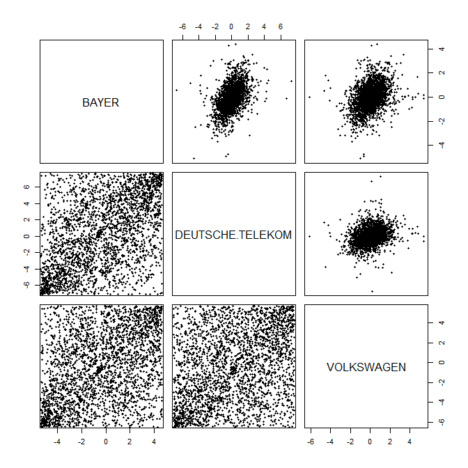

[](http://quantlet.de/)

## [](http://quantlet.de/) **SFE5dim** [](http://quantlet.de/)

```yaml

Name of QuantLet: SFE5dim

Published in: Statistics of Financial Markets

Description: 'Displays scatterplots from GARCH residuals (upper triangular) and 
              from residuals mapped on unit square by the cumulative distribution 
              function (lower triangular).'

Keywords: cdf, data visualization, garch, graphical representation, plot, process, scatterplot, stochastic, stochastic-process, time-series, visualization

See also: MMSTATcorrelation, MMSTATscatterplot

Author: Ostap Okhrin, Piedad Castro

Submitted: Fri, June 24 2016 by Piedad Castro

Datafiles: 2004-2014_dax_ftse.csv

Input: 'The datafile contains daily price data from 07.05.2004 to 07.05.2014 for 
selected companies which are part of DAX30 and FTSE100 as well as the 
corresponding index data. This code makes use of the daily prices for the 
companies Bayer, Deutsche Telekom and Volkswagen.'

```



### R Code
```r

# clear variables and close windows
rm(list = ls(all = TRUE))
graphics.off()

# set working directory
# setwd("C:/...")

# load libraries
# install and load packages
libraries = c("data.table", "fGarch")
lapply(libraries, function(x) if (!(x %in% installed.packages())) {
  install.packages(x)
})
lapply(libraries, library, quietly = TRUE, character.only = TRUE)

# load data
dataset = fread("2004-2014_dax_ftse.csv", select =  c( "BAYER", "DEUTSCHE TELEKOM", "VOLKSWAGEN"))
dataset = as.data.frame(dataset)

# log-returns
X = lapply(dataset, 
           function(x){
            diff(log(x))
})

garchModel = lapply(X, 
                    function(x){
                      garchFit(~garch(1, 1), data = x, trace = F)
                    })

eps = lapply(garchModel, 
             function(x){
               x@residuals/x@sigma.t
             })


panel.cor <- function(x, y, pch)
{
  par(usr = c(-0.01, 1.01, -0.01, 1.01))
  x = rank(x) / (length(x) + 1)
  y = rank(y) / (length(y) + 1)
  points(x, y, pch = pch)
}

pairs(eps, lower.panel = panel.cor, pch = 20)

```

automatically created on 2018-05-28