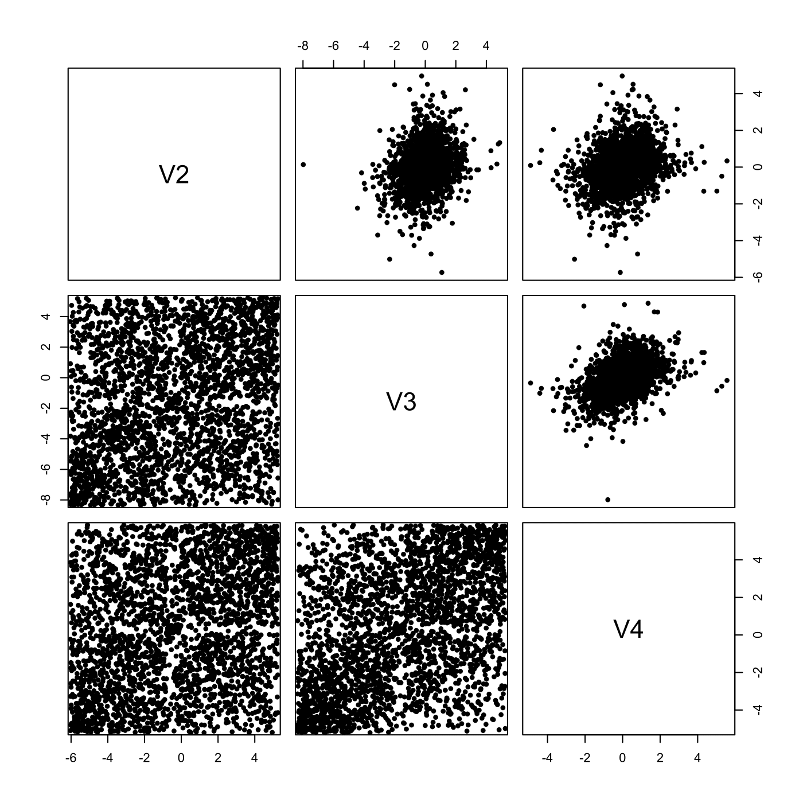

[](http://quantlet.de/)

## [](http://quantlet.de/) **SFE5dim** [](http://quantlet.de/)

```yaml

Name of QuantLet : SFE5dim

Published in : Statistics of Financial Markets

Description : 'Displays scatterplots from GARCH residuals (upper triangular) and from residuals
mapped on unit square by the cumulative distribution function (lower triangular).'

Keywords : 'cdf, data visualization, garch, graphical representation, plot, process, scatterplot,
stochastic, stochastic-process, time-series, visualization'

See also : MMSTATcorrelation, MMSTATscatterplot

Author : Ostap Okhrin

Submitted : Tue, July 14 2015 by quantomas

Datafiles : dataset.txt

```




### R Code:
```r
# clear variables and close windows
rm(list = ls(all = TRUE))
graphics.off()

# install and load packages
libraries = c("copula", "fGarch", "fBasics")
lapply(libraries, function(x) if (!(x %in% installed.packages())) {
    install.packages(x)
})
lapply(libraries, library, quietly = TRUE, character.only = TRUE)

# load data
S = read.table("dataset.txt", skip = 1)
S = S[, -1]
X = S[-1, ]

for (i in 1:length(S[1, ])) {
    X[, i] = log(S[-1, i]/S[-length(S[, i]), i])
}
eps = X

for (i in 1:length(S[1, ])) {
    fit = garchFit(~garch(1, 1), data = X[, i], trace = F)
    eps[, i] = fit@residuals/fit@sigma.t
}
f.eps = eps

for (i in 1:dim(eps)[2]) {
    # making margins uniform, based on Ranks
    f.eps[, i] = rank(eps[, i])/(length(eps[, i]) + 1)
}

panel.cor = function(x, y, pch) {
    par(usr = c(-0.01, 1.01, -0.01, 1.01))
    x = rank(x)/(length(x) + 1)
    y = rank(y)/(length(y) + 1)
    points(x, y, pch = pch)
}

pairs(eps, lower.panel = panel.cor, pch = 20) 
```
